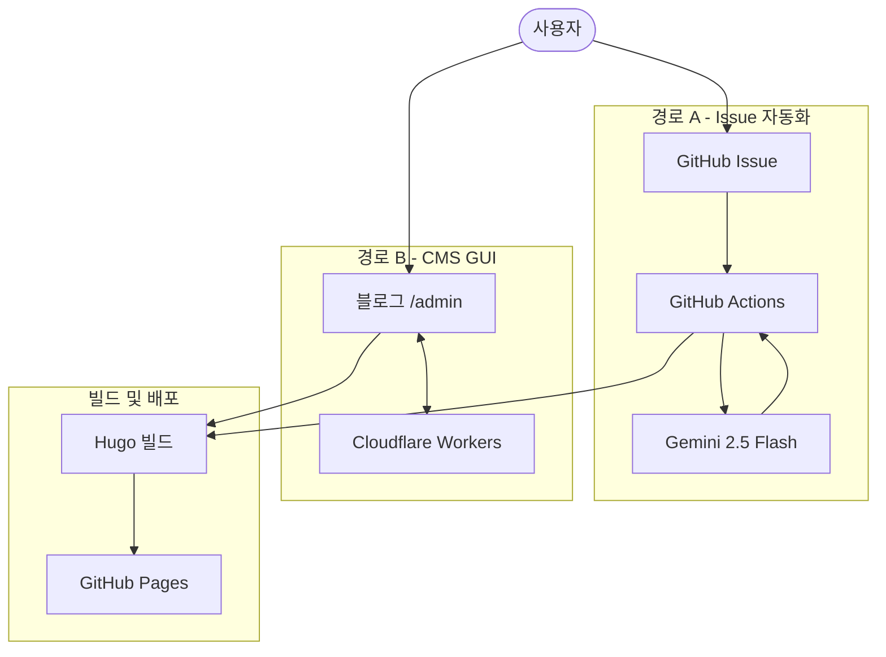

## 1. 개요

본 문서는 기술 블로그 운영 자동화 시스템의 기획 배경, 구축 과정, 트러블슈팅 이력 및 최종 아키텍처를 기술한 보고서이다. 초기 티스토리 기반 자동화 구상에서 출발하여, 플랫폼 전환 및 복수의 기술 스택을 통합함으로써 GitHub Issue 작성만으로 블로그 포스팅이 완료되는 완전 자동화 파이프라인을 구현하였다.

---

## 2. 기획 배경

기술 블로그의 카테고리 중 하나인 **Tech Blurting**은 정제되지 않은 학습 내용을 빠르게 기록하고, AI 피드백을 통해 보완하는 형식을 지향한다. 초기에는 티스토리 플랫폼과 공식 Open API를 활용하여 자동 업로드 파이프라인 구축을 계획하였으나, 티스토리 Open API가 2024년 2월 완전 종료된 사실을 확인함에 따라 플랫폼 전환이 불가피하였다.

카테고리 구성은 다음과 같이 4개로 정의하였다.

| 카테고리 | 설명 |
|---|---|
| Tech Blurting | 학습 내용 블러팅 및 AI 피드백 |
| Coding Test | 코딩테스트 풀이 및 분석 |
| Open Source Analysis | 오픈소스 분석 및 학습 |
| 0 to 1 | 직접 구축한 프로젝트 기록 |

---

## 3. 플랫폼 선택

WordPress와 GitHub Pages를 비교 검토한 결과, 아래 이유로 **GitHub Pages + Hugo** 조합을 채택하였다.

- 마크다운 기반으로 AI 글 생성에 최적화
- Git push 단일 명령으로 배포 자동화 가능
- 카테고리 확장이 프론트매터 한 줄 수정으로 처리됨
- 완전 무료, 광고 없음
- 개발자 기술 블로그로서 적합한 생태계

테마는 **PaperMod**를 채택하여 다크모드, 카테고리 네비게이션, 읽기 시간 표시 등의 기능을 활용하였다.

---

## 4. 구축 과정 및 트러블슈팅

### 4-1. 초기 세팅

Homebrew를 통해 Hugo 및 Git을 설치하고, GitHub 저장소 `xodbs1021.github.io`를 생성하였다. Hugo 프로젝트 초기화 및 PaperMod 테마를 서브모듈로 연결하였으며, `hugo.toml`에 카테고리별 메뉴를 구성하였다.

> **트러블 1.** GitHub push 시 인증 오류 발생
> PAT(Personal Access Token) 발급이 필요하였으며, 초기 발급 시 `workflow` scope 누락으로 인해 `.github/workflows` 파일 push가 거부되었다. scope를 포함하여 재발급함으로써 해결하였다.

> **트러블 2.** GitHub Actions `deploy.yml` 실패
> `peaceiris/actions-gh-pages@v4`가 Node.js 20 deprecated 경고와 함께 exit code 128을 반환하였다. `permissions` 블록을 추가하고 `fetch-depth: 0` 옵션을 설정하여 해결하였다.

> **트러블 3.** GitHub Pages 404 오류
> 배포 브랜치가 `main`으로 설정되어 있었으나, Actions가 빌드 결과를 `gh-pages` 브랜치에 push하는 구조였다. Pages 설정에서 소스 브랜치를 `gh-pages`로 변경하여 해결하였다.

---

### 4-2. 자동화 방식의 발전

**1단계 — Claude.ai Artifact 반자동화 시도**
Artifact 내에서 공부 내용 입력 → Claude 피드백 → 터미널 명령어 생성 방식을 구현하였으나, Artifact는 브라우저 샌드박스 내에서 동작하므로 로컬 파일시스템 및 터미널에 직접 접근이 불가능하였다.

**2단계 — 로컬 Python 스크립트**
Gemini API를 활용하여 로컬에서 실행되는 Python 스크립트를 작성하였다. 공부 내용 터미널 입력 → Gemini 피드백 생성 → 마크다운 파일 생성 → git push까지 자동화하였다.

> **트러블 4.** `google.generativeai` 패키지 deprecated → `google-genai`로 교체
>
> **트러블 5.** `gemini-2.0-flash` 모델 deprecated → `gemini-2.5-flash`로 교체
>
> **트러블 6.** API 키 채팅창 노출로 인한 키 차단 → 신규 발급 후 GitHub Secret에만 등록

**3단계 — GitHub Actions 완전 자동화**
터미널 입력 자체를 제거하고, GitHub Issue를 트리거로 사용하는 완전 자동화 파이프라인을 구축하였다.

> **트러블 7.** YAML 내 Python 코드 특수문자 충돌 → Python 스크립트를 별도 파일로 분리
>
> **트러블 8.** 봇 커밋이 `deploy.yml` 미트리거 → `auto-post.yml`에 Hugo 빌드+배포 직접 포함
>
> **트러블 9.** Gemini가 글쓰기 조언 반환 → 프롬프트에 기술적 보완만 요청하도록 제약 조건 명시

---

### 4-3. 관리 UI 구축

**Netlify CMS**를 채택하여 `/admin` 경로에 콘텐츠 관리 인터페이스를 구현하였다.

> **트러블 10.** GitHub Pages에서 Netlify OAuth 엔드포인트 Not Found
>
> **트러블 11.** 오픈소스 대안 `sveltia-cms-auth` 서버 다운
>
> → **Cloudflare Workers**에 직접 GitHub OAuth 프록시를 구축하여 해결

---

## 5. 최종 아키텍처

---

## 6. 결론

본 프로젝트를 통해 GitHub Issue 작성이라는 단일 액션만으로 AI 피드백이 포함된 기술 블로그 포스팅이 자동 완료되는 파이프라인을 구현하였다. 또한 `/admin` 인터페이스를 통해 GUI 기반의 콘텐츠 관리도 가능하게 하였다. 향후 카테고리 추가 시 `hugo.toml`, `config.yml`, `generate_post.py` 세 파일에 항목을 추가하는 것으로 확장이 가능하다.
