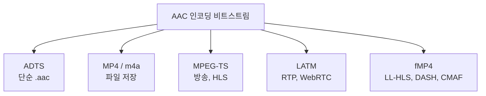
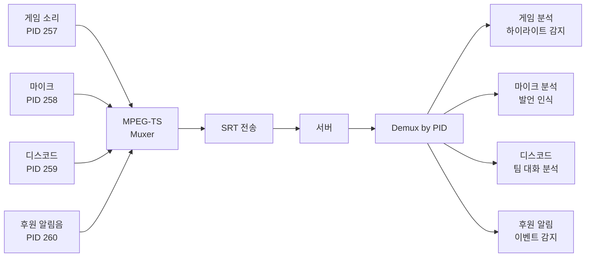

1080p 60fps 라이브 송출 시 영상 6 Mbps, 오디오 128 Kbps. 총 비트레이트의 **2%**.

근데 시청자가 이탈하는 가장 큰 이유 중 하나가 **오디오 끊김**이다. 영상이 1초 멈춰도 참아도, 마이크가 깨지면 바로 떠난다. 오디오 비중은 작지만 임팩트는 크다.

[지난 글](../h264-deep-dive/)에서 영상 코덱 H.264를 봤다면, 이번 글은 **그 옆에 항상 같이 있는 오디오 코덱 AAC**, 그리고 **AAC가 못 하는 영역을 채우는 Opus, AC-3, FLAC** 같은 친구들을 정리한 노트다. 인코더 선택의 진짜 영향, 컨테이너 종류, 시나리오별 선택까지.

---

## 1. MP3 다음에 왜 AAC가 나왔나

1990년대 초 MP3가 세상을 바꿨다. CD를 100MB → 5MB로. 음원 시장의 디지털 전환이 시작.

근데 MP3에는 명확한 한계가 있었다.

| 한계 | 영향 |
|---|---|
| **64kbps 이하 음질 폭락** | 저비트레이트 라디오/모바일 부적합 |
| **5.1 채널 미지원** | 영화/방송 표준 못 됨 |
| **샘플레이트 48kHz 비표준** | 영상과 동기화 시 추가 변환 |
| **표준화 늦음** | 정식 ISO 표준 아닌 industry de facto |

MPEG가 이걸 해결하려고 만든 게 **AAC (Advanced Audio Coding)**. 1997년 발표.

```
공식 명칭:
- MPEG-2 Part 7 (1997)
- MPEG-4 Part 3 (1999)
- ISO/IEC 14496-3
```

H.264와 AAC가 둘 다 MPEG에서 나와서 **세트로 표준화**됨. 이래서 영상 인프라에서 둘이 항상 같이 보임.

### MP3 vs AAC

| 항목 | MP3 | AAC |
|---|---|---|
| 같은 비트레이트 음질 | 기준 | **~30% 우수** |
| 저비트레이트 (64kbps) | 깨짐 | 들어줄 만함 |
| 최대 채널 | 2 | **48 (서라운드 OK)** |
| 표준화 | 비공식 | **공식 ISO** |
| 라이센스 | 비싸다가 만료 | 비싸다가 만료 |
| HLS 의무 | ❌ | ✅ |

Apple이 2003년 iTunes 출시하면서 **AAC를 표준 음원 포맷으로 채택**. 이후 YouTube, HLS, DASH 다 AAC.

---

## 2. 같은 AAC라도 인코더가 다르면 음질이 다르다

H.264에서 x264/NVENC가 달랐듯, AAC도 인코더가 여러 개.

### FFmpeg에서 사용 가능한 AAC 인코더

| 인코더 | 음질 | 라이센스 | 비고 |
|---|---|---|---|
| `aac` (FFmpeg 내장) | 보통 | 무료 | 기본값. 빠름 |
| `libfdk_aac` (Fraunhofer) | **최고** | 비-LGPL | 별도 빌드 필요 |
| `aac_at` (Apple) | 좋음 | macOS 전용 | Apple AudioToolbox |
| `libfaac` | 낮음 (deprecated) | - | 안 씀 |

```bash
# 기본 (내장)
ffmpeg -i input -c:a aac -b:a 128k output.m4a

# 더 좋은 음질
ffmpeg -i input -c:a libfdk_aac -b:a 128k output.m4a
```

### 인코더별 음질 차이 (같은 비트레이트)


{
  "tooltip": { "trigger": "axis" },
  "legend": { "data": ["libfdk_aac", "aac (내장)", "aac_at (Apple)"], "top": 0 },
  "grid": { "left": "10%", "right": "10%", "bottom": "12%", "top": "18%" },
  "xAxis": {
    "type": "category",
    "data": ["64k", "96k", "128k", "160k", "192k", "256k"],
    "name": "비트레이트"
  },
  "yAxis": {
    "type": "value",
    "name": "음질 (0=원본)",
    "min": -3,
    "max": 0
  },
  "series": [
    {
      "name": "libfdk_aac",
      "type": "line",
      "smooth": true,
      "itemStyle": { "color": "#10b981" },
      "data": [-1.8, -1.0, -0.5, -0.3, -0.15, -0.05]
    },
    {
      "name": "aac (내장)",
      "type": "line",
      "smooth": true,
      "itemStyle": { "color": "#f59e0b" },
      "data": [-2.5, -1.5, -0.9, -0.6, -0.4, -0.15]
    },
    {
      "name": "aac_at (Apple)",
      "type": "line",
      "smooth": true,
      "itemStyle": { "color": "#3b82f6" },
      "data": [-2.0, -1.2, -0.7, -0.4, -0.25, -0.1]
    }
  ]
}


128kbps에서 libfdk_aac와 FFmpeg 내장 aac의 차이가 가장 큼. 라이브에서 libfdk_aac 쓰는 게 가치 있는 이유.

근데 **libfdk_aac는 라이센스가 복잡**. FFmpeg 기본 배포에 포함 안 됨. 직접 빌드하거나 별도 패키지 (jrottenberg/ffmpeg:edge 같은) 필요.

대규모 인프라는 libfdk_aac, 빠른 셋업은 내장 aac.

---

## 3. AAC 프로파일 — 언제 뭘 쓰나

AAC도 H.264처럼 프로파일이 있다.

| 프로파일 | 비트레이트 | 사용처 | 음질 vs 비트 |
|---|---|---|---|
| **AAC-LC** (Low Complexity) | 96~256k | **라이브, 일반 음원** | 표준 |
| **HE-AAC** (v1) | 32~80k | 라디오, 모바일 | 저비트레이트 강함 |
| **HE-AAC v2** | 16~48k | 매우 저비트레이트 | 모노 같은 스테레오 |
| **AAC-LD/ELD** | - | VoIP | 저지연 |

```
스트리밍 표준: AAC-LC 128kbps (스테레오 48kHz)
모바일 데이터 절약: HE-AAC 64kbps
초저대역 라디오: HE-AAC v2 32kbps
```

HE-AAC는 SBR(Spectral Band Replication)로 고주파를 *복원* 함. 저비트레이트에서 풍부한 소리 가능. 하지만 디코딩 부담 증가, 일부 옛 디바이스 미지원.

---

## 4. 비트레이트 가이드 — 영상 대비 무시할 수준

```
[라이브 스트리밍 (영상 6 Mbps 기준)]
음성 위주: AAC-LC 96 kbps (1.6%)
음악 포함: AAC-LC 128 kbps (2.1%)
프리미엄: AAC-LC 192 kbps (3.2%)

[VOD]
일반: AAC-LC 128 kbps
고품질: AAC-LC 192 kbps
프리미엄: AAC-LC 256 kbps + 5.1 채널

[화상회의]
일반: AAC-LD 32~64 kbps (또는 Opus)
```

영상이 6 Mbps인데 오디오 32 Kbps 아끼려고 음질 망치는 건 손해. **무조건 128k 이상**.

---

## 5. CBR vs VBR — 라이브는 CBR

```bash
# CBR (라이브 표준)
ffmpeg -i input -c:a aac -b:a 128k output.m4a

# VBR (VOD 가끔)
ffmpeg -i input -c:a aac -q:a 5 output.m4a
# q:a 1(최저) ~ 9(최고)
```

영상과 마찬가지로 라이브엔 CBR. 대역폭 예측 가능해야 함.

VBR은 어려운 부분(폭발, 합창)에 비트 더 주고 조용한 부분에 적게. 평균 비트레이트 같아도 음질 우수. VOD에 적합.

---

## 6. AAC 컨테이너 — 단순 코덱이 아니다

H.264 NAL Unit처럼 AAC도 컨테이너에 담겨야 한다.



### 컨테이너별 비교

| 컨테이너 | 확장자 | 사용처 | 특징 |
|---|---|---|---|
| **ADTS** | `.aac` | 단순 스트림 | 동기 헤더, 인덱싱 어려움 |
| **MP4** | `.m4a` | 파일 저장 | 시킹 빠름, 메타데이터 풍부 |
| **MPEG-TS** | `.ts` | 방송, HLS | PID 기반 멀티 트랙 |
| **LATM** | (스트림) | RTP, WebRTC | 페이로드 효율 |
| **fMP4** | `.m4s` | LL-HLS, DASH | CMAF 통합 표준 |

### Remuxing — 코덱 그대로, 컨테이너만 변환

```bash
# 코덱 재인코딩 없이 컨테이너만 변환
ffmpeg -i input.m4a -c copy output.aac      # MP4 → ADTS
ffmpeg -i input.aac -c copy output.m4a      # ADTS → MP4
ffmpeg -i input.ts -c copy output.m4a       # TS → MP4
```

`-c copy`는 CPU 거의 안 씀. 라이브 인제스트 단계에서 자주 사용.

---

## 7. AAC 코덱 문자열 — MIME 표기

H.264의 `avc1.640028`처럼 AAC도 표준 표기.

```
mp4a.40.2
└────┘ │  │
   │   │  └── 2 = Profile (AAC-LC)
   │   └───── 40 = MPEG-4 Audio
   └───────── mp4a = AAC

→ "AAC-LC MPEG-4"
```

| 코드 | 프로파일 |
|---|---|
| `mp4a.40.2` | AAC-LC |
| `mp4a.40.5` | HE-AAC v1 |
| `mp4a.40.29` | HE-AAC v2 |
| `mp4a.40.23` | AAC-LD |

매니페스트 예시:
```
#EXT-X-STREAM-INF:BANDWIDTH=6500000,CODECS="avc1.640028,mp4a.40.2"
1080p/playlist.m3u8
```

영상 + 오디오 codec string을 같이 박음.

---

## 8. 라이브 송출 표준 명령

지금까지 본 옵션 종합:

```bash
ffmpeg \
  -i input \
  \
  -c:v libx264 -preset veryfast -tune zerolatency \
  -b:v 6000k -maxrate 6000k -bufsize 12000k \
  \
  -c:a aac \
  -profile:a aac_low \
  -b:a 128k \
  -ar 48000 \
  -ac 2 \
  \
  -f flv rtmp://...
```

옵션 의미:
- `profile:a aac_low`: AAC-LC (표준)
- `b:a 128k`: 128 kbps
- `ar 48000`: 48 kHz 샘플레이트 (HLS 표준)
- `ac 2`: 스테레오

영상과 같이 한 명령에 처리.

---

## 9. 멀티 오디오 트랙 — PokeClip 예시

내가 만들고 있는 PokeClip은 게임 방송 분석 파이프라인. 한 스트림에 **4개의 오디오 트랙**.



RTMP는 [예전 글에서 본 것처럼](../rtmp-still-alive/) 멀티 오디오 트랙 불가. MPEG-TS의 PID 구조 + SRT 전송이 핵심.

```bash
# 4개 오디오 트랙 + 비디오 → MPEG-TS
ffmpeg \
  -i video.mp4 \
  -i game.wav \
  -i mic.wav \
  -i discord.wav \
  -i donation.wav \
  -map 0:v -map 1:a -map 2:a -map 3:a -map 4:a \
  -c:v copy \
  -c:a aac -b:a 128k \
  -f mpegts \
  "srt://server:9000?streamid=pokeclip"
```

---

## 10. 라우드니스 — 시청자 경험의 비밀

스트리머마다 마이크 볼륨이 다르다. 시청자가 채널 옮길 때마다 볼륨 조절하면 짜증.

해결: **EBU R128 라우드니스 정규화** (-23 LUFS 표준).

```bash
ffmpeg -i input \
  -af "loudnorm=I=-16:TP=-1.5:LRA=11" \
  -c:a aac -b:a 128k \
  output.m4a
```

- `I=-16`: 목표 라우드니스 -16 LUFS (스트리밍 표준)
- `TP=-1.5`: 트루 피크 -1.5 dBTP
- `LRA=11`: 라우드니스 범위

YouTube가 -14 LUFS, Spotify가 -14 LUFS, **Twitch/치지직이 보통 -16 LUFS**. 모든 영상 자동 적용.

---

## 11. Opus — WebRTC가 AAC를 거부한 이유

AAC가 영상 스트리밍 표준이지만, **실시간 통신에선 안 쓰인다**.

```
Opus — IETF RFC 6716 (2012년)
- Skype (옛 SILK) + Xiph (Vorbis) 합쳐서 만듦
- WebRTC 기본 코덱
- 5ms ~ 60ms 프레임 (저지연)
- 6kbps ~ 510kbps 가변
- 라이센스 무료
```

### Opus vs AAC

| 항목 | AAC | Opus |
|---|---|---|
| 저비트레이트 음질 (64kbps) | 보통 | **AAC 96k급** |
| 초저지연 | 부적합 (~200ms) | **5~60ms** |
| 화상회의 | ❌ | ✅ (WebRTC 기본) |
| 라이센스 | 만료됨 | 무료 |
| HLS 의무 | ✅ | ❌ |
| 스트리밍 시청자 측 | 표준 | 제한적 |

```
WebRTC (화상통화): Opus 강제
HLS (라이브 시청): AAC 의무
→ 같은 회사 인프라에 두 코덱 공존
```

화상회의 솔루션은 Opus, 일반 라이브는 AAC. **Zoom은 Opus, Twitch는 AAC**.

### Opus의 비트레이트별 음질 vs AAC


{
  "tooltip": { "trigger": "axis" },
  "legend": { "data": ["Opus", "AAC-LC", "MP3"], "top": 0 },
  "grid": { "left": "10%", "right": "10%", "bottom": "12%", "top": "18%" },
  "xAxis": {
    "type": "category",
    "data": ["32k", "48k", "64k", "96k", "128k", "192k"],
    "name": "비트레이트"
  },
  "yAxis": {
    "type": "value",
    "name": "음질 (0=원본)",
    "min": -3.5,
    "max": 0
  },
  "series": [
    {
      "name": "Opus",
      "type": "line",
      "smooth": true,
      "itemStyle": { "color": "#10b981" },
      "data": [-1.8, -1.2, -0.7, -0.3, -0.15, -0.05]
    },
    {
      "name": "AAC-LC",
      "type": "line",
      "smooth": true,
      "itemStyle": { "color": "#3b82f6" },
      "data": [-3.2, -2.5, -1.5, -0.6, -0.3, -0.1]
    },
    {
      "name": "MP3",
      "type": "line",
      "smooth": true,
      "itemStyle": { "color": "#94a3b8" },
      "data": [-3.5, -3.0, -2.2, -1.4, -0.8, -0.3]
    }
  ]
}


저비트레이트에서 Opus가 압도적. 64 kbps에서 AAC-LC 96k급. 100kbps 위에서는 모두 들어줄 만함.

WebRTC가 Opus를 표준화한 진짜 이유: **저비트레이트 + 저지연**. 두 가지 다 잡는 코덱 없었음.

---

## 12. AC-3, FLAC 같은 다른 코덱들

영상 코덱은 H.264/H.265/AV1로 정리되지만, 오디오는 더 다양함.

| 코덱 | 표준화 | 사용처 |
|---|---|---|
| **AC-3** (Dolby Digital) | 1991 | 영화, 디지털 방송, 5.1/7.1 |
| **E-AC-3** (Dolby Digital Plus) | 2005 | Netflix 4K HDR, 7.1 |
| **Dolby Atmos** | - | 객체 기반 서라운드 (Apple Music, Netflix) |
| **FLAC** | 2001 | 무손실 압축 (오디오파일러, Bandcamp) |
| **ALAC** | 2004 | Apple 무손실 (Apple Music Lossless) |

### Netflix 4K HDR 영화의 오디오

```
영상: H.265/AV1 + HDR
오디오: E-AC-3 (Atmos 옵션)
컨테이너: fMP4 (CMAF)
시청자: Dolby Atmos 사운드바
```

E-AC-3가 7.1 채널 + 메타데이터 지원. AAC로는 불가. **프리미엄 영화 시청 경험의 핵심**.

### FLAC — 무손실의 영역

```bash
ffmpeg -i input.wav -c:a flac -compression_level 8 output.flac
# 음질 = 100% 원본 동일
# 압축률 = 약 50% (.wav의 절반)
```

Apple Music이 2021년부터 Lossless 옵션 제공 (ALAC). Bandcamp는 FLAC 표준.

**라이브 스트리밍엔 안 씀**. 무손실 트래픽 부담.

---

## 13. 시나리오별 코덱 선택

| 시나리오 | 코덱 | 비트레이트 | 컨테이너 |
|---|---|---|---|
| **HLS 라이브 (Twitch/치지직)** | AAC-LC | 128 kbps | TS / fMP4 |
| **YouTube Live** | AAC-LC | 128~192 kbps | fMP4 |
| **WebRTC (Zoom, Meet)** | Opus | 32~64 kbps | RTP |
| **Discord 음성** | Opus | 64~96 kbps | RTP |
| **Netflix 4K HDR** | E-AC-3 (Atmos) | 384~768 kbps | fMP4 |
| **방송 (지상파)** | AC-3 | 384~448 kbps | MPEG-TS |
| **Apple Music Lossless** | ALAC | 가변 | M4A |
| **VOD MP4 일반** | AAC-LC | 128~192 kbps | MP4 |
| **팟캐스트** | MP3 (호환) / AAC | 64~128 kbps | MP3 / M4A |
| **분석 파이프라인 (PokeClip)** | AAC 멀티 트랙 | 128k × N | MPEG-TS (PID) |

### 결정 원칙

```
1. 표준 강제가 있으면 따른다 (HLS = AAC)
2. 실시간 통신 = Opus
3. 영화/방송 = AC-3 계열
4. 음악 무손실 = FLAC/ALAC
5. 그 외 = AAC (가장 무난)
```

---

## 정리하면

오디오 코덱은 영상의 5%만 차지하지만 **시청자 이탈에 직결**된다.

1. **AAC의 출신** — 1997년 MPEG, MP3의 한계 보완. Apple iTunes + HLS가 표준 굳힘
2. **AAC가 MP3 대비 우수** — 같은 비트레이트에 30% 음질, 5.1 채널, 저비트레이트 강함
3. **인코더 차이** — libfdk_aac > aac_at > 내장 aac. 라이센스 vs 셋업 편의 트레이드오프
4. **프로파일** — AAC-LC (라이브), HE-AAC (저비트), AAC-LD (저지연 VoIP)
5. **컨테이너** — ADTS(스트림), MP4(파일), MPEG-TS(방송/HLS), fMP4(LL-HLS/CMAF)
6. **라이브 표준** — AAC-LC 128k 48kHz 스테레오 + loudnorm -16 LUFS
7. **멀티 트랙** — RTMP 불가, MPEG-TS PID 또는 fMP4 트랙 분리
8. **Opus** — WebRTC 기본, 저비트레이트/저지연에 압도적. AAC와 영역 분리
9. **AC-3/FLAC** — 영화·방송·무손실의 특수 영역. AAC가 못 하는 곳

다음 글에선 **H.264의 후계자 H.265 (HEVC)** + **HDR 영상이 어떻게 구성되는지** 본다.

---

**참고**
- [AAC 표준 (ISO/IEC 14496-3)](https://www.iso.org/standard/76383.html)
- [Opus 표준 (RFC 6716)](https://datatracker.ietf.org/doc/html/rfc6716)
- [FFmpeg AAC 인코더 가이드](https://trac.ffmpeg.org/wiki/Encode/AAC)
- [EBU R128 라우드니스 표준](https://tech.ebu.ch/docs/r/r128.pdf)
