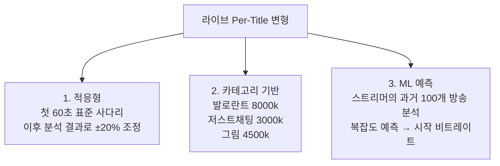
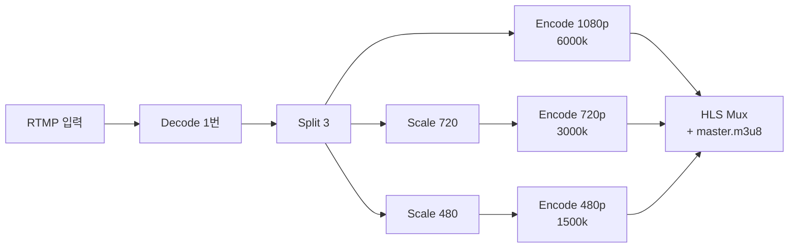
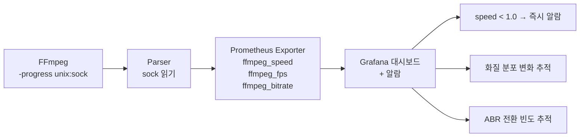
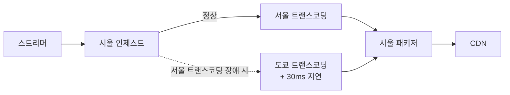

Netflix는 영화 한 편당 약 50번 인코딩한다. 1080p 6Mbps 한 번이 아니라 4K부터 240p까지, 같은 해상도도 비트레이트 5단계씩, 코덱마다 (H.264/H.265/AV1) 따로. 합쳐서 약 50개의 인코딩 결과물이 한 영화에 딸려있다.

게다가 영화마다 그 사다리가 다르다. 토크쇼는 1080p @ 2.5Mbps, 액션 영화는 1080p @ 8Mbps. **콘텐츠 복잡도에 맞춰 비트레이트를 정하는** 이걸 Per-Title Encoding이라고 부른다. Netflix가 2015년 도입한 후 산업 표준이 됐다.

이번 글은 **ABR Ladder 설계**의 모든 것 — 표준 사다리, Per-Title, Shot-Based, FFmpeg/Shaka 구성, 비용 운영까지 — 정리한 노트다. [지난 글](../ffmpeg-deep-dive/)에서 FFmpeg 자체를 봤다면, 이번 글은 그 위에서 실제로 어떤 사다리를 만들지의 결정 가이드다.

---

## 1. ABR Ladder가 뭔지 다시 정리

플랫폼이 한 원본을 여러 화질로 인코딩해서 가지고 있는 목록.

```
[치지직 ABR Ladder 예시]
1080p60 @ 6000 kbps
720p60  @ 3500 kbps
720p30  @ 2500 kbps
480p30  @ 1500 kbps
360p30  @ 800 kbps
```

플레이어가 시청자 네트워크에 맞춰 골라 받는다. [지난 글](../video-quality-bitrate-abr/)에서 개념 봤고, 이번에는 **실제로 어떻게 설계하는지**.

### 사다리를 잘못 짜면

```
[너무 듬성 — 3단계]
1080p @ 6000k / 720p @ 3000k / 360p @ 800k
→ 갭이 큼. 와이파이 흔들리면 바로 360p로 떨어짐
→ 화질 전환 시 시각적 충격

[너무 촘촘 — 10단계]
1080p, 900p, 810p, 720p, 640p, 540p, 480p, 360p, 270p, 180p
→ 인코딩 비용 10배
→ 스토리지 10배
→ CDN 캐시 효율 ↓ (요청 분산)
→ 시청자 체감 차이 거의 없음
```

**적정: 4~5단계.** 1080p, 720p, 480p, 360p가 산업 표준.

---

## 2. Apple HLS Authoring Spec — 업계 출발점

Apple이 제시한 표준 사다리. 모든 플랫폼의 출발점.

| 해상도 | H.264 비트레이트 | HEVC 비트레이트 |
|---|---|---|
| 2160p (4K) | - | 11,500 kbps |
| 1080p | 6,000~10,000 kbps | 6,000 kbps |
| 720p | 4,500 kbps | 3,450 kbps |
| 540p | - | 2,000 kbps |
| 480p | 2,000 kbps | - |
| 432p | - | 1,100 kbps |
| 360p | 1,100 kbps | 730 kbps |
| 270p | - | 365 kbps |
| 240p | 500 kbps | - |
| 234p | - | 145 kbps |

치지직, Twitch가 거의 이 사다리 기반. **HEVC는 같은 화질에 비트레이트가 H.264의 절반.**

---

## 3. Bits per Pixel — 비트레이트 결정의 정량 공식

해상도와 비트레이트의 관계를 수치화.

```
Bits per Pixel (bpp) = 비트레이트 / (가로 × 세로 × fps)

1080p60 @ 6000 kbps:
  6,000,000 / (1920 × 1080 × 60) = 0.048 bpp

720p30 @ 2500 kbps:
  2,500,000 / (1280 × 720 × 30) = 0.090 bpp
```

**같은 화질을 유지하려면 bpp가 일정해야 한다.**

| 코덱 | 권장 bpp |
|---|---|
| H.264 (일반 라이브) | 0.04 ~ 0.06 |
| H.264 (고화질 VOD) | 0.10 ~ 0.15 |
| H.265 | 0.02 ~ 0.04 |
| AV1 | 0.015 ~ 0.025 |

새 사다리 만들 때 이 공식으로 시작점 잡는다.

---

## 4. 콘텐츠 타입별 비트레이트 — 같은 1080p60도 다르다


{
  "tooltip": { "trigger": "axis", "axisPointer": { "type": "shadow" } },
  "grid": { "left": "22%", "right": "10%", "bottom": "12%", "top": "8%" },
  "xAxis": { "type": "value", "name": "비트레이트 (Kbps)" },
  "yAxis": {
    "type": "category",
    "data": ["4K HDR 영화", "빠른 게임 (FPS, 레이싱)", "일반 게임 (전략, MOBA)", "정적 콘텐츠 (토크쇼, 강의)"]
  },
  "series": [{
    "type": "bar",
    "data": [
      { "value": 20000, "itemStyle": { "color": "#ef4444" } },
      { "value": 7000, "itemStyle": { "color": "#f59e0b" } },
      { "value": 5500, "itemStyle": { "color": "#3b82f6" } },
      { "value": 3500, "itemStyle": { "color": "#10b981" } }
    ],
    "label": { "show": true, "position": "right", "formatter": "{c}k" }
  }]
}


빠른 움직임 = P-frame 압축 효율 ↓ = 더 많은 비트 필요. 치지직이 발로란트 1080p60에 8000 Kbps 권장하는 이유 — 카메라 회전 많아서 일반 게임보다 비트 더 필요.

---

## 5. 16:9 가로세로비 + 짝수 픽셀 강제

| 16:9 표준 | 픽셀 |
|---|---|
| 2160p (4K) | 3840×2160 |
| 1440p (QHD) | 2560×1440 |
| 1080p (FHD) | 1920×1080 |
| 720p | 1280×720 |
| 540p | 960×540 |
| 480p | **854**×480 (480÷9×16=853.33, 짝수 반올림) |
| 360p | 640×360 |
| 240p | 426×240 |

H.264/H.265 인코더는 **16×16 매크로블록 단위** 처리. 가로/세로가 짝수 (실제는 16의 배수) 여야 함.

```bash
# FFmpeg에서 자동 짝수 강제
scale=-2:720
# -1: 반올림 (홀수 가능), -2: 강제 짝수
```

세로 영상 (틱톡/쇼츠) 9:16은 별도 사다리.

---

## 6. Convex Hull — 사다리에서 쓸데없는 점 제거

각 (해상도, 비트레이트) 조합의 화질 효율을 그래프로 본다.


각 해상도 곡선의 **가장 효율적인 점들을 잇는 외곽선**이 Convex Hull. 이 라인 위의 점만 사다리에 포함.

```
[제외 대상]
1080p @ 1500 kbps: 화질 너무 떨어짐 (720p @ 1500이 더 나음)
720p @ 6000 kbps: 비트레이트 낭비 (1080p @ 6000이 같은 비트로 더 나음)
```

이 분석으로 사다리 단계를 최소화하면서 효율 극대화. **Netflix가 산업 표준으로 만든 방법.**

---

## 7. Per-Title Encoding — Netflix의 비용 혁명 (2015)

Static 사다리의 비효율을 Netflix가 데이터로 폭로.

```
"피카츄 만화" 영상 1080p @ 5800 kbps
  → 실제로는 1800 kbps로도 같은 화질
  → 4000 kbps 낭비

"폭발 액션" 영상 1080p @ 5800 kbps
  → 실제로는 8000 kbps 필요
  → 모자라서 화질 깨짐
```

매년 수십 PB의 콘텐츠 흐름 × 평균 30% 낭비 = 수십억 달러 CDN 비용. 해결책이 **Per-Title Encoding**.


콘텐츠 복잡도에 맞춰 사다리를 동적 결정.

```
[A 영상: 카페 잡담]  복잡도 낮음
  1080p @ 2500k (일반 사다리는 6000)
  720p  @ 1500k
  480p  @ 800k

[B 영상: 슈퍼히어로 액션]  복잡도 매우 높음
  1080p @ 8000k (일반 사다리는 6000)
  720p  @ 4500k
  480p  @ 2200k
```

### 복잡도 측정 — VMAF 임계점 찾기

```
[1단계: 다양한 비트레이트로 인코딩]
1080p @ 500k, 1000k, 2000k, 4000k, 8000k

[2단계: VMAF 측정]
500k → 45 / 1000k → 65 / 2000k → 82 / 4000k → 92 / 8000k → 96

VMAF 92가 시청자 만족 임계점
→ 이 영상은 1080p @ 4000k가 최적
```

다른 영상은 4000k에서 VMAF 78. 그 영상은 6000k 필요.

### Per-Title 도입 ROI


{
  "tooltip": { "trigger": "axis" },
  "legend": { "data": ["CDN 절감", "분석 + 운영 비용", "순 절감"], "top": 0 },
  "grid": { "left": "12%", "right": "10%", "bottom": "12%", "top": "18%" },
  "xAxis": { "type": "category", "data": ["1 PB", "5 PB", "10 PB", "50 PB", "100 PB"], "name": "월 트래픽" },
  "yAxis": { "type": "value", "name": "월 비용 변화 (USD)" },
  "series": [
    { "name": "CDN 절감", "type": "bar", "data": [6000, 30000, 60000, 300000, 600000], "itemStyle": { "color": "#10b981" } },
    { "name": "분석 + 운영 비용", "type": "bar", "data": [-12000, -12000, -12000, -15000, -20000], "itemStyle": { "color": "#ef4444" } },
    { "name": "순 절감", "type": "line", "smooth": true, "data": [-6000, 18000, 48000, 285000, 580000], "itemStyle": { "color": "#3b82f6" }, "lineStyle": { "width": 3 } }
  ]
}


**손익분기점: 월 트래픽 약 5 PB.** 그 이하면 도입 적자.

```
[Twitch의 부분 적용]
인기 스트리머 (Top 10%): Per-Title 적용 — 트래픽 80%
일반 스트리머: 표준 사다리
```

---

## 8. Shot-Based Encoding — Netflix Dynamic Optimizer (2018)

Per-Title의 진화. 영상 안에서도 비트레이트가 바뀐다.


```
[한 영화 90분 안에서]
0~5초 (타이틀):     480p @ 200k
5분~10분 (대화):    720p @ 1.5M
10분~18분 (산책):  1080p @ 2M
18분~21분 (폭발):  1080p @ 8M
21분~30분 (엔딩):   480p @ 500k
```

카메라 컷(shot) 단위로 비트레이트 + 해상도 독립 결정. CMAF + DASH의 표현력으로 가능. **시청자는 부드럽게 전환**.

산업계 최첨단. Disney+, Apple TV+도 따라가는 중.

---

## 9. 라이브 Per-Title의 변형 — 미래 모름

기본적으로 라이브엔 Per-Title 어렵다 (사전 분석 불가). 3가지 변형.



치지직의 카테고리별 권장 비트레이트가 변형 2번의 흔적.

---

## 10. 모바일 vs 데스크톱 사다리 분리

모바일은 화면 작아서 1080p 의미 없음.

| | 데스크톱 | 모바일 |
|---|---|---|
| 최상위 | 1080p60 @ 6000k | 720p30 @ 2000k |
| 중간 | 720p60 @ 3500k / 720p30 @ 2500k | 480p30 @ 1000k |
| 하위 | 480p30 @ 1500k | 360p30 @ 600k |
| 최저 | - | 240p30 @ 300k |

같은 영상을 두 사다리로 인코딩 → 비용 2배. 근데 모바일 비중 70%면 절감 효과 큼. Apple HLS 권장 — **User-Agent로 모바일 감지 → 다른 master playlist**.

---

## 11. 치지직 실전 사다리 (추정)

발로란트 1080p60 스트리머 기준.


{
  "tooltip": { "trigger": "axis", "axisPointer": { "type": "shadow" } },
  "grid": { "left": "20%", "right": "10%", "bottom": "12%", "top": "8%" },
  "xAxis": { "type": "value", "name": "비트레이트 (Kbps)" },
  "yAxis": {
    "type": "category",
    "data": ["160p30 (데이터 절약)", "360p30", "480p30", "720p30", "720p60", "1080p60 (원본)"]
  },
  "series": [{
    "type": "bar",
    "data": [
      { "value": 230, "itemStyle": { "color": "#94a3b8" } },
      { "value": 800, "itemStyle": { "color": "#94a3b8" } },
      { "value": 1500, "itemStyle": { "color": "#f59e0b" } },
      { "value": 3000, "itemStyle": { "color": "#3b82f6" } },
      { "value": 4500, "itemStyle": { "color": "#10b981" } },
      { "value": 8000, "itemStyle": { "color": "#ef4444" } }
    ],
    "label": { "show": true, "position": "right", "formatter": "{c}k" }
  }]
}


이게 한 명의 인기 스트리머에게 발생하는 트랜스코딩 부담. 동시 방송 스트리머가 수천 명 = 인프라 규모 감.

---

## 12. FFmpeg 한 명령으로 ABR Ladder — 통합 패턴

```bash
ffmpeg -i input.mp4 \
  -filter_complex "\
    [0:v]split=3[v1080][v720_in][v480_in]; \
    [v720_in]scale=1280:720[v720]; \
    [v480_in]scale=854:480[v480]" \
  \
  -map "[v1080]" -map 0:a \
    -c:v libx264 -preset veryfast -tune zerolatency \
    -b:v 6000k -maxrate 6000k -bufsize 12000k \
    -g 120 -keyint_min 120 -sc_threshold 0 \
    -c:a aac -b:a 128k -ar 48000 \
  \
  -map "[v720]" -map 0:a \
    -c:v libx264 -preset veryfast -tune zerolatency \
    -b:v 3000k -maxrate 3000k -bufsize 6000k \
    -g 120 -keyint_min 120 -sc_threshold 0 \
    -c:a aac -b:a 128k \
  \
  -map "[v480]" -map 0:a \
    -c:v libx264 -preset veryfast -tune zerolatency \
    -b:v 1500k -maxrate 1500k -bufsize 3000k \
    -g 120 -keyint_min 120 -sc_threshold 0 \
    -c:a aac -b:a 96k \
  \
  -f hls -hls_time 6 -hls_segment_type fmp4 \
  -hls_flags delete_segments+independent_segments+program_date_time \
  -master_pl_name master.m3u8 \
  -var_stream_map "v:0,a:0,name:1080p v:1,a:1,name:720p v:2,a:2,name:480p" \
  'stream_%v/playlist.m3u8'
```



**디코딩 1번 + 인코딩 3번**. 디코딩 절약이 있지만 인코딩 직렬 처리라 CPU 부담. NVENC GPU 인코더가 필요해지는 지점.

### GOP 정렬이 ABR 부드러운 전환의 비밀

[지난 글](../video-quality-bitrate-abr/)에서 시각화로 다뤘다. 모든 화질이 **같은 시점에 키프레임**을 박아야 ABR 전환이 끊김 없음.

```
모든 화질 동일:
-g 120 -keyint_min 120 -sc_threshold 0
```

### 진짜 CBR — BANDWIDTH는 peak

ABR 매니페스트의 BANDWIDTH 값은 **peak 기준** (평균 아님). 진짜 CBR이 필요.

```bash
-b:v 6000k -maxrate 6000k -minrate 6000k -bufsize 6000k
```

`-minrate` 추가하면 NAL filler로 빈 비트 채움. 트래픽 낭비지만 peak = average.

실전 라이브는 약간 변동 허용:
```bash
-b:v 6000k -maxrate 6000k -bufsize 12000k
```

---

## 13. Shaka Packager 분리 패턴 — 대규모는 분리

```
[FFmpeg 통합]
인코딩 + 패키징 한 프로세스. 작은 라이브에 OK.

[Shaka Packager 분리]
인코딩(FFmpeg) → MP4
패키징(Shaka) → .m4s + .m3u8 + .mpd
```

장점: 독립 스케일링, DRM 통합, LL-HLS 완전 지원.

```bash
# 1단계: FFmpeg 인코딩 (병렬)
ffmpeg -i input.mp4 -c:v libx264 -b:v 6000k -g 120 ... -f mp4 1080p.mp4 &
ffmpeg -i input.mp4 -vf scale=1280:720 -c:v libx264 -b:v 3000k ... -f mp4 720p.mp4 &
ffmpeg -i input.mp4 -vf scale=854:480 -c:v libx264 -b:v 1500k ... -f mp4 480p.mp4 &
wait

# 2단계: Shaka 패키징
packager \
  'in=1080p.mp4,stream=video,init_segment=cmaf/1080p/init.mp4,segment_template=cmaf/1080p/seg_$Number$.m4s' \
  'in=720p.mp4,stream=video,init_segment=cmaf/720p/init.mp4,segment_template=cmaf/720p/seg_$Number$.m4s' \
  'in=480p.mp4,stream=video,init_segment=cmaf/480p/init.mp4,segment_template=cmaf/480p/seg_$Number$.m4s' \
  --hls_master_playlist_output master.m3u8 \
  --mpd_output manifest.mpd \
  --segment_duration 6
```

한 번에 HLS + DASH (CMAF 공유). 스토리지 절반.

### LL-HLS는 Shaka 필수

```bash
packager 'in=1080p.mp4,stream=video,...' \
  --hls_master_playlist_output master.m3u8 \
  --hls_playlist_type LIVE \
  --segment_duration 4 \
  --fragment_duration 0.2 \
  --low_latency_dash_mode
```

`fragment_duration 0.2`가 LL-HLS Partial Segment.

---

## 14. CPU vs GPU 트랜스코딩 비용 — ABR Ladder 1채널 기준


{
  "tooltip": { "trigger": "axis", "axisPointer": { "type": "shadow" } },
  "grid": { "left": "25%", "right": "10%", "bottom": "12%", "top": "8%" },
  "xAxis": { "type": "value", "name": "동시 채널" },
  "yAxis": {
    "type": "category",
    "data": ["NVIDIA T4 GPU", "x264 veryfast (32코어 CPU)", "x264 medium (32코어 CPU)"]
  },
  "series": [{
    "type": "bar",
    "data": [
      { "value": 15, "itemStyle": { "color": "#10b981" } },
      { "value": 4, "itemStyle": { "color": "#3b82f6" } },
      { "value": 1, "itemStyle": { "color": "#94a3b8" } }
    ],
    "label": { "show": true, "position": "right", "formatter": "{c}채널" }
  }]
}


채널당 비용:
- T4 GPU (월 $380): **$25/채널**
- veryfast CPU (월 $500): **$125/채널**
- medium CPU: $500/채널

**GPU 5배 효율**. 대규모 라이브 = GPU 필수.

---

## 15. 사다리 단계 수의 비용 영향


{
  "tooltip": { "trigger": "axis" },
  "legend": { "data": ["인코딩 부하 배수", "스토리지 GB/시간"], "top": 0 },
  "grid": { "left": "12%", "right": "12%", "bottom": "12%", "top": "18%" },
  "xAxis": { "type": "category", "data": ["3단계", "5단계"] },
  "yAxis": [
    { "type": "value", "name": "인코딩 부하", "position": "left", "max": 6 },
    { "type": "value", "name": "스토리지 (GB/h)", "position": "right", "max": 2 }
  ],
  "series": [
    { "name": "인코딩 부하 배수", "type": "bar", "yAxisIndex": 0, "data": [3, 5], "itemStyle": { "color": "#3b82f6" } },
    { "name": "스토리지 GB/시간", "type": "line", "smooth": true, "yAxisIndex": 1, "data": [1.8, 1.43], "itemStyle": { "color": "#10b981" }, "lineStyle": { "width": 3 } }
  ]
}


스토리지는 거의 비슷 (하위 사다리 절대 크기 작음). 인코딩은 정직하게 늘어남. **5단계가 시청자 경험 더 좋지만 인코딩 비용 67% ↑.**

---

## 16. 시청자 화질 분포 — 사다리 최적화의 근거


{
  "tooltip": { "trigger": "item", "formatter": "{b}: {c}% ({d}%)" },
  "legend": { "orient": "vertical", "left": "left", "top": "middle" },
  "series": [{
    "name": "화질 분포",
    "type": "pie",
    "radius": ["40%", "70%"],
    "center": ["62%", "50%"],
    "data": [
      { "value": 35, "name": "1080p60 (PC 와이파이)", "itemStyle": { "color": "#10b981" } },
      { "value": 15, "name": "720p60 (PC 일반)", "itemStyle": { "color": "#3b82f6" } },
      { "value": 20, "name": "720p30 (모바일 와이파이)", "itemStyle": { "color": "#f59e0b" } },
      { "value": 20, "name": "480p30 (모바일 LTE)", "itemStyle": { "color": "#94a3b8" } },
      { "value": 8, "name": "360p30 (약한 신호)", "itemStyle": { "color": "#a78bfa" } },
      { "value": 2, "name": "160p30 (데이터 절약)", "itemStyle": { "color": "#ef4444" } }
    ]
  }]
}


상위 2단계가 시청자 50%. **인코딩 비용이 50% 단계에서 80% 발생**. 근데 1080p 비중 줄이는 게 답 아님 — 그 50%가 매출의 80%일 수 있음 (광고 단가 ↑).

### 하위 단계 통합 — 가장 흔한 최적화

```
[기존]
240p, 180p, 120p (각 1% 미만)

[최적화]
240p 하나로 통합
```

3개 → 1개. 인코딩 비용 절감. 시청자 경험 거의 동일.

---

## 17. 카테고리별 사다리 — 콘텐츠 카테고리에 맞춤


{
  "tooltip": { "trigger": "axis", "axisPointer": { "type": "shadow" } },
  "legend": { "data": ["1080p", "720p", "480p"], "top": 0 },
  "grid": { "left": "12%", "right": "10%", "bottom": "12%", "top": "18%" },
  "xAxis": { "type": "category", "data": ["발로란트 (빠른 액션)", "그림 그리기 (색 변화 ↑)", "저스트 채팅 (정적)"] },
  "yAxis": { "type": "value", "name": "비트레이트 (Kbps)" },
  "series": [
    { "name": "1080p", "type": "bar", "data": [8000, 4500, 3000], "itemStyle": { "color": "#ef4444" } },
    { "name": "720p", "type": "bar", "data": [4500, 2500, 1800], "itemStyle": { "color": "#f59e0b" } },
    { "name": "480p", "type": "bar", "data": [1800, 1200, 1000], "itemStyle": { "color": "#10b981" } }
  ]
}


카테고리에 따라 **평균 30% 비트레이트 절감**. 시청자가 못 느낌.

---

## 18. 운영 모니터링 — 핵심 지표



| 지표 | 정상 | 비정상 |
|---|---|---|
| 인코딩 speed | > 1.0x | < 1.0x (라이브 못 따라감 → 알람) |
| ABR 전환 빈도 | 시청자당 5분에 1회 미만 | 1분에 1회 이상 (단계 사이 갭 큼) |
| 화질 분포 | 70%+ 상위 2단계 | 50%+ 480p (ABR 보수적 or 비트레이트 ↑) |
| 인코딩 에러율 | 0.01% 미만 | OBS 설정 문제 / 입력 PTS 불일치 |

### Per-Stream 헬스체크 — 좀비 감지

```python
def check_stream_health(stream_dir):
    """최근 .m4s 파일이 10초 이내 생성됐는지"""
    files = sorted(os.listdir(stream_dir), key=lambda f: os.path.getmtime(...))
    latest_mtime = os.path.getmtime(...)
    return (time.time() - latest_mtime) < 10
```

CPU는 살아있는데 출력 안 나오는 좀비 상태 감지. 10초 미생성 → FFmpeg 재시작.

---

## 19. A/B 테스트 — 사다리 변경 검증

새 사다리 도입 시 **2주 A/B 테스트**.


{
  "tooltip": { "trigger": "axis" },
  "legend": { "data": ["A: 기존 사다리", "B: −20% 사다리"], "top": 0 },
  "grid": { "left": "12%", "right": "10%", "bottom": "12%", "top": "18%" },
  "xAxis": { "type": "category", "data": ["Rebuffering Ratio (%)", "ABR 전환/5분", "평균 화질 (1080p%)", "CDN 비용 (%)"] },
  "yAxis": { "type": "value", "name": "값" },
  "series": [
    { "name": "A: 기존 사다리", "type": "bar", "data": [0.5, 0.8, 50, 100], "itemStyle": { "color": "#3b82f6" } },
    { "name": "B: −20% 사다리", "type": "bar", "data": [0.7, 1.2, 48, 80], "itemStyle": { "color": "#10b981" } }
  ]
}


```
[결정]
Rebuffering 0.5% → 0.7% (악화)
시청 시간 추정 −3%
매출 추정 −3%

CDN 비용 −20%
ROI: 매출 ↓ 3% × $50M = −$1.5M
     CDN ↓ $200K
→ 적용 안 함
```

화질 절감으로 비용 줄이려다 시청 시간 떨어지면 손해. **데이터 기반 결정**.

---

## 20. Region Failover — 트랜스코딩 데이터센터 장애



인제스트와 트랜스코딩 사이를 **SRT로 연결**하면 region 간 전송 안정성 확보. 장애 시 즉시 다른 region. 5~10초 끊김.

핵심 스트리머는 **active-active** (두 region 동시 트랜스코딩, 비용 2배, 0초 끊김).

---

## 정리하면

ABR Ladder 설계는 **수치 + 운영 + 비용 분석**의 종합이다.

1. **4~5단계가 적정** — 너무 듬성/촘촘 둘 다 손해
2. **Apple HLS Authoring Spec**이 산업 출발점
3. **bpp 일정**으로 화질 균일, 코덱별 다른 권장값
4. **콘텐츠 타입**에 따라 1080p60도 3500~8000k 차이
5. **16:9 + 짝수 픽셀** (FFmpeg `-2:720`)
6. **Convex Hull**로 비효율 단계 제거 — Netflix가 표준화
7. **Per-Title Encoding** — 콘텐츠별 다른 사다리. 손익분기 월 5 PB
8. **Shot-Based Encoding** — 영상 안에서도 shot별 비트레이트
9. **라이브 변형** — 적응형 / 카테고리 / ML 예측 3가지
10. **GOP 정렬** — 모든 화질에 `-g N -keyint_min N -sc_threshold 0` 동일
11. **진짜 CBR** — BANDWIDTH peak 기준이라 `-minrate` 추가
12. **FFmpeg 통합 vs Shaka 분리** — 대규모는 분리 (독립 스케일링 + DRM + LL-HLS)
13. **GPU 5배 효율** — 대규모는 NVENC 필수
14. **사다리 단계 = 인코딩 비용** — 시청자 분포 분석 후 최적화
15. **카테고리별 차등** — 평균 30% 절감, 시청자 못 느낌
16. **모니터링** — speed/ABR 전환/화질 분포/에러율
17. **A/B 테스트** — Rebuffering vs CDN 절감 데이터 기반
18. **Region Failover** — SRT로 region 간 연결

다음 글에선 **NVENC GPU 트랜스코딩의 진짜 깊이** — preset/tune, 4K HDR 옵션, AV1 NVENC — 를 다룬다.

---

**참고**
- [Apple HLS Authoring Specification](https://developer.apple.com/documentation/http-live-streaming/hls-authoring-specification-for-apple-devices)
- [Netflix Per-Title Encoding 블로그 (2015)](https://netflixtechblog.com/per-title-encode-optimization-7e99442b62a2)
- [Netflix Dynamic Optimizer (Shot-Based)](https://netflixtechblog.com/optimized-shot-based-encodes-now-streaming-4938b5fd4c8a)
- [Shaka Packager 공식 문서](https://shaka-project.github.io/shaka-packager/html/)
- [FFmpeg HLS muxer 문서](https://ffmpeg.org/ffmpeg-all.html#hls-2)
