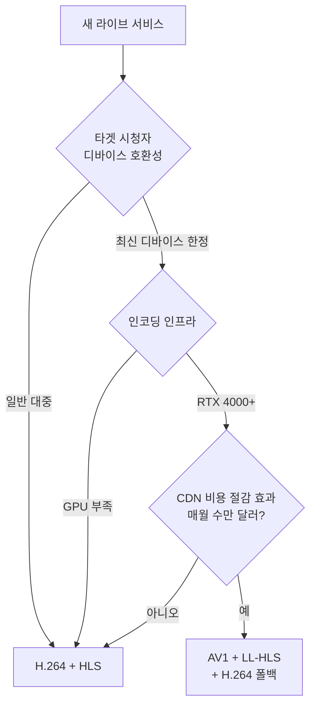

영상 코덱의 역사는 단순했다. ITU + ISO가 H.264 만들고, H.265 만들고. 모두 그걸 쓰면 됐다.

근데 H.265가 [이전 글](../h265-hdr-deep-dive/)에서 본 것처럼 **라이센스 지옥**이라 산업이 안 받았다. 콘텐츠 매출의 0.5% 로열티는 너무 컸다.

여기서 갈라진다. **Google이 VP9**을 만들고 YouTube에 적용. **AOMedia 컨소시엄 30+ 기업이 AV1**을 만들고 차세대 표준으로 밀고 있다. 둘 다 완전 무료.

이번 글은 **MPEG 진영의 라이센스 지옥을 피하려고 만든 무료 코덱들**의 진화 — VP8 → VP9 → AV1, 그리고 그 부산물인 **AVIF(이미지 포맷)**이 어떻게 JPEG을 대체하고 있는지 — 정리한 노트다.

---

## 1. Google의 코덱 인수 — 2010년 On2 Technologies

Google이 YouTube를 운영하면서 직접 부딪힌 문제: **H.264 라이센스 비용**.

```
2010년 YouTube 추정 라이센스 비용:
- 디바이스 수 × $0.10 = 일부
- 사용자 콘텐츠 거의 무한 → 콘텐츠 로열티 부담
- 매년 수천만 달러
```

Google이 해결책으로 **On2 Technologies를 1.24억 달러에 인수** (2010년). On2의 VP6/VP7/VP8 코덱을 무료 오픈소스로 공개.

```
[Google의 무료 코덱 흐름]
2010년: VP8 오픈소스 공개 (전 On2)
2012년: VP9 (자체 개발) → YouTube 적용
2015년: AOMedia 결성 → AV1로 진화
```

---

## 2. VP9 — 2012년 H.265 대항

VP9의 위치 정리.

| 항목 | H.264 | H.265 | VP9 |
|---|---|---|---|
| 같은 화질 비트레이트 | 100% | 50% | **55%** |
| 인코딩 속도 | 빠름 | 보통 | 보통 |
| 라이센스 | 만료된 풀 | **복잡한 3중 풀** | **완전 무료** |
| 디코더 보급 | 100% | ~90% | ~75% |
| 라이브 인프라 | 표준 | 일부 OTT | YouTube 외 거의 없음 |

H.265 대비 압축 효율은 비슷 (살짝 미달). **차이는 무료**.

### YouTube의 VP9 채택

YouTube는 VP9 강제 적극 도입.

```
[YouTube의 VP9 활용 - 추정]
4K 60fps 영상: VP9 (60% 비트레이트 절감 vs H.264)
1080p HDR: VP9 + HDR10
1080p 일반: VP9 (모바일 데이터 절약)
저화질: H.264 (호환성)
```

YouTube가 VP9에 적극적인 이유: **자체 디코더(Chrome)**. Chrome에 VP9 디코더 강제 탑재. YouTube ↔ Chrome 수직 통합.

### VP9의 한계

YouTube 외 거의 안 쓰임. 이유:

1. **하드웨어 인코더 부재**: NVENC VP9 없음. 라이브 송출 불가
2. **iOS 미지원**: Safari 디코더 없음 (Apple이 H.265 진영)
3. **Twitch/Netflix 안 씀**: H.265나 AV1로 직행
4. **AV1로 흡수**: 차세대로 가는 길의 중간 단계로 인식

VP9은 "**YouTube 전용 코덱**"이 된 모양. AV1이 등장하면서 점진 대체 중.

---

## 3. AV1 이전의 분열 — 2015년 즈음

```
[코덱 전선 - 2015년]
H.265 진영: Apple, Netflix, Disney, 방송사
VP9 진영: Google, Mozilla, Cisco

H.265: 라이센스 + 복잡한 풀
VP9: 보급률 낮음

→ 산업 분열, 모두에게 비효율
```

여기서 새 동맹.

---

## 4. AOMedia 결성 — 2015년

**AOMedia (Alliance for Open Media)**: H.265 라이센스 부담을 함께 피하려는 거대 기업 연합.

| 분야 | 참여 기업 |
|---|---|
| **콘텐츠 (CDN/OTT)** | Netflix, Amazon, Hulu, Disney |
| **브라우저** | Google, Mozilla, Microsoft |
| **칩셋** | Intel, NVIDIA, AMD, ARM, Samsung |
| **운영체제/모바일** | Apple (2018 합류), Google, Microsoft |
| **방송/장비** | Cisco, Tencent, Bitmovin |

총 **40+ 기업 합류**. 매년 회비를 내고 공동 특허 풀 운영. **참여 기업끼리 서로 무료 사용**.

핵심 사건: **2018년 Apple 합류**. H.265 진영의 보스가 AV1로 옮겨감. AV1이 진짜 표준이 될 가능성 생김.

---

## 5. AV1의 발표 — 2018년

3년 개발 후 표준 1.0 완성.

```
공식 명칭: AV1 (AOMedia Video 1)
표준 발표: 2018년 3월
라이센스: 완전 무료 (AOMedia 참여 기업)
오픈소스 구현: libaom, SVT-AV1, dav1d (디코더)
```

기존 기술 통합:
- Google의 VP10 (취소된 후속)
- Mozilla의 Daala
- Cisco의 Thor

세 코덱을 합쳐서 AV1.

### AV1 vs H.265 vs VP9 — 압축률 비교


{
  "tooltip": { "trigger": "axis", "axisPointer": { "type": "shadow" } },
  "grid": { "left": "15%", "right": "10%", "bottom": "12%", "top": "8%" },
  "xAxis": { "type": "value", "name": "비트레이트 (%)", "max": 110 },
  "yAxis": {
    "type": "category",
    "data": ["VVC (H.266)", "AV1", "H.265 (HEVC)", "VP9", "H.264 (AVC)"]
  },
  "series": [{
    "type": "bar",
    "data": [
      { "value": 35, "itemStyle": { "color": "#8b5cf6" } },
      { "value": 45, "itemStyle": { "color": "#10b981" } },
      { "value": 55, "itemStyle": { "color": "#f59e0b" } },
      { "value": 60, "itemStyle": { "color": "#3b82f6" } },
      { "value": 100, "itemStyle": { "color": "#94a3b8" } }
    ],
    "label": { "show": true, "position": "right", "formatter": "{c}%" }
  }]
}


AV1이 H.265보다 약 30% 추가 절감. H.264 대비 50% 이상.

```
[4K 영상 시청자 1명당 데이터]
H.264: 25 Mbps
H.265: 12 Mbps
VP9: 14 Mbps
AV1: 10 Mbps
```

대규모 OTT에 매년 수십억 달러 절감 가능.

---

## 6. AV1의 엄청난 부담 — 인코딩 시간

압축률은 좋은데 **인코딩이 극도로 느리다**.


{
  "tooltip": { "trigger": "axis", "axisPointer": { "type": "shadow" } },
  "grid": { "left": "20%", "right": "10%", "bottom": "12%", "top": "8%" },
  "xAxis": { "type": "log", "name": "인코딩 시간 (분)", "min": 1 },
  "yAxis": {
    "type": "category",
    "data": ["AV1 (libaom default)", "AV1 (libaom preset 6)", "AV1 (SVT-AV1)", "AV1 (NVENC RTX 4090)", "H.265 (x265 medium)", "H.264 (x264 medium)"]
  },
  "series": [{
    "type": "bar",
    "data": [
      { "value": 12000, "itemStyle": { "color": "#ef4444" } },
      { "value": 600, "itemStyle": { "color": "#f59e0b" } },
      { "value": 120, "itemStyle": { "color": "#fbbf24" } },
      { "value": 5, "itemStyle": { "color": "#10b981" } },
      { "value": 150, "itemStyle": { "color": "#3b82f6" } },
      { "value": 30, "itemStyle": { "color": "#94a3b8" } }
    ],
    "label": { "show": true, "position": "right", "formatter": "{c}분" }
  }]
}


libaom 기본 설정은 1시간 영상에 200시간(!). 실용 불가. **이게 AV1 보급의 가장 큰 장벽**.

해결 흐름:

### SVT-AV1 — Intel + Netflix의 해결

2019년 Intel과 Netflix가 빠른 AV1 인코더 발표.

```
[SVT-AV1]
- libaom 대비 5~10배 빠름
- 화질은 약간 떨어짐 (3~5%)
- 실시간 1080p AV1 인코딩 가능 (고성능 서버)
- 오픈소스
```

이게 AV1 보급의 결정타.

```bash
# SVT-AV1 (실용적)
ffmpeg -i input.mp4 \
  -c:v libsvtav1 \
  -preset 7 \
  -crf 35 \
  output.mp4

# libaom (느리지만 화질 최고)
ffmpeg -i input.mp4 \
  -c:v libaom-av1 \
  -crf 30 \
  -b:v 0 \
  output.mp4
```

대부분 SVT-AV1 사용.

### 하드웨어 인코더 — 2022년부터

| 하드웨어 | AV1 인코더 | 출시 |
|---|---|---|
| **NVIDIA Ada (RTX 4000)** | av1_nvenc | 2022 |
| **Intel Arc GPU** | av1_qsv | 2022 |
| **Intel 13세대 CPU+ (Quick Sync)** | av1_qsv | 2022 |
| **AMD RDNA 3+ (RX 7000)** | av1_amf | 2022 |
| **Apple M3+ (일부)** | av1_videotoolbox | 2023 |

GPU 인코더로 **실시간 4K AV1 가능**.

```bash
# NVIDIA AV1
ffmpeg -i input.mp4 \
  -c:v av1_nvenc \
  -preset p4 \
  -b:v 2000k \
  output.mp4
```

---

## 7. AV1 디코딩 부담

다행히 디코딩은 인코딩만큼 무겁지 않음.

```
[디코딩 CPU 부하 — 1080p60]
H.264: 매우 낮음
H.265: 보통
AV1: 보통 (H.265보다 약간 더)
VP9: 보통
```

근데 **하드웨어 디코더 보급이 늦음**.

| 디바이스 | AV1 하드웨어 디코더 보급 |
|---|---|
| 스마트TV (LG/Samsung 신모델) | 2021년 이후 |
| iPhone | **15 Pro부터** (2023) |
| Android | Galaxy S22+ (2022) |
| PC GPU | RTX 3000+ / RX 6000+ / Intel Arc |
| 구형 기기 | **디코딩 불가** |

저가폰은 여전히 AV1 못 본다. AV1 활성화하면 시청자 30%가 못 봄. 이게 라이브 도입 발목.

---

## 8. AV1 적용 현황 — 2024년

| 서비스 | AV1 채택 | 비고 |
|---|---|---|
| **YouTube** | ✅ 4K HDR 일부 | 시청자 디바이스 자동 감지 |
| **Netflix** | ✅ 모바일 + 4K HDR 도입 중 | 30% 적은 데이터 (vs H.265) |
| **Twitch** | ⭕ 베타 | RTX 4000 스트리머만 |
| **Discord** | ✅ 화면 공유 | AV1 NVENC 활용 |
| **Vimeo** | ✅ Pro 플랜 | |
| **Cloudflare Stream** | ✅ | |
| **치지직 / SOOP** | ❌ | H.264만 |
| **방송 (지상파)** | ❌ | H.265 또는 H.264 |

---

## 9. Twitch AV1 베타 — 실제 사례

```
[Twitch AV1 베타 2023~]
대상: RTX 4000 시리즈 보유 스트리머
시청자: AV1 지원 브라우저
효과: 같은 화질에 50% 대역폭

[제약]
스트리머: 비싼 GPU 필요 ($1000+)
시청자: 최신 디바이스 (도달률 60%)
호환성: 자동 폴백 (H.264로)

[결과]
점진적 확대 중
2025년 일반 보급 예상
```

AV1 송출 + 폴백 패턴.

---

## 10. AVIF — AV1의 이미지 포맷 부산물

AV1 영상 기술을 단일 이미지에 적용한 게 **AVIF**.

```
AVIF (AV1 Image Format)
- AV1의 키프레임(intra-frame)을 이미지로 사용
- JPEG 대비 50% 작음
- HDR 지원
- 무손실/손실 모두 가능
- 라이센스 무료
```


같은 30KB 파일 크기에서 JPEG은 banding/blocking이 명확히 보이고, AVIF는 부드럽다. **AV1의 압축 효율을 이미지에도 그대로 가져옴**.

### 브라우저 지원

| 브라우저 | AVIF 지원 |
|---|---|
| Chrome | 85+ (2020) |
| Firefox | 93+ (2021) |
| Safari | 16+ (2022) |
| Edge | 121+ (2024) |
| iOS Safari | 16+ (2022) |

모든 메이저 브라우저 지원. JPEG 대체 본격화.

### AVIF 인코딩

```bash
# FFmpeg로 AVIF
ffmpeg -i input.jpg -c:v libaom-av1 -still-picture 1 -crf 30 output.avif

# 전용 도구 (더 빠름)
avifenc input.jpg output.avif
```

웹 이미지 표준의 점진적 교체. CDN에서 자동 변환 + content-negotiation.

```nginx
# Nginx 자동 변환 예시
location ~* \.(jpg|png)$ {
  if ($http_accept ~* "image/avif") {
    rewrite ^(.+)\.(jpg|png)$ $1.avif last;
  }
}
```

---

## 11. AV1 코덱 문자열 — MIME 표기

```
av01.0.05M.08
└──┘ │ │   │
  │  │ │   └── 08 = bit depth (8-bit)
  │  │ └────── 05M = Level (4.0 Main)
  │  └──────── 0 = Profile (Main)
  └─────────── av01 = AV1
```

브라우저 지원 확인:

```javascript
MediaSource.isTypeSupported('video/mp4; codecs="av01.0.05M.08"')
// true면 디코더 있음
```

---

## 12. 코덱 종합 비교 — 2024년 현황

| 항목 | H.264 | H.265 | VP9 | AV1 | VVC (H.266) |
|---|---|---|---|---|---|
| 발표 | 2003 | 2013 | 2012 | 2018 | 2020 |
| 압축률 | 100% | 50% | 55% | **45%** | 35% |
| 인코딩 속도 | ⭐⭐⭐⭐⭐ | ⭐⭐⭐ | ⭐⭐⭐ | ⭐⭐ | ⭐ |
| 라이센스 | 만료 | **3중 풀** | **무료** | **무료** | 복잡 |
| 디코더 보급 | 100% | 90% | 75% | 60% | <10% |
| 하드웨어 인코더 | 어디든 | NVENC | ❌ | RTX 4000+ | 거의 없음 |
| 라이브 적합성 | ⭐⭐⭐⭐⭐ | ⭐⭐ | ⭐ | ⭐⭐ | ⭐ |

각 코덱의 강점이 다름.

---

## 13. 실무 결정 가이드



### 시나리오별 추천

| 시나리오 | 코덱 추천 |
|---|---|
| 한국 라이브 (치지직/SOOP) | H.264 |
| 글로벌 OTT 4K HDR | AV1 또는 H.265 |
| 화상회의 (Zoom) | AV1 SVC (Google Meet) |
| 모바일 라이브 | H.264 + AV1 폴백 |
| 8K 이상 미래 | AV1 또는 VVC |
| 웹 이미지 | AVIF (JPEG 점진 교체) |

치지직 = AV1 불필요. 향후 5년도 H.264 유지가 정답.  
YouTube/Netflix = AV1 도입 진행 중.

---

## 14. AV1의 미래 — 라이브 스트리밍 진입 가능성

```
[AV1 라이브 도입 조건]
1. 송신: 고성능 GPU 인코더 (RTX 4000+, 보급 30%)
2. 서버: AV1 트랜스코딩 인프라
3. CDN: AV1 콘텐츠 지원
4. 시청자: AV1 디코더 (보급 60%)

[현재 상황]
조건 1, 2, 3: 가능
조건 4: 시청자 보급 60% (40% 못 봄)

→ 2027~2030년 본격 보급 예상
```

---

## 15. Sisvel — AV1에 대한 라이센스 위협

AV1이 무료라고 했는데 100% 무료는 아니다.

```
[Sisvel - AV1 특허 풀]
2020년: Sisvel이 "AV1에 자기 특허가 들어갔다" 주장
요구: 시청자 디바이스당 $0.05
참여 기업: SK Telecom, ETRI 등 일부
```

AOMedia는 "특허 문제 없다"고 반박. 법적 분쟁은 아직 없음. 실제 부담은 미미.

```
[현실]
- AOMedia 멤버 (대부분 대기업): 무료
- Sisvel 청구: 작은 회사가 직접 부담 가능
- 한국 회사 (SK Telecom 참여): 협상 가능
```

H.265만큼 끔찍하진 않지만 완전 무료의 환상은 깨짐.

---

## 16. 미래 — 코덱 경쟁 구도

| 코덱 | 만든 곳 | 상태 |
|---|---|---|
| **AV1** | AOMedia (40+ 기업) | 2024 보급 중 |
| **VVC (H.266)** | MPEG/ITU | 2020 발표, 라이센스 다시 복잡, 더딘 보급 |
| **EVC (MPEG-5)** | MPEG | Baseline 무료 / Main 유료, AV1과 경쟁 |
| **LCEVC** | V-Nova | 기존 코덱 위 화질 레이어 추가 |
| **AV2** | AOMedia | 2025+ 예정, AV1보다 30% 더 |

당분간 **H.264 + H.265 + AV1 + VP9 공존**. 코덱 통일은 없을 듯.

---

## 정리하면

AV1은 **MPEG 진영의 라이센스 지옥을 피하려고 40개 기업이 합심해서 만든 무료 표준**이다.

1. **흐름** — VP8 (2010) → VP9 (2012) → AV1 (2018) → AV2 (2025+)
2. **AOMedia** — Google + Amazon + Apple + Netflix + Microsoft + Mozilla 등 40+ 기업
3. **압축률** — H.265 대비 30%, H.264 대비 50% 비트레이트 절감
4. **인코딩 부담** — libaom 200x 느림 → SVT-AV1 5x → NVENC 1x
5. **하드웨어** — RTX 4000+ / Intel Arc / Apple M3+ (2022~)
6. **디코더 보급** — 60% (저가 디바이스 미지원)
7. **AVIF** — AV1의 이미지 포맷 부산물. JPEG 대체 진행 중
8. **VP9** — YouTube 전용으로 남음, AV1으로 흡수
9. **Sisvel** — 일부 특허 위협, 완전 무료의 환상은 깨짐
10. **한국 라이브** — H.264 유지가 정답. AV1은 시기상조

다음 글부터는 **트랜스코딩 인프라 운영** — FFmpeg, NVENC, ABR Ladder, Per-Title Encoding 등 — 으로 들어간다.

---

**참고**
- [AV1 표준 (AOMedia)](https://aomediacodec.github.io/av1-spec/)
- [SVT-AV1 GitHub (Intel + Netflix)](https://gitlab.com/AOMediaCodec/SVT-AV1)
- [AOMedia 공식 사이트](https://aomedia.org/)
- [AVIF 브라우저 지원 현황](https://caniuse.com/avif)
- [Netflix AV1 도입 블로그](https://netflixtechblog.com/svt-av1-an-open-source-av1-encoder-and-decoder-ad295d9b5ca2)
