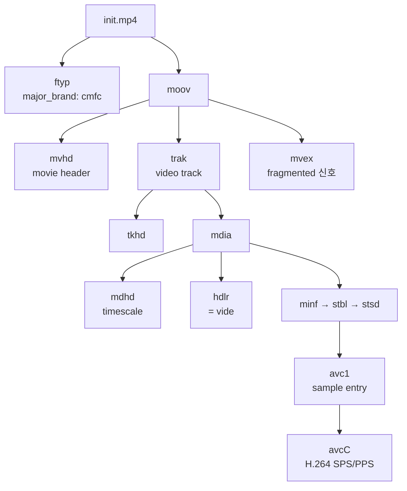
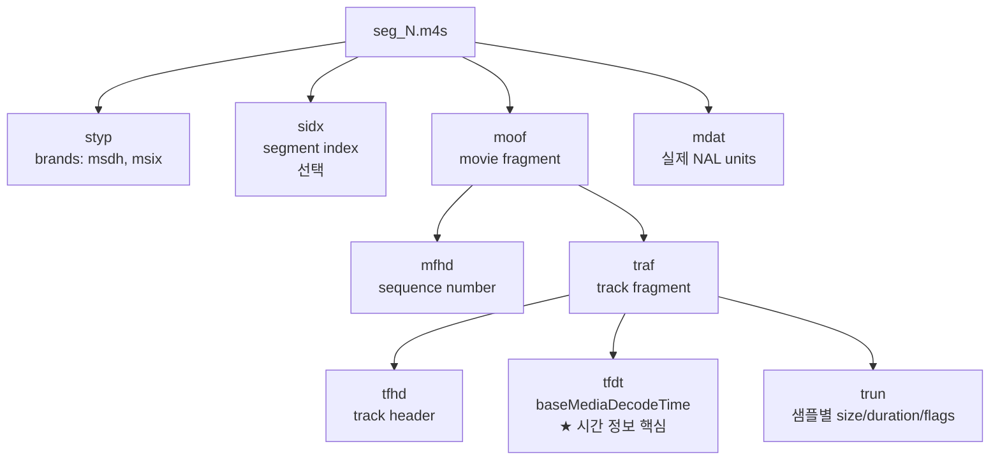
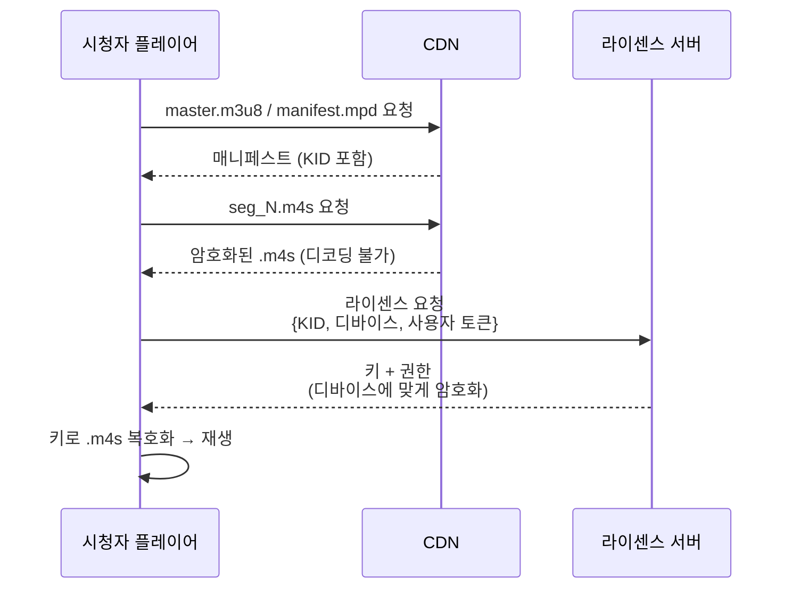
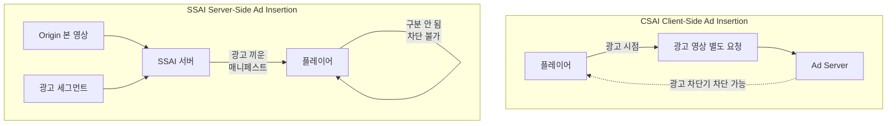
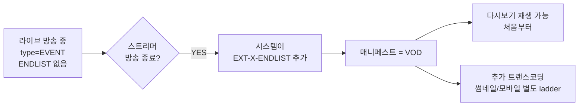
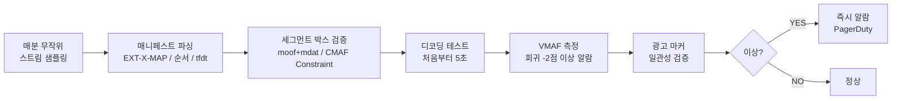

2015년까지 OTT는 콘텐츠 한 편을 두 번 인코딩했다. iPhone 시청자를 위한 HLS용 `.ts` 한 번, Android·Smart TV용 DASH용 `.m4s` 한 번. **인코딩 2배, 스토리지 2배, CDN 캐시 2배.** Netflix·Disney+ 규모면 매년 수억 달러 낭비.

2016년 Apple과 Microsoft가 공동 제안한 **CMAF (Common Media Application Format)**가 이 분열을 끝냈다. 같은 `.m4s` 파일을 HLS와 DASH가 공유. 매니페스트만 다르고 미디어는 하나. Disney+ 추정 인코딩 비용 **40% 절감**.

거기다 CMAF가 없었으면 **LL-HLS (저지연 HLS)**도 불가능했다. 6초 세그먼트를 200ms 청크로 잘라서 점진 전송하는 chunked CMAF가 LL-HLS의 핵심 기반.

이번 글은 [지난 글](../hls-just-files/)에서 다룬 HLS, [지난 글](../dash-vs-hls/)의 DASH 분열 위에서 등장한 **CMAF의 모든 것** — 박스 구조, chunked CMAF, DRM 통합, 광고 삽입, 운영까지 — 정리한 노트다.

---

## 1. CMAF가 끝낸 HLS/DASH 분열


**Before (2015):**

| 진영 | 컨테이너 | 매니페스트 | 디바이스 |
|---|---|---|---|
| Apple HLS | MPEG-TS (`.ts`) | `.m3u8` | iOS, Safari, Apple TV |
| Google/MS DASH | fMP4 (`.m4s`) | `.mpd` | Android Chrome, Smart TV, Xbox |

같은 영상을 두 번 인코딩 → 두 번 저장 → CDN 캐시도 따로.

**After (2016+):**

```
encoding/
├── master.m3u8       ← HLS 매니페스트
├── manifest.mpd      ← DASH 매니페스트
└── segments/
    ├── init.mp4      ← 초기화 (공유)
    ├── seg_1.m4s     ← 미디어 (공유)
    ├── seg_2.m4s
    └── ...
```

가능했던 이유: **HLS v7 (2016)이 fMP4 지원**. iOS 10 이상이면 OK. 8년 전 디바이스 이하만 호환성 신경.

---

## 2. CMAF 도입 효과 — 실제 절감 수치


{
  "tooltip": { "trigger": "axis", "axisPointer": { "type": "shadow" } },
  "grid": { "left": "22%", "right": "10%", "bottom": "12%", "top": "8%" },
  "xAxis": { "type": "value", "name": "변화 (%)", "min": -60, "max": 120 },
  "yAxis": {
    "type": "category",
    "data": ["신규 콘텐츠 처리량", "CDN 캐시 히트율", "스토리지 비용", "인코딩 비용"]
  },
  "series": [{
    "type": "bar",
    "data": [
      { "value": 100, "itemStyle": { "color": "#10b981" } },
      { "value": 30, "itemStyle": { "color": "#10b981" } },
      { "value": -50, "itemStyle": { "color": "#ef4444" } },
      { "value": -40, "itemStyle": { "color": "#ef4444" } }
    ],
    "label": { "show": true, "position": "right", "formatter": "{c}%" }
  }]
}


음수 = 절감, 양수 = 증가. 인코딩 1번이면 처리량 2배, 스토리지 절반.

---

## 3. fMP4가 가능했던 이유 — 일반 MP4와의 차이

| 구분 | 일반 MP4 | fMP4 |
|---|---|---|
| 메타데이터 | `moov` 전체 미디어 정보 | `moov` (init) + `moof` (조각별) |
| 재생 시작 | `moov` 다 받아야 | 첫 조각만 받으면 |
| 시킹 | `moov` 인덱스로 | `sidx` + 조각 독립 |
| 스트리밍 | 어려움 | 최적 |
| 세그먼트화 | 불가 | 자연스러움 |

fMP4 = **moov 분리 + 조각마다 moof 메타데이터**. 각 조각이 독립 디코딩.

---

## 4. init.mp4 박스 트리



`avcC`가 H.264 SPS/PPS 들고 있음 → 디코더 초기화의 핵심. `mvex` 박스가 없으면 일반 MP4로 인식됨.

---

## 5. .m4s 미디어 세그먼트 박스 트리



핵심 박스:
- **`tfdt`**: 이 세그먼트의 시작 시간 — ABR 전환, 시킹에 필수
- **`trun`**: mdat 안의 NAL unit 자르는 정보
- **`mdat`**: H.264 NAL units (IDR + P-frame들)

---

## 6. fMP4 박스 빠른 참조

| 박스 | 위치 | 역할 |
|---|---|---|
| `ftyp` | init.mp4 | 파일 타입, CMAF면 `cmfc` |
| `moov` | init.mp4 | 초기화 메타데이터 |
| `mvex` | moov 안 | fragmented임을 신호 |
| `avcC` | stsd 안 | H.264 SPS/PPS |
| `styp` | .m4s | 세그먼트 타입, `msdh`/`msix` |
| `sidx` | .m4s | 세그먼트 인덱스 (선택) |
| `moof` | .m4s | 조각 메타데이터 |
| `tfdt` | traf 안 | 디코드 시작 시간 |
| `trun` | traf 안 | 샘플별 정보 |
| `mdat` | .m4s | 실제 미디어 데이터 |

```bash
# 박스 분석
MP4Box -info input.mp4              # GPAC
mp4dump --verbose input.m4s | head  # Bento4
ffprobe -show_format -of json *.m4s
```

라이브 디버깅에서 일상 도구.

---

## 7. timescale — 시간 단위의 함정

```
timescale: 90000  →  1초 = 90000

예시:
sample_duration 3000      → 3000/90000 = 1/30초 (30fps)
sample_duration 1500      → 1/60초 (60fps)
baseMediaDecodeTime 7200000 → 80초
```

비디오 90000 (MPEG 표준), 오디오 48000 (샘플레이트). **서로 다른 timescale 정확히 동기화**가 트랜스코더의 일.

---

## 8. CMAF Constraint — 표준 준수 7항목

| # | 규칙 | 위반 시 |
|---|---|---|
| 1 | 모든 세그먼트가 IDR(키프레임)로 시작 | ABR 전환 불가 |
| 2 | moof + mdat 박스 순서 준수 | 일부 플레이어 거부 |
| 3 | mfhd sequence_number 순차 증가 | 순서 혼란 |
| 4 | tfdt baseMediaDecodeTime 정확 | 시간 점프 |
| 5 | timescale 일관성 | 동기화 깨짐 |
| 6 | init.mp4에 mvex 박스 필수 | fragmented 인식 안 됨 |
| 7 | .m4s styp에 msdh/msix 브랜드 | CMAF 호환 안 됨 |

**Shaka Packager가 자동 보장**. 직접 fMP4 만들면 실수하기 쉬움.

---

## 9. MPEG-TS vs fMP4 — 어디서 뭘 쓰나

| 항목 | MPEG-TS | fMP4 |
|---|---|---|
| 오버헤드 | 2% (188바이트 패킷 헤더) | 0.5% (moof 박스) |
| 시킹 | 패킷 단위 파싱 | sidx 즉시 |
| 메타데이터 | 단순 (PID) | 풍부 |
| 오류 복구 | 패킷 단위 가능 | 박스 손상 시 fragment 전체 |
| 호환성 | 모든 디바이스 | iOS 10+, Android 5+ |

```
인제스트(스트리머 → 플랫폼): MPEG-TS (RTMP/SRT 위)
배포(플랫폼 → 시청자): fMP4/CMAF
```

각 단계에 맞는 컨테이너.

---

## 10. Chunked CMAF — LL-HLS의 기반


일반 CMAF는 6초 인코딩 다 끝나야 .m4s 생성. 지연 18~25초.

**Chunked CMAF**: 한 .m4s 안에 (moof + mdat) 청크 30개. 200ms 청크가 만들어지자마자 HTTP/1.1 chunked encoding으로 즉시 전송.

```
[일반 .m4s]
moof + mdat (전체 6초)

[Chunked .m4s]
moof + mdat (청크 1, 0~200ms)
moof + mdat (청크 2, 200~400ms)
moof + mdat (청크 3, 400~600ms)
...
```

플레이어가 청크 받자마자 디코더에 넘김. **세그먼트 완성 대기 0초**.

---

## 11. LL-HLS 지연 분해 — 1.9초의 정체


{
  "tooltip": { "trigger": "axis", "axisPointer": { "type": "shadow" } },
  "grid": { "left": "20%", "right": "10%", "bottom": "12%", "top": "8%" },
  "xAxis": { "type": "value", "name": "지연 (ms)" },
  "yAxis": {
    "type": "category",
    "data": ["디코딩", "플레이어 버퍼", "CDN 전송", "청크 패키징", "NVENC 인코딩", "인제스트→트랜스코딩", "RTMP/SRT 전송", "OBS 인코딩"]
  },
  "series": [{
    "type": "bar",
    "data": [
      { "value": 50, "itemStyle": { "color": "#94a3b8" } },
      { "value": 1000, "itemStyle": { "color": "#ef4444" } },
      { "value": 200, "itemStyle": { "color": "#f59e0b" } },
      { "value": 100, "itemStyle": { "color": "#3b82f6" } },
      { "value": 200, "itemStyle": { "color": "#10b981" } },
      { "value": 200, "itemStyle": { "color": "#a78bfa" } },
      { "value": 100, "itemStyle": { "color": "#76b900" } },
      { "value": 50, "itemStyle": { "color": "#94a3b8" } }
    ],
    "label": { "show": true, "position": "right", "formatter": "{c}ms" }
  }]
}


총 **약 1.9초**. 플레이어 버퍼가 최대 비중. 더 줄이려면 WebRTC.

---

## 12. 프로토콜별 지연 비교


{
  "tooltip": { "trigger": "axis", "axisPointer": { "type": "shadow" } },
  "grid": { "left": "22%", "right": "10%", "bottom": "12%", "top": "8%" },
  "xAxis": { "type": "value", "name": "지연 (초, log)", "type": "log" },
  "yAxis": {
    "type": "category",
    "data": ["WebRTC", "LL-DASH", "LL-HLS", "DASH (일반)", "HLS (일반)"]
  },
  "series": [{
    "type": "bar",
    "data": [
      { "value": 0.3, "itemStyle": { "color": "#10b981" } },
      { "value": 2, "itemStyle": { "color": "#3b82f6" } },
      { "value": 2, "itemStyle": { "color": "#3b82f6" } },
      { "value": 15, "itemStyle": { "color": "#f59e0b" } },
      { "value": 22, "itemStyle": { "color": "#ef4444" } }
    ],
    "label": { "show": true, "position": "right", "formatter": "{c}s" }
  }]
}


LL-HLS는 일반 HLS의 **10배 개선**. WebRTC는 또 그 10배.

---

## 13. LL-HLS 매니페스트 — EXT-X-PART

청크를 매니페스트에 노출.

```
#EXTM3U
#EXT-X-VERSION:9
#EXT-X-TARGETDURATION:6
#EXT-X-SERVER-CONTROL:CAN-BLOCK-RELOAD=YES,PART-HOLD-BACK=1.0
#EXT-X-PART-INF:PART-TARGET=0.2

#EXT-X-MAP:URI="init.mp4"

#EXTINF:6.0,
seg_1.m4s
#EXTINF:6.0,
seg_2.m4s

# 진행 중인 세그먼트의 청크들
#EXT-X-PART:DURATION=0.2,URI="seg_3.m4s",BYTERANGE="50000@0"
#EXT-X-PART:DURATION=0.2,URI="seg_3.m4s",BYTERANGE="42000@50000"
#EXT-X-PART:DURATION=0.2,URI="seg_3.m4s",BYTERANGE="47000@92000"

#EXT-X-PRELOAD-HINT:TYPE=PART,URI="seg_3.m4s",BYTERANGE-START=139000
#EXT-X-RENDITION-REPORT:URI="720p/playlist.m3u8",LAST-MSN=42,LAST-PART=14
```

| 태그 | 역할 |
|---|---|
| `EXT-X-PART` | 청크 위치 (URI + byterange) |
| `EXT-X-PART-INF` | 청크 길이 정보 |
| `EXT-X-PRELOAD-HINT` | 다음 청크 미리 알림 |
| `EXT-X-SERVER-CONTROL` | Blocking reload 허용 |
| `EXT-X-RENDITION-REPORT` | 다른 화질 진행 상황 |

---

## 14. Blocking Playlist Reload — 폴링 없이 push

```
GET /playlist.m3u8?_HLS_msn=42&_HLS_part=15
```

"시퀀스 42의 파트 15보다 새 게 나올 때까지 대기."

서버가 응답을 보류했다가 새 청크 생기면 즉시 회신. 클라이언트 폴링 없이 **push 효과**. 대신 서버는 long polling 처리 필요.

```bash
# Shaka Packager로 chunked CMAF 인코딩
packager \
  'in=video.mp4,stream=video,init_segment=init.mp4,segment_template=seg_$Number$.m4s' \
  --hls_master_playlist_output master.m3u8 \
  --hls_playlist_type LIVE \
  --segment_duration 6 \
  --fragment_duration 0.2 \
  --low_latency_dash_mode
```

---

## 15. CDN 캐시 TTL — 매니페스트 vs 세그먼트 분리


{
  "tooltip": { "trigger": "axis" },
  "legend": { "data": ["매니페스트", "세그먼트"], "top": 0 },
  "grid": { "left": "12%", "right": "10%", "bottom": "12%", "top": "18%" },
  "xAxis": { "type": "category", "data": ["TTL 0초", "TTL 1초", "TTL 2초", "TTL 6초", "TTL 60초", "TTL 86400초"] },
  "yAxis": { "type": "value", "name": "캐시 히트율 (%)", "max": 100 },
  "series": [
    { "name": "매니페스트", "type": "line", "smooth": true, "data": [0, 80, 90, 30, 5, 0], "itemStyle": { "color": "#3b82f6" }, "lineStyle": { "width": 3 } },
    { "name": "세그먼트", "type": "line", "smooth": true, "data": [0, 60, 75, 92, 98, 99], "itemStyle": { "color": "#10b981" }, "lineStyle": { "width": 3 } }
  ]
}


매니페스트는 매 6초 변함 → TTL 1~2초가 최적 sweet spot. 세그먼트는 한 번 만들어지면 안 변함 → TTL 24시간.

```
# 매니페스트
Cache-Control: max-age=2

# 세그먼트
Cache-Control: max-age=86400
```

이 분리만 잘해도 CDN 비용 큰 차이.

---

## 16. fMP4 vs MPEG-TS 오버헤드


{
  "tooltip": { "trigger": "axis", "axisPointer": { "type": "shadow" } },
  "grid": { "left": "20%", "right": "10%", "bottom": "12%", "top": "8%" },
  "xAxis": { "type": "value", "name": "오버헤드 (%)" },
  "yAxis": { "type": "category", "data": ["fMP4 (CMAF)", "MPEG-TS"] },
  "series": [{
    "type": "bar",
    "data": [
      { "value": 0.5, "itemStyle": { "color": "#10b981" } },
      { "value": 2, "itemStyle": { "color": "#ef4444" } }
    ],
    "label": { "show": true, "position": "right", "formatter": "{c}%" }
  }]
}


1000채널 트래픽 기준 1.5%p 차이가 월 수백만원. 작아 보여도 누적이 큼.

---

## 17. CENC — Common Encryption

CMAF의 또 다른 큰 가치: **하나의 .m4s에 다중 DRM**.



이전엔 HLS용 암호화 + DASH용 암호화 따로. CENC로 **같은 .m4s 파일을 Widevine/FairPlay/PlayReady가 공유**.

---

## 18. CTR vs CBCS 암호화 모드

| 모드 | 풀네임 | 표준 | 특징 |
|---|---|---|---|
| **AES-CTR** | Counter mode | DASH (Widevine, PlayReady) | 빠름 |
| **AES-CBCS** | CBC with subsample | HLS (FairPlay) | iOS/Safari 필수, 약간 무거움 |

```
[현실적 선택]
- DASH 전용: CTR
- HLS 전용: CBCS
- 통합 Multi-DRM: 두 번 암호화 또는 CBCS 단일
  (Widevine도 CBCS 지원, 최근 트렌드)
```

---

## 19. DRM 3진영

| DRM | 벤더 | 플랫폼 | 보안 레벨 |
|---|---|---|---|
| **Widevine** | Google | Android, Chrome, ChromeOS, Smart TV | L1/L2/L3 |
| **FairPlay** | Apple | iOS, macOS Safari, Apple TV | 모바일 필수 |
| **PlayReady** | Microsoft | Xbox, Windows, Edge | 비중 감소 |

OTT는 보통 **셋 다 지원 (Multi-DRM)**. Shaka Packager 한 명령으로 셋 다 처리.

```bash
packager \
  'in=video.mp4,stream=video,init_segment=init.mp4,segment_template=seg_$Number$.m4s,drm_label=video' \
  --enable_widevine_encryption --key_server_url https://widevine/v1/key ... \
  --enable_playready_encryption --playready_server_url https://playready/v1/key \
  --enable_fairplay_encryption --fairplay_key_uri skd://fairplay/key \
  --hls_master_playlist_output master.m3u8 \
  --mpd_output manifest.mpd
```

---

## 20. SCTE-35 — 광고 마커

```
#EXTINF:6.0,
seg_42.m4s
#EXT-X-CUE-OUT:DURATION=30      ← 광고 시작
#EXTINF:6.0,
seg_43.m4s
...
#EXT-X-CUE-IN                   ← 광고 끝, 본 콘텐츠 복귀
#EXTINF:6.0,
seg_48.m4s
```

방송 표준 SCTE-35 마커가 HLS의 CUE-OUT/CUE-IN으로. 플레이어가 광고 매니페스트로 전환.

---

## 21. SSAI vs CSAI — 광고 삽입 두 방식



| | CSAI | SSAI |
|---|---|---|
| 광고 위치 | 클라이언트 요청 | 서버가 끼움 |
| 광고 차단 | 가능 | 불가 |
| 지연 | 있음 | 원활 |
| CDN 캐시 | 본 영상 공유 | 매니페스트마다 다름 |
| 채택 | 레거시 | YouTube, Hulu, Disney+ |

**SSAI가 표준.** 시청자별 매니페스트가 다르지만 광고 세그먼트는 공유 → CDN 캐시 효율 유지.

---

## 22. 광고 비콘 — 시청 funnel


{
  "tooltip": { "trigger": "item" },
  "series": [{
    "type": "funnel",
    "left": "10%",
    "right": "10%",
    "label": { "show": true, "position": "inside", "formatter": "{b}: {c}%" },
    "data": [
      { "value": 100, "name": "impression (시작)" },
      { "value": 88, "name": "25% 시청" },
      { "value": 78, "name": "50% 시청" },
      { "value": 71, "name": "75% 시청" },
      { "value": 67, "name": "complete (끝)" },
      { "value": 4, "name": "click" }
    ]
  }]
}


VAST/VPAID 표준 비콘 이벤트. 25%/50%/75%/complete 단계별로 광고 서버에 전송. **광고 매출 정산의 핵심 데이터**.

---

## 23. 라이브 → VOD 자동 변환



세그먼트는 그대로 보존. **매니페스트만 ENDLIST 태그 추가**. 가벼운 작업.

---

## 24. QC 파이프라인 — 매분 자동 검증



매분 수십~수백 스트림 자동 검증. 라이브 인프라의 안전망.

---

## 25. CMAF 라이브 흔한 장애 3종

| # | 증상 | 원인 | 해결 |
|---|---|---|---|
| 1 | 디코딩 실패 | init.mp4 변경 누락 (매니페스트는 옛 init) | init.mp4 버전 관리 (`init_v1.mp4`, `init_v2.mp4`), 매니페스트 URI 함께 갱신 |
| 2 | 시퀀스 끊김 | 세그먼트 누락 (seg_42 → seg_44, 트랜스코딩 노드 hang) | `#EXT-X-DISCONTINUITY` 추가, 플레이어 catch-up |
| 3 | PTS 점프 | 인코딩 재시작으로 tfdt 0부터 다시 | baseMediaDecodeTime을 이전 끝 + 1로 강제, 또는 새 매니페스트 시퀀스 |

운영 경험: 거의 모든 라이브 장애가 이 셋 중 하나. 모니터링/대응 룰북 필수.

---

## 26. CMAF 도입 시 트레이드오프

**도입 OK 시나리오:**
- 시청자 디바이스 iOS 10+, Android 5+ 비중 95% 이상
- HLS와 DASH 둘 다 운영하는 OTT
- LL-HLS 준비

**도입 보류 시나리오:**
- 구형 스마트TV/피처폰 비중 큰 곳
- HLS만 사용하고 LL-HLS도 필요 없음 (단일 인코딩이라 효과 미미)
- 인제스트 단계 (RTMP/SRT는 MPEG-TS 그대로)

치지직처럼 게임 방송은 시청자 거의 다 최신 디바이스. **안전한 도입.**

---

## 정리하면

CMAF는 **컨테이너 통합 + 저지연 + DRM 통합**의 종합 표준이다.

1. **HLS/DASH 분열 종식** — 같은 .m4s 공유, 매니페스트만 다름
2. **fMP4 = init.mp4(moov) + .m4s(moof+mdat)** — 각 조각 독립 디코딩
3. **avcC**에 H.264 SPS/PPS, **mvex**가 fragmented 신호
4. **tfdt + trun**이 시간/샘플 정보의 핵심
5. **CMAF Constraint 7항목** — Shaka Packager가 자동 보장
6. **인제스트 MPEG-TS, 배포 fMP4** — 단계에 맞는 컨테이너
7. **Chunked CMAF** — 6초 세그먼트를 200ms 청크로 분할 전송
8. **LL-HLS 지연 ~1.9초** — 플레이어 버퍼가 최대 비중
9. **EXT-X-PART + Blocking Reload + Preload Hint** — 폴링 없이 push
10. **CDN TTL 분리** — 매니페스트 1~2초, 세그먼트 24시간
11. **CENC**로 하나의 .m4s에 Widevine/FairPlay/PlayReady 동시
12. **CTR (DASH) vs CBCS (Apple)** — Widevine CBCS 지원으로 단일 암호화 트렌드
13. **SSAI가 표준** — 매니페스트 동적, 세그먼트 공유로 CDN 효율 유지
14. **SCTE-35 CUE-OUT/IN**으로 라이브 광고 트리거
15. **라이브→VOD = ENDLIST 추가**만으로 자동 변환
16. **QC 파이프라인 매분 자동 검증** — 매니페스트/박스/디코딩/VMAF/광고 마커
17. **흔한 장애 3종** — init.mp4 누락 / 세그먼트 누락 / PTS 점프

다음 글에선 **CDN 멀티 벤더 전략** — Origin Shield, 멀티 CDN 라우팅, 비용 최적화 — 를 다룬다.

---

**참고**
- [CMAF 표준 ISO/IEC 23000-19](https://www.iso.org/standard/79106.html)
- [HLS Authoring Specification (Apple)](https://developer.apple.com/documentation/http-live-streaming/hls-authoring-specification-for-apple-devices)
- [Shaka Packager 공식 문서](https://shaka-project.github.io/shaka-packager/html/)
- [Low-Latency HLS (Apple WWDC 2019)](https://developer.apple.com/documentation/http-live-streaming/enabling-low-latency-http-live-streaming-hls)
- [Common Encryption (CENC) ISO/IEC 23001-7](https://www.iso.org/standard/79431.html)
