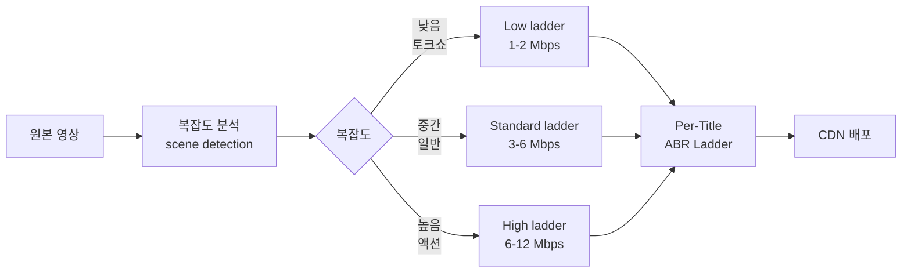
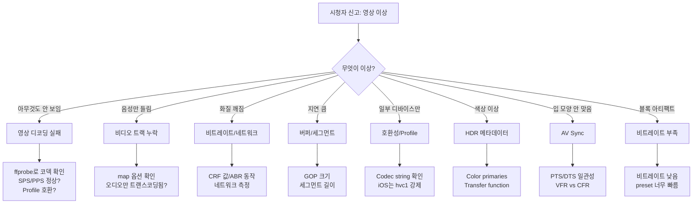

지금까지 H.264, AAC, H.265, Opus, AV1, VP9까지 코덱 6개를 봤다. 각각의 압축 원리와 라이센스 구조를 알아도, 실무 질문은 결국 하나로 모인다.

**"우리 서비스에는 어떤 코덱 조합을 써야 하나?"**

이 질문에 "AV1이 가장 효율적이니까 AV1!"이라고 답하면 60% 시청자가 못 본다. "H.264가 가장 호환성 좋으니까 H.264!"라고 답하면 CDN 비용이 두 배다. 진짜 답은 **시나리오마다 다르다**.

[지난 시리즈](../av1-vp9-deep-dive/)에서 코덱들의 정체를 봤다면, 이번 글은 **레벨 3 (코덱) 시리즈의 마지막** — 시나리오별 코덱 결정, 비용 구조, 그리고 실전 디버깅 — 정리한 노트다.

---

## 1. 코덱 결정의 6가지 요인

선택 자체보다 **무엇을 따져야 하는지** 먼저.

| 요인 | 질문 | 결과에 영향 |
|---|---|---|
| **호환성** | 시청자 디바이스 95% 이상 지원? | 도달률 |
| **지연** | 실시간 통신? 라이브? VOD? | 사용자 경험 |
| **화질/비트레이트** | CDN 비용 절감 가치? | 인프라 비용 |
| **인코딩 인프라** | GPU 보유? CPU만? | 자본/운영 비용 |
| **라이센스** | 콘텐츠 매출 로열티? | 매출 직접 영향 |
| **운영 복잡도** | 엔지니어 익숙도? | 개발 속도 |

엔지니어들이 흔히 빠지는 함정: **호환성과 비용만 고려**. 라이센스는 법무팀 문제로 미루고, 인프라는 인프라팀 문제로 미룸. 그러면 6개월 후 "왜 우리 라이브가 적자지?" 한다.

---

## 2. 10가지 실전 시나리오 — 코덱 추천 매트릭스

| 시나리오 | 비디오 | 오디오 | 프로토콜 | 이유 |
|---|---|---|---|---|
| **한국 라이브 게임 방송** (치지직/SOOP) | H.264 | AAC-LC | RTMP→HLS | 호환성 100% + 인프라 안정 |
| **글로벌 OTT 4K HDR** (Netflix급) | H.265 + AV1 | E-AC-3 | DASH+HLS | CDN 비용 절감, 4K HDR |
| **WebRTC 화상회의** (Zoom급) | H.264 / VP9 SVC | Opus | WebRTC | 저지연 + 양방향 |
| **모바일 라이브 송출** (인스타 라이브) | H.264 | AAC-LC | RTMP / WHIP | 모바일 인코더 + 호환성 |
| **스포츠 중계 LL-HLS** | H.264 + H.265 | AAC-LC | LL-HLS | 채팅 동기화 + 대규모 |
| **PokeClip 분석 파이프라인** | H.264 | AAC × 4트랙 | SRT (MPEG-TS) | 멀티 오디오 필수 |
| **Discord 음성 채널** | - | Opus | WebRTC | FEC/DTX + 무료 |
| **YouTube 라이브** | H.264 → VP9 | AAC + Opus | HLS / DASH | 자체 디코더 통제 |
| **소규모 화상 인터뷰** | VP8 / H.264 | Opus | WebRTC | 5명 이하, P2P 가능 |
| **라이브 음악 콘서트** | H.264 | AAC-LC 256k | HLS | 음질 우선 |

**한국 라이브 = H.264 + AAC가 정답**. 다른 시도하면 거의 손해. 글로벌 OTT만 다양한 코덱 조합.

### 의사결정 매트릭스 (간소화)

```
시청자 < 1K + 양방향 → WebRTC + H.264/VP8 + Opus
시청자 1K~100K + 저지연 → LL-HLS + H.264 + AAC
시청자 > 100K + 일반 → HLS + H.264 + AAC
시청자 > 100M (Netflix급) → DASH+HLS + H.265/AV1 + E-AC-3
```

---

## 3. CPU vs GPU 트랜스코딩 비용 비교

[지난 글들](../h264-deep-dive/)에서 NVENC 얘기를 여러 번 했지만, 실제 비용 수치로 보면.


{
  "tooltip": { "trigger": "axis", "axisPointer": { "type": "shadow" } },
  "grid": { "left": "22%", "right": "10%", "bottom": "12%", "top": "8%" },
  "xAxis": { "type": "value", "name": "월 비용 (USD)" },
  "yAxis": {
    "type": "category",
    "data": ["AWS MediaLive H.264", "자체 GPU (NVENC AV1)", "자체 GPU (NVENC H.265)", "자체 GPU (NVENC H.264)", "자체 CPU (x264 veryfast)"]
  },
  "series": [{
    "type": "bar",
    "data": [
      { "value": 720, "itemStyle": { "color": "#ef4444" } },
      { "value": 40, "itemStyle": { "color": "#8b5cf6" } },
      { "value": 35, "itemStyle": { "color": "#f59e0b" } },
      { "value": 30, "itemStyle": { "color": "#10b981" } },
      { "value": 60, "itemStyle": { "color": "#94a3b8" } }
    ],
    "label": { "show": true, "position": "right", "formatter": "${c}" }
  }]
}


AWS MediaLive 같은 매니지드 서비스가 20배 이상 비쌈. 채널 1000개 운영하면 매니지드 $72만/월 vs 자체 GPU $3만/월. **자체 GPU 인프라가 필수**.

근데 자체 GPU는 초기 자본 부담. 채널 100개 미만이면 AWS, 1000개 이상이면 자체. 사이는 하이브리드.

---

## 4. 코덱별 인코딩 부하

같은 GPU(RTX 4090)에서 코덱별 동시 채널 처리량.

| 코덱 | 1080p60 동시 채널 | 4K30 동시 채널 | 비고 |
|---|---|---|---|
| **H.264 NVENC** | ~12 | ~3 | 가장 빠름 |
| **H.265 NVENC** | ~10 | ~3 | H.264 비슷 |
| **AV1 NVENC** | ~8 | ~2 | 약간 무거움 |
| **VP9** | ❌ NVENC 없음 | ❌ | CPU 강제 |

GPU 1대 = 1080p60 H.264 채널 12개. 채널 1000개 운영하려면 GPU 약 85대. 이게 한국 라이브 플랫폼의 NVENC 인프라 규모.

---

## 5. CDN 비용과 코덱의 관계

코덱 효율이 CDN 비용을 직접 결정.

```
[월 시청 시간 1억 시간, CloudFront 한국 $0.12/GB]
H.264 6 Mbps: 1억h × 6Mbps × 3600s ÷ 8 = 270 PB
              → 27만 TB × $120 = $3,240만 / 월

H.265 3 Mbps (50% 절감):
              → 135 PB → $1,620만 / 월
              월 절감 $1,620만!

AV1 2 Mbps (66% 절감):
              → 90 PB → $1,080만 / 월
              월 절감 $2,160만!
```

이런 규모에서 **AV1 도입 ROI가 명확**. Netflix가 AV1을 미는 이유.

근데 한국 라이브 플랫폼은 시청 규모가 다름. 월 1억 시간 ≫ 치지직 추정 1억 시간 미만. 절감 효과 미미.

```
[치지직 추정 (월 시청 1000만 시간)]
H.264 6 Mbps: 27 PB → $324만
AV1 2 Mbps: 9 PB → $108만
월 절감: $216만

도입 비용:
- AV1 GPU 인프라 추가: 월 $50만
- 엔지니어링 (3명 × 6개월): $30만
- 시청자 도달 -30%: 매출 $100만 손실 추정

ROI: 손실
```

치지직 규모에선 AV1 도입이 적자. 이래서 한국 라이브는 H.264 유지.

---

## 6. Per-Title Encoding의 비용 효과

Netflix가 적용한 핵심 최적화. [예전 글에서 잠깐 봤음](../video-quality-bitrate-abr/).

```
[기존 - Static Ladder]
모든 콘텐츠에 같은 비트레이트 ladder
- 1080p: 6 Mbps
- 720p: 3 Mbps
- 480p: 1.5 Mbps

[Per-Title Encoding]
콘텐츠 분석 후 최적 비트레이트 결정
- 토크쇼 1080p: 2 Mbps (충분)
- 액션 영화 1080p: 8 Mbps (필요)
- 정적 강의 1080p: 1 Mbps
```

같은 화질 유지하면서 **평균 비트레이트 30% 절감**. Netflix가 매년 수억 달러 절감.



라이브에서는 사전 분석 불가능. **VOD에만 적용 가능**. 그래서 OTT(Netflix)는 적극, 라이브는 안 함.

---

## 7. 라이브 vs VOD 비용 구조의 결정적 차이

| 항목 | 라이브 | VOD |
|---|---|---|
| **인코딩 횟수** | 1번 (실시간) | 1번 (사전) |
| **재인코딩 가능** | ❌ | ✅ (콘텐츠 영원함) |
| **Per-Title** | ❌ (사전 분석 불가) | ✅ |
| **Two-Pass** | ❌ | ✅ |
| **시청 시간당 인코딩 비용** | 매번 발생 | 한 번 + 영원 재사용 |

**VOD는 인코딩 비용 한 번 + 시청 무한**. 라이브는 매번 인코딩. 그래서:

- 라이브: 빠른 인코딩 (NVENC veryfast) + H.264
- VOD: 느려도 화질 짜내기 (x265 slow + Two-Pass + AV1)

---

## 8. Twitch의 인코딩 정책 — 비용 절감 사례

```
[Twitch의 단계적 비용 절감]
2018년: 자체 GPU 인프라 구축 (AWS → 자체)
2020년: NVENC 도입 → CPU 인코딩 채널의 80% 절감
2022년: H.265 베타 (인기 스트리머 한정)
2023년: AV1 베타 (RTX 4000+ 스트리머)
2024년: 일반 스트리머용 Transcoding limits 강화
```

특히 2024년 정책 변경: **일반 스트리머에게 ABR Ladder 제공 안 함**. 시청자가 원본 화질만 받음. 트랜스코딩 GPU 비용 절감.

```
[Partner / Affiliate 한정 ABR]
Twitch Partner: 1080p60 + 720p60 + 720p30 + 480p30 + 360p30 + 160p
Affiliate (조건부): 720p60 + 480p30 + 160p
일반 스트리머: 원본만 (보통 1080p60)
```

일반 스트리머 시청자는 1080p만 받아야 함. 모바일/저속 인터넷 시청자 불편. 인프라 비용 vs UX의 트레이드오프.

---

## 9. 코덱 트러블슈팅 — 흔한 문제 8가지

운영하면서 만나는 패턴들.



### 진단 도구 — ffprobe

```bash
# 코덱 정보 확인
ffprobe -v error -select_streams v:0 \
  -show_entries stream=codec_name,profile,level,pix_fmt,r_frame_rate,bit_rate \
  -of json input.mp4

# 결과 예시
{
  "streams": [{
    "codec_name": "h264",
    "profile": "High",
    "level": 40,
    "pix_fmt": "yuv420p",
    "r_frame_rate": "60/1",
    "bit_rate": "6000000"
  }]
}
```

### 브라우저 개발자 도구

Chrome DevTools → Media 탭에서 디코더 정보 확인. `codecs="avc1.640028"` 매칭되는지.

### hls.js 디버깅

```javascript
hls.on(Hls.Events.ERROR, (event, data) => {
  console.log(data.type, data.details, data.fatal);
  // data.details: "manifestLoadError", "fragLoadError",
  //               "bufferAppendError", "mediaError" 등
});
```

`mediaError` = 코덱 디코딩 실패. `bufferAppendError` = MSE에 데이터 못 넣음.

---

## 10. 자주 만나는 코덱 호환성 문제

### 문제 1: iOS Safari에서 H.265 영상 안 나옴

**원인**: `-tag:v hvc1` 누락. 기본 `hev1` 태그는 iOS 미지원.

**해결**:
```bash
ffmpeg ... -c:v libx265 -tag:v hvc1 output.mp4
```

### 문제 2: Chrome에서 HLS 안 나옴

**원인**: Chrome은 HLS 네이티브 미지원. hls.js 필요.

**해결**: video 태그 + hls.js 라이브러리 사용.

### 문제 3: 옛 Android에서 일부 영상 안 나옴

**원인**: H.264 High Profile + Level 4.2 미지원 (3.1까지만).

**해결**: 호환성 화질을 Main Profile + Level 3.1로.

### 문제 4: 입 모양 안 맞음 (AV Sync)

**원인**: 영상 PTS와 오디오 PTS 어긋남. VFR(가변 프레임레이트) 입력일 때 흔함.

**해결**:
```bash
# VFR → CFR 변환
ffmpeg -i input.mp4 -vf fps=30 -c:v libx264 -c:a aac output.mp4
```

### 문제 5: HDR이 SDR로 보임

**원인**: 메타데이터 누락 또는 디바이스가 HDR 미지원.

**해결**:
```bash
# HDR10 메타데이터 명시
ffmpeg -i input \
  -c:v libx265 \
  -x265-params "colorprim=bt2020:transfer=smpte2084:colormatrix=bt2020nc:master-display=...:max-cll=1000,400" \
  output.mp4
```

---

## 11. 코덱 호환성 빠른 참조 매트릭스

| 코덱 | iOS Safari | Chrome | Firefox | Edge | Android | 스마트TV |
|---|---|---|---|---|---|---|
| H.264 | ✅ | ✅ | ✅ | ✅ | ✅ | ✅ |
| H.265 | ✅ (hvc1) | ⭕ 부분 | ❌ | ⭕ | ⭕ 90% | ⭕ 80% |
| VP9 | ❌ | ✅ | ✅ | ✅ | ✅ | ⭕ 60% |
| AV1 | ✅ (iPhone 15+) | ✅ | ✅ | ✅ | ⭕ 60% | ⭕ 50% |
| AAC | ✅ | ✅ | ✅ | ✅ | ✅ | ✅ |
| Opus | ⭕ Safari 17+ | ✅ | ✅ | ✅ | ✅ | ⭕ 80% |

**호환성 안전한 조합**: H.264 + AAC. 어디서나 됨.  
**최신 기기 한정**: AV1 + Opus.

---

## 12. 코덱 마이그레이션 — 단계별 진행

새 코덱 도입할 때 한 번에 바꾸면 안 됨. 5단계.


각 단계별 기간:
- 1단계 (분석): 1주
- 2단계 (베타): 1~3개월
- 3단계 (Dual): 6개월 (호환성 95% 달성 시까지)
- 4단계 (확대): 3개월
- 5단계 (정리): 3개월

H.264 → AV1 마이그레이션이라면 **총 1년 이상**. Twitch의 AV1 도입이 2년째 진행 중인 이유.

---

## 13. 면접 질문 — "코덱을 어떻게 선택했나요?"

실제 면접에서 답하는 방식.

```
"단순히 압축 효율 좋은 코덱이 정답이 아닙니다.
저는 6가지 요인을 우선순위로 두고 결정합니다:

1. 호환성 — 시청자 도달률 95% 미만이면 도입 불가
2. 라이센스 — 콘텐츠 매출 0.5% 로열티는 큰 부담
3. CDN 비용 절감 — 시청 규모가 10 PB/월 넘으면 도입 가치
4. 인코딩 인프라 — GPU 보유 여부
5. 지연 — 라이브 vs VOD vs 통신
6. 운영 복잡도 — 엔지니어 익숙도

치지직 같은 한국 라이브에 H.264 유지가 맞다고 본 이유는
1. AV1 도달률 60% (스마트TV/저가폰 부적합)
2. 시청 규모가 Netflix급 아님 (절감 효과 적음)
3. 인프라 변경 비용 > 절감
4. 시청자 경험 손해 (-30% 도달)

YouTube/Netflix급에서만 AV1 도입 ROI가 명확.

문제 발생 시 진단은:
ffprobe로 코덱/Profile/Level → 
hls.js error event → 
chrome://media-internals → 
ffmpeg debug log 순서로 좁혀갑니다."
```

---

## 정리하면

코덱 결정은 **기술이 아니라 비즈니스**다.

1. **6가지 요인** — 호환성/지연/품질/인코딩/라이센스/운영
2. **시나리오별 정답** — 한국 라이브는 H.264+AAC, 글로벌 OTT는 H.265+AV1
3. **트랜스코딩 비용** — AWS MediaLive 20배 비쌈, 자체 GPU가 정답
4. **CDN 비용 절감 ROI** — 월 10 PB+ 시청 규모에서만 AV1 도입 ROI 명확
5. **Per-Title Encoding** — VOD에서 30% 비트레이트 절감, 라이브에선 불가
6. **라이브 vs VOD** — 인코딩 횟수와 화질 짜내기 가능 여부의 결정적 차이
7. **트러블슈팅 8가지 패턴** — 디코딩 실패/AV Sync/HDR 메타/Profile 호환
8. **호환성 매트릭스** — H.264+AAC는 100%, AV1+Opus는 60%
9. **마이그레이션** — 5단계로 1년+ 진행. Twitch가 2년째 진행 중
10. **면접 답변** — "AV1이 효율적이다"가 아니라 "시청 규모 + 도달률 + ROI 계산"

레벨 3 (코덱) 시리즈는 여기까지. 다음부터는 **레벨 4 — 트랜스코딩 인프라 운영** 시리즈로 들어간다. FFmpeg 깊이, NVENC 튜닝, ABR Ladder 설계, Origin Shield, Per-Title Encoding 자동화까지.

---

**참고**
- [Netflix Per-Title Encoding 블로그](https://netflixtechblog.com/per-title-encode-optimization-7e99442b62a2)
- [Twitch Transcoding Limits 정책](https://help.twitch.tv/s/article/source-quality-only-and-quality-options)
- [hls.js 에러 디버깅 가이드](https://github.com/video-dev/hls.js/blob/master/docs/API.md#errors)
- [FFprobe 공식 문서](https://ffmpeg.org/ffprobe.html)
