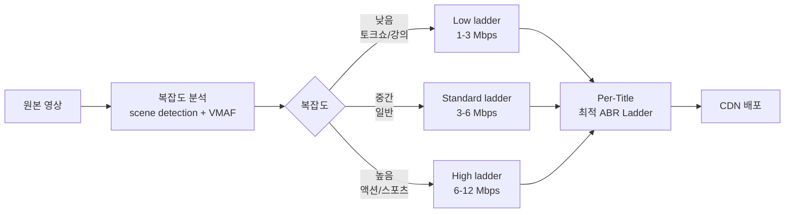
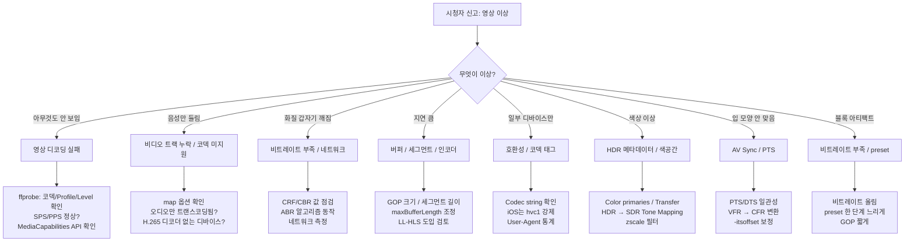

지금까지 H.264, AAC, H.265, Opus, AV1, VP9까지 코덱 6개를 봤다. 각각의 압축 원리와 라이센스 구조를 알아도, 실무 질문은 결국 하나로 모인다.

**"우리 서비스에는 어떤 코덱 조합을 써야 하나?"**

이 질문에 "AV1이 가장 효율적이니까 AV1!"이라고 답하면 **60% 시청자가 못 본다** (AV1 디코더 보급률). "H.264가 가장 호환성 좋으니까 H.264!"라고 답하면 **CDN 비용이 두 배**다. 진짜 답은 시나리오마다 다르다.

[지난 글](../av1-vp9-deep-dive/)에서 코덱들의 정체를 봤다면, 이번 글은 **시나리오별 코덱 결정, 비용 구조, 그리고 실전 디버깅**을 정리한 노트다.

---

## 1. 코덱 결정의 6가지 요인

선택 자체보다 **무엇을 따져야 하는지** 먼저.

| 요인 | 질문 | 결과에 영향 |
|---|---|---|
| **호환성** | 시청자 디바이스 95% 이상 지원? | 도달률 |
| **지연** | 실시간 통신? 라이브? VOD? | 사용자 경험 |
| **화질/비트레이트** | CDN 비용 절감 가치? | 인프라 비용 |
| **인코딩 인프라** | GPU 보유? CPU만? | 자본/운영 비용 |
| **라이센스** | 콘텐츠 매출 로열티? | 매출 직접 영향 |
| **운영 복잡도** | 엔지니어 익숙도? | 개발 속도 |

엔지니어가 흔히 빠지는 함정: **호환성과 비용만 고려**. 라이센스는 법무팀, 인프라는 인프라팀으로 미루고. 그러면 6개월 후 "왜 우리 라이브가 적자지?"가 된다.

---

## 2. 10가지 실전 시나리오

| 시나리오 | 영상 | 오디오 | 프로토콜 |
|---|---|---|---|
| **한국 라이브 (치지직)** | H.264 High | AAC-LC 128k | RTMP → HLS |
| **글로벌 OTT 4K HDR (Netflix)** | H.265 Main10 + AV1 | AAC + Dolby Atmos + E-AC-3 | DASH + HLS (CMAF) |
| **WebRTC 화상회의 (Zoom)** | VP8 / H.264 Baseline + Simulcast | Opus 32~64k | WebRTC + SFU |
| **모바일 라이브 송출** | H.264 Baseline/Main | AAC 64~96k | RTMP → HLS |
| **스포츠 중계 LL-HLS** | H.264 + H.265 | AAC + AC-3 5.1 | LL-HLS + DASH-IF LL |
| **PokeClip 분석** | H.264 | AAC × 트랙별 | SRT (MPEG-TS PID) |
| **Discord 음성** | - | Opus 64k | WebRTC |
| **YouTube 라이브** | H.264 + VP9 + AV1 | AAC + Opus | HLS + DASH |
| **화상 인터뷰 (1:1)** | H.264 Baseline | Opus 64k | WHIP/WHEP |
| **라이브 음악 콘서트** | H.264 + H.265 (4K) | AAC 256k 또는 AC-3 5.1 | LL-HLS |

**한국 라이브 = H.264 + AAC가 정답**. 다른 시도하면 거의 손해.

### 비용 우선순위 결정

```
[라이센스 회피]   H.264 (소규모 면제) 또는 AV1 / Opus / MP3
[인코딩 비용 ↓]  H.264 NVENC (가장 빠름) + AAC (간단)
[대역폭 비용 ↓]  H.265 또는 AV1 + HE-AAC 또는 Opus
[저장 비용 ↓]    CMAF로 HLS+DASH 통합 (한 번만 인코딩)
```

### 호환성 우선순위

```
모든 디바이스 (100%):   H.264 + AAC
옛 기기 제외 (~70%):    H.265 + AAC
최신 디바이스만 (~30%): AV1 + Opus
디바이스 분포 모름:     H.264 + AAC 안전
```

---

## 3. CPU vs GPU 트랜스코딩 비용

기본 비교부터.


{
  "tooltip": { "trigger": "axis", "axisPointer": { "type": "shadow" } },
  "grid": { "left": "25%", "right": "10%", "bottom": "12%", "top": "8%" },
  "xAxis": { "type": "value", "name": "동시 채널 수" },
  "yAxis": {
    "type": "category",
    "data": ["NVENC GPU (NVIDIA L40)", "x264 veryfast (CPU 라이브)", "x264 medium (CPU)"]
  },
  "series": [{
    "type": "bar",
    "data": [
      { "value": 100, "itemStyle": { "color": "#10b981" } },
      { "value": 12, "itemStyle": { "color": "#3b82f6" } },
      { "value": 5, "itemStyle": { "color": "#94a3b8" } }
    ],
    "label": { "show": true, "position": "right", "formatter": "{c}채널" }
  }]
}


**GPU가 약 15~20배 효율**. 대규모 라이브 = GPU 필수.

근데 자체 GPU 인프라 구축 vs 클라우드 매니지드의 비용 차이가 더 충격적.


{
  "tooltip": { "trigger": "axis", "axisPointer": { "type": "shadow" } },
  "grid": { "left": "30%", "right": "10%", "bottom": "12%", "top": "8%" },
  "xAxis": { "type": "log", "name": "연 비용 (USD)", "min": 100000 },
  "yAxis": {
    "type": "category",
    "data": ["AWS MediaConvert", "자체 GPU (x265 CPU)", "자체 GPU (NVENC AV1)", "자체 GPU (NVENC H.265)", "자체 GPU (NVENC H.264)"]
  },
  "series": [{
    "type": "bar",
    "data": [
      { "value": 20000000, "itemStyle": { "color": "#ef4444" } },
      { "value": 2600000, "itemStyle": { "color": "#f59e0b" } },
      { "value": 260000, "itemStyle": { "color": "#8b5cf6" } },
      { "value": 170000, "itemStyle": { "color": "#3b82f6" } },
      { "value": 130000, "itemStyle": { "color": "#10b981" } }
    ],
    "label": { "show": true, "position": "right", "formatter": "${c}" }
  }]
}


**AWS MediaConvert가 자체 GPU 인프라 대비 150배 비싸다.** 채널 1000개 = 연 2천만 달러 vs 13만 달러. 이래서 치지직/Twitch/YouTube가 자체 GPU.

손익분기점: 채널 100개 이상이면 자체 GPU가 답.

---

## 4. 코덱별 GPU 부하 — 같은 NVENC라도 다르다


{
  "tooltip": { "trigger": "axis", "axisPointer": { "type": "shadow" } },
  "grid": { "left": "22%", "right": "10%", "bottom": "12%", "top": "8%" },
  "xAxis": { "type": "value", "name": "동시 채널", "max": 110 },
  "yAxis": {
    "type": "category",
    "data": ["VP9 (NVENC 없음)", "AV1 NVENC (Ada+)", "H.265 NVENC", "H.264 NVENC"]
  },
  "series": [{
    "type": "bar",
    "data": [
      { "value": 0, "itemStyle": { "color": "#ef4444" } },
      { "value": 50, "itemStyle": { "color": "#8b5cf6" } },
      { "value": 80, "itemStyle": { "color": "#f59e0b" } },
      { "value": 100, "itemStyle": { "color": "#10b981" } }
    ],
    "label": { "show": true, "position": "right", "formatter": "{c}채널" }
  }]
}


VP9은 GPU 인코더 자체가 없어서 CPU 강제. AV1은 RTX 4000+ / Ada Lovelace 이상에서만 가능. **H.264가 압도적으로 효율적**.

### ABR Ladder 한 채널이 GPU에 미치는 부담


{
  "tooltip": { "trigger": "axis" },
  "legend": { "data": ["1080p 6Mbps", "720p 3Mbps", "480p 1.5Mbps", "360p 0.6Mbps"], "top": 0 },
  "grid": { "left": "10%", "right": "10%", "bottom": "12%", "top": "18%" },
  "xAxis": { "type": "category", "data": ["1채널 ABR Ladder"] },
  "yAxis": { "type": "value", "name": "GPU 사용률 (%)", "max": 15 },
  "series": [
    { "name": "1080p 6Mbps", "type": "bar", "stack": "ladder", "data": [5], "itemStyle": { "color": "#3b82f6" } },
    { "name": "720p 3Mbps",  "type": "bar", "stack": "ladder", "data": [3], "itemStyle": { "color": "#10b981" } },
    { "name": "480p 1.5Mbps","type": "bar", "stack": "ladder", "data": [2], "itemStyle": { "color": "#f59e0b" } },
    { "name": "360p 0.6Mbps","type": "bar", "stack": "ladder", "data": [1], "itemStyle": { "color": "#94a3b8" } }
  ]
}


한 채널 = GPU 11%. **L40 1대에 9채널 동시** 가능. 1000채널 운영하려면 GPU 약 110대.

---

## 5. CDN 비용 — 진짜 큰 항목

[지난 글](../av1-vp9-deep-dive/)에서 본 압축 효율을 비용으로 환산.

```
[1000채널 × 100만 시청자 × 일평균 4시간]

H.264 1080p 6 Mbps:
  트래픽: 약 11 PB/일
  CDN $0.05/GB: $550K/일 (연 $200M)

H.265 1080p 3 Mbps (50% 절감):
  CDN: $275K/일 (연 $100M)
  연 $100M 절감

AV1 1080p 2 Mbps (66% 절감):
  CDN: $183K/일 (연 $67M)
  연 $133M 절감
```

이게 Netflix가 H.265/AV1 적극 채택하는 이유.

### 진짜 ROI 계산 — 라이센스 + 인프라 비용까지


{
  "tooltip": { "trigger": "axis", "axisPointer": { "type": "shadow" } },
  "legend": { "data": ["CDN 절감", "라이센스", "인코딩 추가 GPU", "호환성 폴백 운영", "순 절감"], "top": 0 },
  "grid": { "left": "10%", "right": "10%", "bottom": "12%", "top": "18%" },
  "xAxis": { "type": "category", "data": ["H.264 → H.265", "H.264 → AV1"] },
  "yAxis": { "type": "value", "name": "연 비용 영향 (백만 USD)" },
  "series": [
    { "name": "CDN 절감", "type": "bar", "data": [100, 130], "itemStyle": { "color": "#10b981" } },
    { "name": "라이센스", "type": "bar", "data": [-30, 0], "itemStyle": { "color": "#ef4444" } },
    { "name": "인코딩 추가 GPU", "type": "bar", "data": [-5, -10], "itemStyle": { "color": "#f59e0b" } },
    { "name": "호환성 폴백 운영", "type": "bar", "data": [-10, -10], "itemStyle": { "color": "#94a3b8" } },
    { "name": "순 절감", "type": "line", "smooth": true, "data": [55, 110], "itemStyle": { "color": "#3b82f6" }, "lineStyle": { "width": 3 } }
  ]
}


H.265는 라이센스 부담으로 절감 효과가 깎임 ($100M → $55M).  
AV1은 라이센스 무료라 절감 효과가 거의 그대로 ($130M → $110M).

이게 **AV1이 결국 답이 되는 이유**.

---

## 6. 한국 라이브 플랫폼의 비용 현실 — 치지직급 가상 분석

```
[가상 시나리오]
동시 라이브 채널: 5,000개
평균 시청자/채널: 100명
피크 시청자: 50만

[연 비용]
CDN:        ~200억
트랜스코딩: ~30억
스토리지:   ~10억
인프라/운영:~50억

[H.265 전환 검토]
CDN 절감: 100억 (50%)
H.265 라이센스: 10~30억 (협상가)
인코딩 GPU 추가: 5억

순 절감: 65~85억
→ 호환성 폴백 운영 + 운영 복잡도로 실제 30~50억
```

이래서 한국 플랫폼이 **H.264 유지가 안정적**. ROI가 확실하지 않음.

Netflix급 (시청자 수천만, 콘텐츠 매출 수십억)이라야 H.265/AV1 도입 ROI가 명확.

---

## 7. Per-Title Encoding — Netflix의 비용 혁명

VOD 한정 기법.

```
[고정 ABR Ladder]
모든 영화 4K 12 Mbps
영화당 저장: ~7 GB

[Per-Title]
정적 토크쇼:  4K 6 Mbps  (복잡도 낮음)
일반 영화:    4K 8 Mbps
액션 영화:    4K 18 Mbps (복잡도 높음)
영화당 평균: 4.7 GB

→ 평균 33% 절감
→ 100만 영화 × 5년 보관 시 연 $80K 추가 절감
```



**라이브에선 불가능** (사전 분석 필요). Netflix/Disney+ 같은 VOD만 적용. 라이브 변형: 첫 1분 분석 후 비트레이트 동적 조정.

---

## 8. 라이브 vs VOD 비용 구조의 결정적 차이

| 항목 | 라이브 | VOD |
|---|---|---|
| **인코딩 횟수** | 매번 실시간 | 한 번 (사전) |
| **재인코딩 가능** | ❌ | ✅ (콘텐츠 영원함) |
| **Per-Title** | ❌ (사전 분석 불가) | ✅ |
| **Two-Pass** | ❌ | ✅ |
| **preset** | `veryfast` / NVENC `p4` | `medium` / `slow` / NVENC `p7` |
| **시청 시간당 비용** | 매번 트랜스코딩 | 한 번 + 영원 재사용 |

**VOD가 라이브보다 비용 효율적**. 같은 1시간 콘텐츠를 100만 명이 봐도 VOD는 인코딩 한 번. 라이브는 매번 1시간 트랜스코딩.

### Twitch의 비용 절감 사례 (2017년)

```
2017년 이전: 모든 스트리머에 ABR Ladder 제공
2017년: 작은 스트리머는 "Source 화질만"
       → ABR Ladder 1세트 = GPU 11%
       → 작은 스트리머 100만 명 × 11% 절감 = 매우 큼
       → 부작용: 시청자 경험 저하 (모바일/저속 인터넷 시청자 불편)
```

비용 vs UX 트레이드오프. 데이터 기반 결정.

---

## 9. 코덱 트러블슈팅 — 흔한 8가지 문제

운영하면서 만나는 패턴.



### 8개 문제 — 원인 → 해결 패턴

| 증상 | 가장 흔한 원인 | 해결 |
|---|---|---|
| 영상 안 보임 | 코덱 미지원 / 코덱 문자열 잘못 | H.264 폴백, `avc1.640028` 명시 |
| 음성만 들림 | H.265 영상인데 H.264만 지원 디바이스 | 디바이스별 트랙 분리 |
| 화질 떨어짐 | ABR 보수적 / 네트워크 일시 단절 | `abrBandWidthUpFactor` 튜닝, 화질 floor |
| 지연 증가 | 버퍼 비정상 / 인코더 처리 지연 | `maxBufferLength` 줄임, LL-HLS, NVENC |
| iOS만 안 됨 | `hev1` 태그 (iOS는 `hvc1`만) | `ffmpeg -tag:v hvc1` |
| HDR 색 이상 | 메타데이터 누락 / Tone Mapping 안 됨 | `zscale=t=linear:npl=100,tonemap=hable` |
| AV Sync 어긋남 | PTS 불일치 / VFR 입력 | `-vsync vfr`, `-itsoffset 0.1` |
| 블록 아티팩트 | 비트레이트 부족 / preset 너무 빠름 | 비트레이트 ↑, preset 한 단계 ↓ |

---

## 10. 진단 도구 — 디버깅의 무기

### ffprobe — 영상 파일 분석의 기본

```bash
# 비디오 정보 한 줄
ffprobe -v error -select_streams v:0 \
  -show_entries stream=codec_name,profile,level,width,height,r_frame_rate,pix_fmt,bit_rate \
  -of csv=p=0 input.mp4
# 출력: h264,High,40,1920,1080,60/1,yuv420p,6000000

# 오디오 정보
ffprobe -v error -select_streams a:0 \
  -show_entries stream=codec_name,profile,sample_rate,channels,bit_rate \
  -of csv=p=0 input.mp4
# 출력: aac,LC,48000,2,128000

# 키프레임 위치 (블록 아티팩트 진단)
ffprobe -show_packets input.mp4 | grep flags=K
```

### 브라우저 개발자 도구

```javascript
// 비디오 에러
const video = document.querySelector('video');
video.addEventListener('error', () => {
  console.error('Video error:', video.error);
  // MEDIA_ERR_SRC_NOT_SUPPORTED → 코덱 미지원
  // MEDIA_ERR_DECODE → 디코딩 실패
});

// MediaCapabilities API — 디바이스 코덱 지원 확인
const capabilities = await navigator.mediaCapabilities.decodingInfo({
  type: 'media-source',
  video: {
    contentType: 'video/mp4; codecs="avc1.640028"',
    width: 1920, height: 1080,
    bitrate: 6000000, framerate: 60,
  },
});
console.log('H.264 1080p60 supported:', capabilities.supported);
console.log('Smooth:', capabilities.smooth);
console.log('Power efficient:', capabilities.powerEfficient);
```

### hls.js 디버깅

```javascript
const hls = new Hls({ debug: true });

hls.on(Hls.Events.ERROR, (event, data) => {
  if (data.fatal) {
    switch(data.type) {
      case Hls.ErrorTypes.MEDIA_ERROR:
        console.error('Media error — 코덱 문제 가능성');
        hls.recoverMediaError();
        break;
      case Hls.ErrorTypes.NETWORK_ERROR:
        console.error('Network error');
        break;
    }
  }
});

hls.on(Hls.Events.MANIFEST_PARSED, (event, data) => {
  data.levels.forEach((level, idx) => {
    console.log(`Level ${idx}: ${level.codecs} ${level.width}x${level.height} ${level.bitrate}`);
  });
});
```

### chrome://webrtc-internals — WebRTC 디버깅의 최고

```
chrome://webrtc-internals

확인 가능:
- RTP 패킷 통계
- 패킷 손실율 / 지터
- 대역폭 추정치
- 코덱 협상 결과
- ICE 후보들
- DTLS 핸드셰이크
```

### FFmpeg 로그 분석

```bash
# 상세 로그
ffmpeg -loglevel debug -i input.mp4 output.mp4 2> debug.log

# 통계만
ffmpeg -loglevel info -stats -i input.mp4 output.mp4
```

| 로그 키워드 | 의미 |
|---|---|
| `Bitstream filters not applied` | bitstream 변환 필요 (Annex B ↔ AVCC) |
| `Reference frame issue` | 키프레임 문제 |
| `Audio underrun` | 오디오 처리 못 따라감 |
| `Encoder frame queue is empty` | 인코더 입력 부족 |
| `Dropping frame` | 프레임 드롭 |

---

## 11. 브라우저별 코덱 호환성 매트릭스 (2024년)

| 코덱 | Chrome | Firefox | Safari | Edge |
|---|---|---|---|---|
| H.264 (avc1) | ✅ | ✅ | ✅ | ✅ |
| H.265 (hvc1) | ✅ (M105+) | ❌ | ✅ | ✅ |
| H.265 (hev1) | ⚠️ 일부 | ❌ | ❌ | ⚠️ |
| VP8 | ✅ | ✅ | ⚠️ WebRTC만 | ✅ |
| VP9 | ✅ | ✅ | ⚠️ M17+ | ✅ |
| AV1 | ✅ | ✅ | ✅ (M16+) | ✅ |
| AAC | ✅ | ✅ | ✅ | ✅ |
| Opus | ✅ | ✅ | ⚠️ M17+ | ✅ |
| MP3 | ✅ | ✅ | ✅ | ✅ |

**iOS Safari가 가장 까다로움.** `hev1` 절대 안 되고 `hvc1`만. Opus는 최근에야 지원. 호환성 안전한 조합 = **H.264 + AAC**.

---

## 12. 코덱 마이그레이션 — 5단계 점진 도입

새 코덱 도입은 한 번에 하면 안 된다.


| 단계 | 기간 | 핵심 활동 |
|---|---|---|
| 1. 측정 | 1주 | 시청자 디바이스 통계 (User-Agent, 코덱 지원율) |
| 2. 시범 | 1~3개월 | 10% 트래픽, 베타 테스트 |
| 3. 확대 | 6개월 | 50% 트래픽, 호환성 95% 확인 |
| 4. 완전 도입 | 3개월 | 전체 시청자, 폴백 유지 |
| 5. 종료 | 3개월 | 기존 코덱 점진 제거 |

**총 1년 이상**. Twitch의 AV1 도입이 2년째 진행 중인 이유.

---

## 13. 면접 답변 — "코덱을 어떻게 선택했나요?"

실제 답변 패턴.

```
"단순히 압축 효율 좋은 코덱이 정답이 아닙니다.
6가지 요인을 우선순위로 두고 결정합니다:

1. 호환성: 시청자 도달률 95% 미만이면 도입 불가
2. 라이센스: 콘텐츠 매출 0.5% 로열티는 큰 부담
3. CDN 비용 절감: 월 시청 10 PB+ 규모에서 도입 가치
4. 인코딩 인프라: GPU 보유 여부
5. 지연: 라이브 / VOD / 통신
6. 운영 복잡도: 엔지니어 익숙도

치지직 같은 한국 라이브에 H.264 유지가 맞다고 본 이유:
- AV1 도달률 60% (스마트TV/저가폰 부적합)
- 시청 규모가 Netflix급 아님 (절감 효과 적음)
- 인프라 변경 비용 > 절감
- 시청자 경험 손해 (-30% 도달)

YouTube/Netflix급에서만 AV1 도입 ROI가 명확합니다.

문제 발생 시 진단은:
ffprobe로 코덱/Profile/Level →
hls.js error event →
chrome://media-internals →
ffmpeg debug log 순서로 좁혀갑니다.

마이그레이션은 5단계 점진 도입 (측정 → 시범 → 확대 → 도입 → 종료).
Twitch가 AV1 도입에 2년째 진행 중인 게 이 때문입니다."
```

---

## 정리하면

코덱 결정은 **기술이 아니라 비즈니스**다.

1. **6가지 요인** — 호환성 / 지연 / 화질 / 인코딩 / 라이센스 / 운영
2. **시나리오별 정답** — 한국 라이브는 H.264+AAC, 글로벌 OTT는 H.265+AV1, WebRTC는 Opus
3. **CPU vs GPU** — NVENC가 15배 효율, 자체 GPU가 AWS 대비 150배 저렴
4. **코덱별 NVENC 부하** — H.264 100채널/대, H.265 80, AV1 50 (Ada+), VP9 없음
5. **ABR Ladder** — 1채널 4단계 = GPU 11%, L40 1대에 9채널
6. **CDN 절감 ROI** — H.265는 라이센스 깎임 ($100M→$55M), AV1은 거의 그대로 ($130M→$110M)
7. **한국 라이브 현실** — 순 절감 30~50억 + 호환성 위험 = H.264 유지가 안정적
8. **Per-Title** — VOD 33% 절감, 라이브엔 불가능 (사전 분석)
9. **라이브 vs VOD** — VOD가 비용 효율적, 라이브는 매번 인코딩
10. **8가지 트러블슈팅** — 영상 안 보임 / AV Sync / iOS hvc1 / HDR Tone Mapping
11. **진단 도구** — ffprobe → 브라우저 도구 → hls.js → webrtc-internals → ffmpeg log
12. **호환성 매트릭스** — iOS Safari가 가장 까다로움 (hev1 ❌, hvc1만 ✅)
13. **마이그레이션 5단계** — 측정 → 시범 → 확대 → 도입 → 종료. 1년+ 소요

다음 글부터 **트랜스코딩 인프라 운영** — FFmpeg, NVENC, ABR Ladder, Origin Shield, Per-Title 자동화 — 로 들어간다.

---

**참고**
- [Netflix Per-Title Encoding 블로그](https://netflixtechblog.com/per-title-encode-optimization-7e99442b62a2)
- [Twitch Transcoding Limits 정책](https://help.twitch.tv/s/article/source-quality-only-and-quality-options)
- [hls.js 에러 디버깅 가이드](https://github.com/video-dev/hls.js/blob/master/docs/API.md#errors)
- [FFprobe 공식 문서](https://ffmpeg.org/ffprobe.html)
- [MediaCapabilities API](https://developer.mozilla.org/en-US/docs/Web/API/MediaCapabilities)
