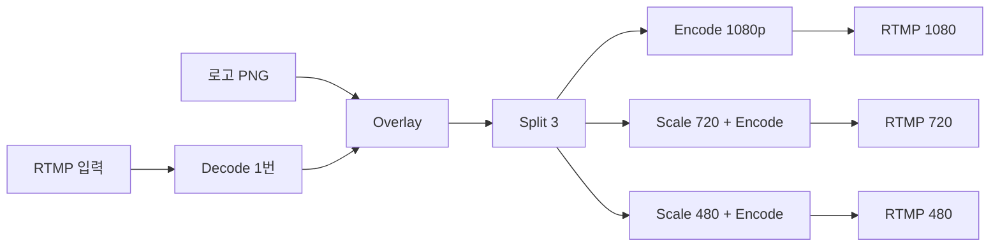
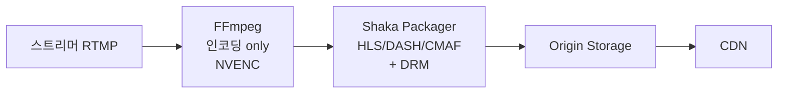

치지직, Twitch, Netflix, YouTube의 라이브/VOD 인프라를 다 뜯어보면 한 가지 공통점이 있다. **모두 FFmpeg 위에서 돌아간다**. 인코딩, 트랜스코딩, 패키징, 트랜스먹싱, 자막 처리, 워터마크, 멀티 트랙 분리 — 거의 모든 미디어 처리가 FFmpeg 한 도구로 가능.

근데 FFmpeg는 옵션 100개가 넘는다. `-ss`를 `-i` 앞에 두는지 뒤에 두는지에 따라 인코딩 시간이 10배 차이 난다. `-c copy` 한 줄 차이가 CPU 100% vs 1%의 차이를 만든다. 모르면 시간 낭비, 비용 낭비, 화질 손해.

[지난 시리즈 레벨 3](../codec-decision-and-debugging/)에서 코덱 선택을 봤다면, **이번 글부터 레벨 4 — 트랜스코딩 인프라 운영** 시리즈다. 첫 글은 그 모든 인프라의 기반인 **FFmpeg**. 파이프라인 구조부터 라이브 인제스트 표준 명령, HLS 패키징, CMAF 통합 옵션까지 정리한 노트다.

---

## 1. FFmpeg는 사실 하나의 도구가 아니다

`ffmpeg` 명령어를 치면 한 프로그램이지만, 그 안에는 거대한 생태계.

```
[FFmpeg 프로젝트 구성]
라이브러리:
- libavcodec: 코덱 (H.264, H.265, AAC, Opus, AV1, VP9 ...)
- libavformat: 컨테이너 (MP4, MPEG-TS, FLV, M3U8 ...)
- libavfilter: 필터 (스케일, 크롭, 워터마크 ...)
- libswscale: 이미지 변환 (색공간, 해상도)
- libswresample: 오디오 변환 (샘플레이트, 채널)

CLI 도구:
- ffmpeg: 트랜스코딩
- ffprobe: 메타데이터 분석
- ffplay: 재생 (테스트용)
```

**OBS, VLC, Chrome, Plex, 거의 모든 미디어 도구가 내부적으로 libav* 사용**. `ffmpeg` CLI는 그 위에 얹힌 한 사용 방식일 뿐.

---

## 2. FFmpeg 파이프라인 — 5단계

`ffmpeg` 명령어 하나는 내부적으로 5단계 파이프라인을 거친다.


각 단계가 독립적이다. **이걸 알아야 옵션을 어디에 붙일지 안다**.

| 단계 | 입력 | 출력 | 옵션 예 |
|---|---|---|---|
| **Demuxer** | 컨테이너 파일 | 압축된 스트림들 | `-f`, `-i` |
| **Decoder** | 압축 스트림 | raw 프레임 (YUV/PCM) | `-c:v`, `-c:a` (입력 측) |
| **Filter** | raw 프레임 | 가공된 raw 프레임 | `-vf`, `-af`, `-filter_complex` |
| **Encoder** | raw 프레임 | 압축 스트림 | `-c:v libx264`, `-b:v`, `-preset` |
| **Muxer** | 압축 스트림 | 컨테이너 파일 | `-f flv`, `-hls_*` |

### `-c copy` 의 진짜 의미

```bash
# 재인코딩 없이 컨테이너만 변환
ffmpeg -i input.mp4 -c copy output.mkv
```

`-c copy`는 **Decoder/Encoder를 건너뛴다**. demux → mux만. CPU 거의 안 씀. 영상 1시간을 1분에 처리 가능. **라이브 인제스트의 표준 패턴**.

### Filter가 들어가면 무조건 재인코딩

```bash
# 1080p → 720p (Filter 사용)
ffmpeg -i input.mp4 -vf scale=1280:720 -c:v libx264 output.mp4
```

Filter는 raw 프레임에 작용. 무조건 decode → filter → encode 필요. `-c copy`랑 같이 못 씀.

---

## 3. 옵션 위치가 의미를 바꾼다 — FFmpeg의 가장 큰 함정

```bash
# 옳음: 입력 옵션은 -i 앞에
ffmpeg -ss 60 -i input.mp4 -c copy output.mp4

# 다름: 같은 옵션이 출력 옵션으로 가면 의미 바뀜
ffmpeg -i input.mp4 -ss 60 -c copy output.mp4
```

`-ss 60` 위치 차이:

| 위치 | 동작 | 속도 | 정확도 |
|---|---|---|---|
| `-i` **앞** | 입력 demuxer 단계에서 60초로 점프 후 시작 | **빠름** | 키프레임 단위 (정확하지 않음) |
| `-i` **뒤** | 전체 디코딩하면서 60초까지 버림 | **느림** | 정확 (프레임 단위) |

```bash
# 빠른 + 정확한 시킹 조합
ffmpeg -ss 55 -i input.mp4 -ss 5 -t 30 -c:v libx264 clip.mp4
# 55초로 빠르게 시킹 (키프레임) + 정확히 5초 더 = 60초 지점부터 30초
```

이걸 모르고 정확한 시킹을 하려고 `-i` 뒤에만 두면 1시간 영상 자르는 데 10분 걸림. 앞뒤 조합으로 1분이면 끝.

---

## 4. -map — 스트림 명시적으로 고르기

기본 동작은 "비디오 1개 + 오디오 1개"만 자동 선택. 여러 트랙 있으면 명시 필수.

```bash
# 모든 스트림 출력에 포함
ffmpeg -i input.mkv -map 0 -c copy output.mp4

# 비디오 + 첫 번째 오디오만
ffmpeg -i input.mkv -map 0:v:0 -map 0:a:0 -c copy output.mp4

# 비디오 + 모든 오디오 (PokeClip 같은 멀티 트랙)
ffmpeg -i input.mkv -map 0:v -map 0:a -c copy output.mp4
```

`-map 0:v:0` 문법:
- `0`: 첫 번째 입력 파일
- `v`: 비디오 (`a` = 오디오, `s` = 자막, `d` = 데이터)
- `0`: 그중 0번 인덱스

PokeClip처럼 멀티 오디오 분석 파이프라인에선 `-map`을 정확히 알아야 함. 게임 소리, 마이크, 디스코드를 각각 다른 파일로 빼야 하니까.

---

## 5. -re와 -stream_loop — 라이브 송출 시뮬레이션

기본 FFmpeg는 입력을 최대 속도로 읽는다. 1시간 영상을 5분에 다 읽음. 라이브 테스트할 때 문제.

```bash
# 파일을 라이브처럼 송출
ffmpeg -re -i sample.mp4 -c copy -f flv rtmp://localhost/live/test
```

`-re` = "real time". 1초어치 데이터를 1초마다 보냄. **진짜 라이브 송출처럼**.

```bash
# 24/7 라이브 채널 (테스트용)
ffmpeg -re -stream_loop -1 -i loop.mp4 \
  -c copy -f flv rtmp://localhost/live/test
```

`-stream_loop -1`: 무한 반복. 스테이징 환경에서 24시간 라이브 부하 테스트할 때 자주 쓴다.

---

## 6. 무손실 트랜스먹싱 — 라이브 인제스트 표준

RTMP로 들어온 스트림을 HLS로 그대로 패키징. **재인코딩 없이 컨테이너만 변환**.

```bash
ffmpeg \
  -fflags +genpts \
  -i rtmp://localhost/live/streamkey \
  -c copy \
  -f hls \
  -hls_time 6 \
  -hls_list_size 5 \
  -hls_flags delete_segments+independent_segments \
  -hls_segment_filename 'seg%05d.ts' \
  /var/www/hls/playlist.m3u8
```

- `-c copy`: 재인코딩 없음. CPU 거의 안 씀
- `-fflags +genpts`: PTS 자동 생성 (RTMP 입력 깨졌을 때 보정)
- `-hls_time 6`: 6초 세그먼트
- `delete_segments`: 오래된 .ts 자동 삭제 (sliding window)

**라이브 인제스트의 가장 기본 명령**. 인코딩 부하 없이 RTMP → HLS만 변환. 서버 1대에 동시 인제스트 100개 가능.

---

## 7. x264 옵션 — 라이브의 90%

[h264-deep-dive 글](../h264-deep-dive/)에서 preset/CRF/CBR을 다뤘다. 실전 명령 정리.

### 라이브 트랜스코딩 표준 명령

```bash
ffmpeg \
  -re -i rtmp://input/live/streamkey \
  \
  -c:v libx264 \
  -preset veryfast \
  -tune zerolatency \
  -profile:v high \
  -level 4.0 \
  -pix_fmt yuv420p \
  -g 60 -keyint_min 60 \
  -sc_threshold 0 \
  -b:v 6000k -minrate 6000k -maxrate 6000k -bufsize 12000k \
  \
  -c:a aac \
  -b:a 128k -ar 48000 -ac 2 \
  \
  -f flv rtmp://output/live/streamkey
```

핵심 조합:
- `preset veryfast`: 실시간 처리 가능
- `tune zerolatency`: B-frame 비활성, 지연 -100ms
- `g 60 -keyint_min 60 -sc_threshold 0`: GOP 정확히 60프레임 (1초 @ 60fps), scene change에 의한 자동 키프레임 비활성 — **ABR Ladder의 GOP 정렬에 필수**
- `-b:v -minrate -maxrate -bufsize` 조합: 진짜 CBR 강제

### CRF vs CBR vs VBR 선택 가이드

| 모드 | 옵션 | 사용처 | 비트레이트 |
|---|---|---|---|
| **CRF** | `-crf 23` | VOD | 가변 (화질 일정) |
| **CBR** | `-b:v 6000k -minrate 6000k -maxrate 6000k -bufsize 12000k` | **라이브** | 일정 |
| **VBR** | `-b:v 5000k -maxrate 10000k -bufsize 20000k` | VOD 가끔 | 평균 일정 |

라이브 = CBR 강제. 대역폭 예측 가능해야 함.

---

## 8. 오디오 — loudnorm이 가장 중요

```bash
ffmpeg -i input \
  -c:a aac -profile:a aac_low \
  -b:a 128k -ar 48000 -ac 2 \
  -af "loudnorm=I=-16:TP=-1.5:LRA=11" \
  output.m4a
```

`loudnorm=I=-16:TP=-1.5:LRA=11`이 핵심. **EBU R128 라우드니스 정규화**. 스트리머마다 마이크 볼륨 다 다른데 강제로 -16 LUFS로 통일. 시청자가 채널 옮길 때마다 볼륨 조절 안 하게.

YouTube/Spotify -14 LUFS, Twitch/치지직 -16 LUFS.

---

## 9. -filter_complex — 멀티 입력/출력 + 다중 출력 ABR

`-vf`/`-af`는 단일 입력/출력에만. 복잡한 처리는 `-filter_complex`.

### 워터마크 오버레이 + 한 명령에 ABR Ladder 3단계

```bash
ffmpeg \
  -re -i rtmp://input/live/streamkey \
  -i logo.png \
  \
  -filter_complex "\
    [0:v][1:v]overlay=W-w-20:20[wm]; \
    [wm]split=3[v1][v2][v3]; \
    [v2]scale=1280:720[v720]; \
    [v3]scale=854:480[v480]" \
  \
  -map "[v1]"  -map 0:a -c:v libx264 -preset veryfast -tune zerolatency \
    -b:v 6000k -maxrate 6000k -bufsize 12000k -c:a aac -b:a 128k \
    -f flv rtmp://output/1080 \
  \
  -map "[v720]" -map 0:a -c:v libx264 -preset veryfast -tune zerolatency \
    -b:v 3000k -maxrate 3000k -bufsize 6000k -c:a aac -b:a 128k \
    -f flv rtmp://output/720 \
  \
  -map "[v480]" -map 0:a -c:v libx264 -preset veryfast -tune zerolatency \
    -b:v 1500k -maxrate 1500k -bufsize 3000k -c:a aac -b:a 96k \
    -f flv rtmp://output/480
```

문법 해석:
- `[0:v][1:v]overlay=W-w-20:20[wm]`: 입력 0의 비디오 + 입력 1의 비디오 → 우상단에서 20px 안쪽에 로고 → 결과를 `wm`으로 라벨
- `[wm]split=3[v1][v2][v3]`: `wm`을 3개로 복제 → `v1`, `v2`, `v3`
- `[v2]scale=1280:720[v720]`: `v2`를 720p로 스케일 → `v720`

**한 디코딩으로 3개 화질 동시 출력**. 라이브 트랜스코딩 서버 한 인스턴스가 하는 일.



근데 1080p60 + 720p + 480p를 CPU(x264)로 동시 처리하면 32코어 서버도 부담. NVENC 같은 GPU 인코더가 필요해진다. 다음 글에서 본다.

---

## 10. HLS 패키징 — FFmpeg 옵션 총정리

```bash
ffmpeg -i input.mp4 \
  -c:v libx264 -preset veryfast \
  -c:a aac -b:a 128k \
  \
  -f hls \
  -hls_time 6 \
  -hls_list_size 5 \
  -hls_segment_type fmp4 \
  -hls_segment_filename 'seg_%05d.m4s' \
  -hls_fmp4_init_filename 'init.mp4' \
  -hls_flags delete_segments+independent_segments+program_date_time \
  -hls_playlist_type event \
  \
  output.m3u8
```

| 옵션 | 의미 | 권장값 |
|---|---|---|
| `-hls_time` | 세그먼트 길이 (초) | 6 (일반), 2 (LL-HLS) |
| `-hls_list_size` | 매니페스트에 유지할 세그먼트 수 | 5 (라이브 sliding) / 0 (VOD 무제한) |
| `-hls_segment_type` | 컨테이너 | `mpegts` (전통), `fmp4` (CMAF) |
| `-hls_flags` | 동작 옵션 | `delete_segments+independent_segments+program_date_time` |
| `-hls_playlist_type` | 타입 | `event` (라이브→VOD 변환), `vod` (ENDLIST) |

### -hls_flags 주요 옵션

- `delete_segments`: sliding window에서 빠진 .ts 자동 삭제 (디스크 관리)
- `independent_segments`: 각 세그먼트가 키프레임으로 시작 (ABR 보장)
- `program_date_time`: `#EXT-X-PROGRAM-DATE-TIME` 태그 (시간 동기화)

---

## 11. 한 명령으로 ABR Ladder + Master Playlist

`-var_stream_map`이 핵심.

```bash
ffmpeg -i input.mp4 \
  -filter_complex "[0:v]split=3[v1][v2][v3];[v2]scale=1280:720[v720];[v3]scale=854:480[v480]" \
  \
  -map "[v1]"   -map 0:a -c:v libx264 -b:v 6000k -c:a aac -b:a 128k \
  -map "[v720]" -map 0:a -c:v libx264 -b:v 3000k -c:a aac -b:a 128k \
  -map "[v480]" -map 0:a -c:v libx264 -b:v 1500k -c:a aac -b:a 96k \
  \
  -f hls \
  -hls_time 6 \
  -hls_segment_filename 'stream_%v/seg_%05d.ts' \
  -master_pl_name master.m3u8 \
  -var_stream_map "v:0,a:0,name:1080p v:1,a:1,name:720p v:2,a:2,name:480p" \
  \
  'stream_%v/playlist.m3u8'
```

결과 파일 구조:
```
master.m3u8              ← 시청자가 받는 마스터
stream_1080p/
  playlist.m3u8
  seg_00000.ts, seg_00001.ts, ...
stream_720p/playlist.m3u8 + .ts
stream_480p/playlist.m3u8 + .ts
```

매니페스트 구조와 ABR 동작은 [hls-just-files 글](../hls-just-files/)에서 자세히.

---

## 12. CMAF — HLS와 DASH 동시 생성

`fmp4`로 패키징하면 같은 세그먼트를 HLS와 DASH가 공유.

```bash
ffmpeg -i input.mp4 \
  -c:v libx264 -b:v 5000k \
  -c:a aac -b:a 128k \
  \
  # HLS (fMP4)
  -f hls \
  -hls_segment_type fmp4 \
  -hls_segment_filename 'cmaf/seg_%05d.m4s' \
  -hls_fmp4_init_filename 'cmaf/init.mp4' \
  cmaf/playlist.m3u8 \
  \
  # DASH (같은 .m4s 파일 사용)
  -f dash \
  -seg_duration 6 \
  -init_seg_name 'cmaf/init.mp4' \
  -media_seg_name 'cmaf/seg_$Number%05d$.m4s' \
  cmaf/manifest.mpd
```

같은 `.m4s` 파일을 HLS와 DASH가 가리킴. 스토리지/CDN 비용 절반. [dash-vs-hls 글](../dash-vs-hls/)에서 봤던 CMAF 수렴 패턴.

---

## 13. LL-HLS Partial Segment

FFmpeg의 LL-HLS 지원은 아직 완전치 않음. 진짜 LL-HLS는 Shaka Packager 권장.

```bash
ffmpeg -i rtmp://input \
  -c:v libx264 -preset veryfast -tune zerolatency \
  -c:a aac -b:a 128k \
  \
  -f hls \
  -hls_time 4 \
  -hls_segment_type fmp4 \
  -hls_flags independent_segments \
  -hls_playlist_type event \
  \
  -hls_init_time 0.2 \
  -hls_segment_options "movflags=+frag_keyframe+empty_moov+default_base_moof" \
  \
  ll_hls.m3u8
```

LL-HLS 메커니즘(Partial Segment, Blocking Reload, Preload Hint)은 [ll-hls-deep-dive 글](../ll-hls-deep-dive/)에서 자세히.

---

## 14. FFmpeg vs Shaka Packager — 분리 패턴

대규모 인프라는 FFmpeg 패키징 안 씀.

```
[FFmpeg 통합]
인코딩 + 패키징 한 프로세스
장점: 단순
단점: 인코딩 끝나야 패키징 시작, 스케일링 어려움

[Shaka Packager 분리]
인코딩: FFmpeg → MP4 출력
패키징: Shaka가 .m4s + .m3u8 + .mpd 생성
장점: 독립 스케일링, DRM 통합 쉬움, LL-HLS 완전 지원
단점: 파이프라인 복잡
```



```bash
# 분리 패턴 - 파이프
ffmpeg -i rtmp://input ... -f mp4 - | \
  packager 'in=-,stream=video' \
    --hls_master_playlist_output master.m3u8 \
    --segment_duration 6
```

치지직/Twitch 같은 대형 플랫폼은 분리. 작은 라이브 서비스는 FFmpeg 통합.

---

## 15. -progress — 라이브 트랜스코딩 모니터링

서버에서 FFmpeg 돌고 있는지 어떻게 알지?

```bash
# 진행 상황을 stdout에 키=값으로 출력
ffmpeg -i input.mp4 \
  -c:v libx264 \
  -progress pipe:1 \
  -nostats \
  output.mp4
```

출력 예시:
```
frame=1234
fps=58.5
bitrate=2500.3kbits/s
total_size=12345678
out_time_ms=20566000
speed=1.95x
```

`speed=1.95x`가 핵심 지표. 1.0x보다 크면 실시간보다 빠름 (라이브 트랜스코딩 OK). 0.5x면 실시간의 절반 → 라이브로는 못 씀.

서버에서 FFmpeg 띄울 때 이 stdout 파싱해서 Prometheus에 노출. **1.0x 이하면 알람**.

---

## 16. ffprobe — 메타데이터 분석

`ffmpeg`로 변환하기 전에 입력의 정체를 알아야 함.

```bash
# JSON으로 전체 정보
ffprobe -v error -show_format -show_streams -of json input.mp4
```

출력:
```json
{
  "format": {
    "filename": "input.mp4",
    "duration": "3600.000000",
    "bit_rate": "5000000"
  },
  "streams": [
    {
      "codec_type": "video",
      "codec_name": "h264",
      "profile": "High",
      "width": 1920,
      "height": 1080,
      "r_frame_rate": "60/1"
    },
    {
      "codec_type": "audio",
      "codec_name": "aac",
      "sample_rate": "48000",
      "channels": 2
    }
  ]
}
```

라이브 인제스트 서버는 RTMP 받자마자 ffprobe로 코덱 확인. **H.264 아닌 코덱 들어오면 강제 트랜스코딩, H.264면 -c copy 패스스루**.

---

## 17. FFmpeg Docker 운영

프로덕션에서 FFmpeg는 거의 항상 컨테이너로.

```dockerfile
# 공식 이미지 (CPU 인코딩)
FROM jrottenberg/ffmpeg:6.0-ubuntu

# NVIDIA GPU 인코딩
FROM jrottenberg/ffmpeg:6.0-nvidia
```

```bash
# NVENC 컨테이너
docker run --gpus all \
  -v $(pwd):/data \
  jrottenberg/ffmpeg:6.0-nvidia \
  -i /data/input.mp4 \
  -c:v h264_nvenc \
  /data/output.mp4
```

`--gpus all`로 GPU 노출. NVENC 트랜스코딩 인프라의 기본 패턴.

### Kubernetes 운영

```yaml
apiVersion: apps/v1
kind: Deployment
spec:
  template:
    spec:
      containers:
      - name: ffmpeg
        image: jrottenberg/ffmpeg:6.0-nvidia
        resources:
          limits:
            nvidia.com/gpu: 1
        args:
          - -i
          - rtmp://input/live/streamkey
          - -c:v
          - h264_nvenc
          # ...
```

NVIDIA device plugin 설치 + `nvidia.com/gpu: 1`로 GPU 할당. 다음 글에서 NVENC 깊이 다룬다.

---

## 18. 라이브에서 자주 만나는 입력 문제

### 문제 1: 비표준 코덱 들어옴

```bash
# 코덱 확인 후 분기
CODEC=$(ffprobe -v error -select_streams v:0 -show_entries stream=codec_name -of csv=p=0 input.flv)
if [ "$CODEC" == "h264" ]; then
  ffmpeg -i input.flv -c copy ...  # passthrough
else
  ffmpeg -i input.flv -c:v libx264 ...  # transcode
fi
```

### 문제 2: 오디오 샘플레이트 비표준

```bash
# 44100 → 48000 강제
ffmpeg -i input.flv -c:v copy -ar 48000 -c:a aac output.ts
```

### 문제 3: PTS 비정상

```bash
# PTS 자동 생성으로 복구
ffmpeg -fflags +genpts -i input.flv ...
```

라이브 인제스트 서버는 이 케이스들을 자동 감지해서 처리.

---

## 19. 면접 답변용 — "FFmpeg 어떻게 활용하셨어요?"

```
"FFmpeg는 단순 CLI가 아니라 libav* 라이브러리 모음이고,
demux → decode → filter → encode → mux 5단계 파이프라인입니다.

옵션이 입력/출력 둘 다에 붙을 수 있는 게 핵심인데,
-ss를 -i 앞에 두면 빠른 시킹, 뒤에 두면 정확한 시킹입니다.

실무에서는:
1. 컨테이너만 바꿀 땐 -c copy로 CPU 절약 (라이브 인제스트의 표준 패턴)
2. 트랜스코딩할 때만 디코더/인코더를 거침
3. -filter_complex로 한 디코딩 + 다중 인코딩 (ABR Ladder)
4. -var_stream_map + master_pl_name으로 한 명령에 ABR HLS 통합
5. CMAF로 HLS/DASH 동시 지원

라이브에서는 -progress pipe:1로 speed 지표를 뽑아
Prometheus로 실시간 모니터링했습니다. 1.0x 밑이면 알림 갔습니다.

대규모는 FFmpeg(인코딩) + Shaka Packager(패키징) 분리.
- 독립 스케일링
- DRM 통합 쉬움
- LL-HLS 완전 지원

운영은 Kubernetes + jrottenberg/ffmpeg:nvidia 이미지로
nvidia.com/gpu 자원 할당해서 NVENC 트랜스코딩 채널 관리했습니다."
```

---

## 정리하면

FFmpeg는 **라이브 인프라의 90%가 그 위에서 굴러가는 도구**다.

1. **정체** — `ffmpeg` CLI + libavcodec/libavformat/libavfilter 라이브러리 모음
2. **5단계 파이프라인** — Demux → Decode → Filter → Encode → Mux
3. **-c copy의 의미** — Decoder/Encoder 건너뜀, CPU 거의 안 씀 (라이브 인제스트 표준)
4. **옵션 위치** — `-i` 앞이냐 뒤냐에 따라 의미가 바뀜 (`-ss` 위치가 대표적)
5. **-map** — 멀티 트랙 명시적 선택. PokeClip 같은 분석 파이프라인에 필수
6. **라이브 표준 옵션** — `preset veryfast + tune zerolatency + GOP 정렬 + 진짜 CBR`
7. **loudnorm** — `loudnorm=I=-16:TP=-1.5:LRA=11` 라우드니스 정규화
8. **-filter_complex** — 한 디코딩 + ABR Ladder 다중 인코딩
9. **HLS 패키징** — `-var_stream_map` + `-master_pl_name` + `-hls_segment_type fmp4`
10. **CMAF** — HLS/DASH 같은 .m4s 공유로 비용 절감
11. **분리 패턴** — 대규모는 FFmpeg(인코딩) + Shaka Packager(패키징)
12. **모니터링** — `-progress pipe:1` + speed 지표 + Prometheus
13. **운영** — Docker `jrottenberg/ffmpeg:nvidia` + K8s `nvidia.com/gpu`

다음 글에선 **NVENC + GPU 트랜스코딩의 진짜 깊이** — preset/tune 차이, 4K HDR NVENC 옵션, 비용 비교, AV1 NVENC — 를 다룬다.

---

**참고**
- [FFmpeg 공식 문서](https://ffmpeg.org/documentation.html)
- [FFmpeg HLS muxer 문서](https://ffmpeg.org/ffmpeg-all.html#hls-2)
- [jrottenberg/ffmpeg Docker](https://github.com/jrottenberg/ffmpeg)
- [Shaka Packager](https://github.com/shaka-project/shaka-packager)
- [FFmpeg Filter 문서](https://ffmpeg.org/ffmpeg-filters.html)
