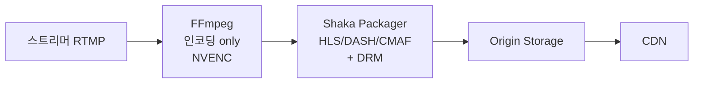

치지직, Twitch, Netflix의 라이브/VOD 인프라를 뜯어보면 공통점이 있다. **모두 FFmpeg 위에서 굴러간다**. 그리고 그건 인프라뿐이 아니다.

```
[FFmpeg가 쓰이는 곳]
- 스트리머: OBS 내부 인코딩 (libavcodec 사용)
- 인제스트 서버: RTMP → HLS 변환
- 트랜스코딩 서버: 1080p → 720p/480p ABR ladder 생성
- 분석 파이프라인: 멀티 오디오 분리
- 썸네일 생성: 영상에서 정지 이미지 추출
- 라이브 → VOD 자동 변환
```

**FFmpeg 모르면 라이브 인프라 일을 못한다.** 그런데 옵션이 100개가 넘고, `-ss`를 `-i` 앞에 두는지 뒤에 두는지에 따라 인코딩 시간이 10배 차이 난다. `-c copy` 한 줄 차이가 CPU 100% vs 1%.

[지난 시리즈 레벨 3](../codec-decision-and-debugging/)에서 코덱 선택을 봤다면, **이번 글부터 레벨 4 — 트랜스코딩 인프라 운영** 시리즈다. 첫 글은 그 모든 인프라의 기반인 **FFmpeg**.

---

## 1. FFmpeg는 사실 하나의 도구가 아니다

`ffmpeg` 명령어 뒤에 거대한 생태계가 있다.

```
[FFmpeg 프로젝트 구성]
라이브러리:
- libavcodec: 코덱 (H.264, H.265, AAC, Opus, AV1, VP9 ...)
- libavformat: 컨테이너 (MP4, MPEG-TS, FLV, M3U8 ...)
- libavfilter: 필터 (스케일, 크롭, 워터마크 ...)
- libswscale: 이미지 변환 (색공간, 해상도)
- libswresample: 오디오 변환 (샘플레이트, 채널)

CLI 도구:
- ffmpeg: 트랜스코딩
- ffprobe: 메타데이터 분석
- ffplay: 재생 (테스트용)
```

**OBS, VLC, Chrome, Plex가 내부적으로 libav* 사용**. `ffmpeg` CLI는 그 위에 얹힌 한 사용 방식.

---

## 2. FFmpeg 파이프라인 — 5단계

`ffmpeg` 명령어 하나는 내부적으로 5단계.


| 단계 | 입력 | 출력 | 핵심 옵션 |
|---|---|---|---|
| **Demuxer** | 컨테이너 | 압축 스트림들 | `-f`, `-i`, `-re` |
| **Decoder** | 압축 스트림 | raw 프레임 (YUV/PCM) | (자동) |
| **Filter** | raw 프레임 | 가공된 raw | `-vf`, `-af`, `-filter_complex` |
| **Encoder** | raw 프레임 | 압축 스트림 | `-c:v`, `-b:v`, `-preset` |
| **Muxer** | 압축 스트림 | 컨테이너 | `-f flv`, `-hls_*` |

### `-c copy`의 진짜 의미

```bash
# 재인코딩 없이 컨테이너만 (MP4 → MKV)
ffmpeg -i input.mp4 -c copy output.mkv
```

**Decoder/Encoder 건너뜀**. demux → 그대로 → mux. CPU 거의 안 씀. **1시간 영상을 1분에 처리**.

라이브 인제스트의 표준 패턴 — RTMP 받아서 HLS로 패키징할 때 코덱은 그대로 두고 컨테이너만 MPEG-TS로.

### Filter는 반드시 재인코딩 동반

```bash
# 1080p → 720p
ffmpeg -i input.mp4 -vf scale=1280:720 -c:v libx264 output.mp4
```

Filter는 raw 프레임에 작용. 무조건 decode → filter → encode 필요. `-c copy`와 같이 못 씀.

---

## 3. 옵션 위치가 의미를 바꾼다 — FFmpeg 최대 함정

```bash
# 옳음: 입력 옵션은 -i 앞
ffmpeg -ss 60 -i input.mp4 -c copy output.mp4

# 다름: 같은 옵션이 출력 옵션으로 가면 의미 바뀜
ffmpeg -i input.mp4 -ss 60 -c copy output.mp4
```

| 위치 | 동작 | 속도 | 정확도 |
|---|---|---|---|
| `-i` **앞** | demuxer에서 60초로 점프 후 시작 | **빠름** | 키프레임 단위 (부정확) |
| `-i` **뒤** | 전체 디코딩하면서 60초까지 버림 | **느림** | 프레임 단위 (정확) |

```bash
# 빠른 + 정확한 시킹 조합
ffmpeg -ss 55 -i input.mp4 -ss 5 -t 30 -c:v libx264 clip.mp4
# 55초로 빠르게 시킹 (키프레임) + 정확히 5초 더 = 60초부터 30초
```

모르고 정확한 시킹을 `-i` 뒤에만 두면 1시간 영상 자르는 데 10분. 앞뒤 조합으로 1분이면 끝.

---

## 4. -map / -map_metadata / -shortest

### `-map` — 스트림 명시 선택

기본은 "비디오 1개 + 오디오 1개". 멀티 트랙 있으면 명시 필수.

```bash
# 모든 스트림 포함
ffmpeg -i input.mkv -map 0 -c copy output.mp4

# 비디오 + 모든 오디오 (PokeClip 멀티 트랙)
ffmpeg -i input.mkv -map 0:v -map 0:a -c copy output.mp4

# 두 파일 합성: 첫째에서 비디오, 둘째에서 오디오 (음원 교체)
ffmpeg -i video.mp4 -i audio.aac \
  -map 0:v:0 -map 1:a:0 -c copy output.mp4
```

문법: `0:v:0` = 입력 0번 파일의 비디오 스트림 0번.

### `-map_metadata` — 메타데이터 처리

```bash
# 메타데이터 다 버리기 (OBS 비표준 태그 제거)
ffmpeg -i input.mp4 -map_metadata -1 -c copy clean.mp4

# 다른 파일에서 메타데이터 가져오기
ffmpeg -i video.mp4 -i meta.mp4 -map_metadata 1 -c copy output.mp4
```

라이브 인제스트에서 자주 — 스트리머 OBS의 비표준 태그가 CDN에서 문제 될 수 있어 정리.

### `-shortest` — 가장 짧은 입력에 맞춰 종료

```bash
# 정지 이미지 + 음악 → 팟캐스트 영상
ffmpeg \
  -loop 1 -i thumbnail.jpg \
  -i music.mp3 \
  -shortest \
  -c:v libx264 -c:a copy \
  podcast.mp4
```

이미지 `-loop 1`로 무한 반복, 음악 끝나면 `-shortest`로 같이 끝남.

---

## 5. 라이브 입력 옵션 — `-re`, `-stream_loop`, PTS 복구

### `-re` — 실시간 속도로 입력

기본 FFmpeg는 입력을 최대 속도로 읽음. 1시간 영상을 5분에 다 읽음. 라이브 송출 시뮬레이션에 문제.

```bash
# 파일을 라이브처럼 송출
ffmpeg -re -i sample.mp4 -c copy -f flv rtmp://localhost/live/test
```

`-re` 없으면 RTMP 서버에 1시간치를 5분에 밀어넣어 서버 죽음. `-re` = 1초어치 데이터를 1초마다.

### `-stream_loop` — 무한 반복

```bash
# 24/7 테스트 채널
ffmpeg -re -stream_loop -1 -i loop.mp4 \
  -c copy -f flv rtmp://localhost/live/test
```

`-1`=무한, `3`=3번 더 반복 (총 4번). 스테이징 부하 테스트에 자주.

### PTS 복구 — 라이브 인풋의 실전 문제

```bash
# PTS 강제 재생성 (깨진 TS 복구)
ffmpeg -fflags +genpts -i broken.ts -c copy fixed.ts

# 첫 PTS를 0으로 리셋
ffmpeg -i input.ts -reset_timestamps 1 -c copy reset.ts

# DTS 누락 무시
ffmpeg -fflags +genpts+igndts -i input.ts -c copy output.ts
```

RTMP/MPEG-TS 받다 가끔 PTS가 음수거나 점프함. 인제스트 단에서 정리 안 하면 CDN에서 깨짐.

### `-f` — 컨테이너 강제

| 프로토콜 | `-f` 값 |
|---|---|
| RTMP | `flv` |
| HLS | `hls` |
| DASH | `dash` |
| MPEG-TS over UDP | `mpegts` |
| SRT | `mpegts` |

RTMP의 컨테이너 이름이 `flv`라는 게 헷갈리는 부분.

---

## 6. 무손실 transmuxing — 라이브 인제스트 표준

RTMP로 들어온 스트림을 HLS로 그대로 패키징. **재인코딩 없이 컨테이너만 변환**.

```bash
ffmpeg \
  -fflags +genpts \
  -i rtmp://localhost/live/streamkey \
  -c copy \
  -f hls \
  -hls_time 6 \
  -hls_list_size 5 \
  -hls_flags delete_segments+independent_segments \
  -hls_segment_filename 'seg%05d.ts' \
  /var/www/hls/playlist.m3u8
```

CPU 거의 안 씀. **서버 1대에 동시 인제스트 100개** 가능.

### 라이브 입력의 실전 분기

```bash
# 1. 코덱 확인 후 분기
CODEC=$(ffprobe -v error -select_streams v:0 \
  -show_entries stream=codec_name -of csv=p=0 input.flv)
if [ "$CODEC" == "h264" ]; then
  ffmpeg -i input.flv -c copy ...  # passthrough
else
  ffmpeg -i input.flv -c:v libx264 ...  # transcode
fi

# 2. 오디오 샘플레이트 비표준 (HLS 표준 48000)
ffmpeg -i input.flv -c:v copy -ar 48000 -c:a aac output.ts

# 3. PTS 비정상
ffmpeg -fflags +genpts -i input.flv ...
```

---

## 7. x264 옵션 — 라이브의 90%

라이브 스트리밍 인프라의 90%가 x264 (소프트웨어 H.264 인코더).

### preset — 속도 vs 화질

같은 비트레이트에서 얼마나 압축을 열심히 할지.

```
[느림 → 빠름]
placebo > veryslow > slower > slow > medium > fast > faster > veryfast > superfast > ultrafast
```

같은 화질 기준 인코딩 시간:

| preset | 시간 (medium=1x) | 용도 |
|---|---|---|
| placebo | 100x | 실용 불가 |
| veryslow | 10x | VOD 아카이브 |
| slow | 3x | VOD |
| medium | 1x | 기준, YouTube 업로드 |
| fast | 0.7x | 균형 |
| veryfast | 0.4x | **라이브 표준** |
| ultrafast | 0.1x | 긴급 (파일 30% 큼) |

라이브에서 `medium`은 못 씀. 1080p60을 medium으로 인코딩하면 0.5x speed.

### tune — 콘텐츠 특성

```bash
-tune zerolatency  # 라이브 (B-frame 비활성, look-ahead 0)
-tune film         # 영화
-tune animation    # 애니메이션 (큰 단색 영역)
-tune grain        # 필름 그레인 보존
-tune fastdecode   # 디코딩 부하 최소화
-tune stillimage   # 정지 이미지 (썸네일 시퀀스)
```

라이브 = `zerolatency` 거의 항상. 하는 일:
- B-frame 비활성 (B는 미래 프레임 참조 → 지연 발생)
- look-ahead 0
- 슬라이스드 스레딩

화질 약간 떨어지지만 지연 200ms 이하.

### CRF vs CBR vs VBR

| 모드 | 옵션 | 사용처 |
|---|---|---|
| **CRF** | `-crf 23` | VOD (화질 일정, 비트레이트 가변) |
| **CBR** | `-b:v 5000k -minrate 5000k -maxrate 5000k -bufsize 10000k` | **라이브** (비트레이트 일정) |
| **VBR** | `-b:v 5000k -maxrate 8000k -bufsize 16000k` | VOD 다운로드 |

CRF 값:
- 18 이하: 시각적 무손실
- 23: 표준
- 28: 보이는 저하 시작
- 35+: 모바일

### 진짜 CBR — `-minrate`가 핵심

```bash
ffmpeg -i input \
  -c:v libx264 \
  -b:v 5000k \
  -maxrate 5000k \   # 순간 최대 제한
  -bufsize 10000k \  # VBV 버퍼 (비트레이트의 2배)
  -minrate 5000k \   # 순간 최소도 5000k (필러로 채움)
  output.flv
```

`-b:v 5000k`만으로는 진짜 CBR이 아님. x264는 약간 변동 허용. `-minrate`를 추가해야 진짜 고정. CDN/ISP가 대역폭 예측해야 하니 필요.

`bufsize` 작을수록 비트가 균일하게 분배되지만 화질 떨어짐.

### GOP 정렬 — `-g`, `-keyint_min`, `-sc_threshold 0`

키프레임 간격. HLS 세그먼트 경계와 직결.

```bash
# 60fps에서 2초마다 키프레임
-g 120 -keyint_min 120 -sc_threshold 0
```

| 옵션 | 의미 |
|---|---|
| `-g 120` | 최대 GOP. 120프레임마다 강제 키프레임 |
| `-keyint_min 120` | 최소 GOP. 그 전엔 키프레임 안 박음 |
| `-sc_threshold 0` | 씬 전환 시 자동 키프레임 비활성 |

세 옵션을 **같이 설정해야** 정확히 N프레임 간격으로 키프레임. 안 그러면 씬 전환 때문에 들쭉날쭉.

HLS 6초 세그먼트:
```
30fps: -g 180 -keyint_min 180
60fps: -g 360 -keyint_min 360
```

**ABR ladder의 모든 화질이 같은 GOP 설정이어야 세그먼트 경계 정렬**. 이게 ABR 부드러운 전환의 비밀.

### Profile / Level

```
baseline: 가장 단순 (피처폰)
main:     일반 (셋탑박스)
high:     가장 효율 (현대 디바이스)
```

라이브 플랫폼 표준: `-profile:v high -level 4.0` (1080p30) 또는 `4.2` (1080p60).

레벨 = 해상도/비트레이트 상한:
```
4.0: 1920x1080 @ 30fps
4.2: 1920x1080 @ 60fps
5.1: 4K @ 60fps
```

### pix_fmt

```
yuv420p     # 8비트, 호환성 표준
yuv420p10le # 10비트 (HDR)
yuv444p     # 풀 컬러 (호환성 낮음)
```

웹/모바일 라이브는 `yuv420p` 고정. OBS에서 `yuv444p`로 송출하는 스트리머가 있는데 인제스트에서 강제로 `yuv420p` 재인코딩이 정석.

### 라이브 표준 명령 (종합)

```bash
ffmpeg \
  -re -i rtmp://input/live/streamkey \
  \
  -c:v libx264 \
  -preset veryfast \
  -tune zerolatency \
  -profile:v high -level 4.2 \
  -pix_fmt yuv420p \
  -g 120 -keyint_min 120 -sc_threshold 0 \
  -b:v 6000k -minrate 6000k -maxrate 6000k -bufsize 12000k \
  \
  -c:a aac -b:a 128k -ar 48000 -ac 2 \
  \
  -f flv rtmp://output/live/streamkey
```

치지직/Twitch가 RTMP 1080p60 받아서 처리하는 기본형.

### Two-pass — VOD에서만

```bash
# Pass 1: 분석
ffmpeg -y -i input.mp4 -c:v libx264 -b:v 5000k -pass 1 \
  -an -f null /dev/null

# Pass 2: 인코딩
ffmpeg -i input.mp4 -c:v libx264 -b:v 5000k -pass 2 \
  -c:a aac -b:a 128k output.mp4
```

같은 비트레이트에서 화질 5~10% 향상. 시간 2배. 라이브엔 불가능 (전체 영상 필요).

### VMAF — 화질 측정

```bash
ffmpeg -i original.mp4 -i encoded.mp4 \
  -lavfi libvmaf -f null -
```

| VMAF | 의미 |
|---|---|
| 95+ | 시각적 원본 동등 |
| 85~95 | 약간 차이 |
| 70 미만 | 명확한 저하 |

ABR ladder 튜닝할 때 각 비트레이트 단계의 VMAF로 결정.

---

## 8. 오디오 인코딩

비디오 옵션의 절반.

```bash
ffmpeg -i input.mp4 \
  -c:a aac \      # 코덱
  -b:a 128k \     # 비트레이트
  -ar 48000 \     # 샘플레이트
  -ac 2 \         # 채널
  output.mp4
```

라이브 HLS 표준: **AAC-LC 128k 48kHz 스테레오**.

### AAC 인코더 선택

| 인코더 | 음질 | 라이센스 |
|---|---|---|
| `aac` (FFmpeg 내장) | 보통 | LGPL, 어디서나 |
| `libfdk_aac` (Fraunhofer) | **최고** | 비-LGPL, 별도 빌드 |
| `libfaac` | 낮음 | deprecated |

```bash
ffmpeg -i input -c:a libfdk_aac -b:a 128k output.m4a
```

`libfdk_aac`는 같은 비트레이트에서 음질 더 좋고 96k까지 들어줄 만함. 근데 라이센스 문제로 `jrottenberg/ffmpeg` 같은 일반 도커에 없음. 라이브 인프라는 보통 내장 `aac`.

### 라우드니스 정규화 — loudnorm

스트리머마다 볼륨 다 다른데 EBU R128로 통일.

```bash
ffmpeg -i input -af "loudnorm=I=-16:LRA=11:TP=-1.5" output.m4a
```

플랫폼별 권장:

| 플랫폼 | 라우드니스 |
|---|---|
| Spotify | -14 LUFS |
| YouTube | -14 LUFS |
| **Twitch/치지직** | **-16 LUFS** |
| 방송 (한국) | -23 LUFS |

라이브 인제스트에서 자동 적용하는 곳도 있고 스트리머에게 맡기는 곳도 있다.

### 오디오 필터 모음

```bash
-af "volume=0.5"                                  # 볼륨 50%
-af "afade=t=in:st=0:d=2,afade=t=out:st=58:d=2"   # 페이드 인/아웃
-af "agate=threshold=0.05"                        # 노이즈 게이트
```

---

## 9. -filter_complex — 멀티 입력/출력

`-vf`/`-af`는 단일 입력/출력만. 복잡한 처리는 `-filter_complex`.

```bash
# 두 영상 좌우 합성
ffmpeg -i left.mp4 -i right.mp4 \
  -filter_complex "[0:v][1:v]hstack=inputs=2[v]" \
  -map "[v]" -map 0:a output.mp4
```

### 멀티 오디오 트랙 (PokeClip 패턴)

```bash
# 영상 + 게임/마이크/디스코드 오디오
ffmpeg \
  -i video.mp4 -i game.wav -i mic.wav -i discord.wav \
  -map 0:v -map 1:a -map 2:a -map 3:a \
  -c:v copy -c:a aac \
  -metadata:s:a:0 title="Game" \
  -metadata:s:a:1 title="Mic" \
  -metadata:s:a:2 title="Discord" \
  output.mp4
```

각 트랙에 라벨. HLS multi-audio에서 사용자에게 보임.

### 오디오 채널 조작

```bash
# 스테레오 → 좌/우 분리
ffmpeg -i input.wav \
  -filter_complex "[0:a]channelsplit=channel_layout=stereo[L][R]" \
  -map "[L]" left.wav -map "[R]" right.wav

# 모노 → 스테레오 (한쪽 채널만 녹음된 마이크 복구)
ffmpeg -i mono_left.wav -af "channelmap=channel_layout=mono" output.wav

# 여러 오디오 믹싱
ffmpeg -i game.wav -i mic.wav \
  -filter_complex "[0:a][1:a]amix=inputs=2:duration=longest:weights=1 0.8[a]" \
  -map "[a]" mixed.wav
```

`weights`로 각 입력 비중. OBS에서 게임 + 마이크 + 디스코드 + BGM 다 `amix`.

### AV 동기화 — `-itsoffset`

```bash
# 오디오를 100ms 늦추기
ffmpeg -i video.mp4 -itsoffset 0.1 -i video.mp4 \
  -map 0:v -map 1:a -c copy output.mp4
```

같은 파일을 두 번 입력하고 한쪽에만 오프셋. OBS의 마이크 오프셋 -50ms 같은 효과를 후처리로.

### 필터 체인 vs 그래프

```
체인 (직렬, `,`): -vf "scale=1280:720,fps=30"
그래프 (병렬/분기, `;` + `[]`): -filter_complex "[0:v]scale=1280:720[v1];[0:v]scale=854:480[v2]"
```

### 워터마크 오버레이

```bash
# 우상단 로고 (반투명)
ffmpeg -i video.mp4 -i logo.png \
  -filter_complex "[1:v]format=rgba,colorchannelmixer=aa=0.5[logo]; \
                   [0:v][logo]overlay=W-w-20:20" \
  -c:a copy output.mp4
```

`overlay=W-w-20:20`: 우상단에서 20px 안쪽. `W`=영상 너비, `w`=로고 너비.

### `drawtext` — 라이브 지연 측정

```bash
ffmpeg -i video.mp4 \
  -vf "drawtext=text='%{localtime}':x=10:y=10:fontsize=24:fontcolor=white:box=1:boxcolor=black@0.5" \
  output.mp4
```

원본에 현재 시각 박고, 시청자 화면 시각과 비교하면 **글래스 투 글래스 지연** 측정.

### 라이브 인제스트 + 워터마크 + ABR 통합

```bash
ffmpeg \
  -re -i rtmp://input/live/streamkey \
  -i logo.png \
  \
  -filter_complex "\
    [0:v][1:v]overlay=W-w-20:20[wm]; \
    [wm]split=3[v1][v2][v3]; \
    [v2]scale=1280:720[v720]; \
    [v3]scale=854:480[v480]" \
  \
  -map "[v1]"  -map 0:a -c:v libx264 -preset veryfast -tune zerolatency \
    -b:v 6000k -maxrate 6000k -bufsize 12000k -c:a aac -b:a 128k \
    -f flv rtmp://output/1080 \
  \
  -map "[v720]" -map 0:a -c:v libx264 -preset veryfast -tune zerolatency \
    -b:v 3000k -maxrate 3000k -bufsize 6000k -c:a aac -b:a 128k \
    -f flv rtmp://output/720 \
  \
  -map "[v480]" -map 0:a -c:v libx264 -preset veryfast -tune zerolatency \
    -b:v 1500k -maxrate 1500k -bufsize 3000k -c:a aac -b:a 96k \
    -f flv rtmp://output/480
```

이게 라이브 트랜스코딩 서버 한 인스턴스가 하는 일. `split=3`이 디코딩 결과를 3개로 분기. **디코딩 1번 + 인코딩 3번**.

근데 1080p60+720p+480p CPU로 동시 처리면 32코어 서버도 부담. NVENC 같은 GPU 인코더 필요 → 다음 글.

---

## 10. HLS 패키징 — 인코딩과 별개의 단계

많은 사람이 헷갈리는 부분.

```
인코딩: raw → H.264 비트스트림
패키징: H.264 → HLS .ts + .m3u8 / DASH .m4s + .mpd
```

x264가 만든 H.264 비트스트림을 그대로 시청자에게 줄 수 없음. **HLS 규격에 맞게 잘라서 컨테이너에 담아야**.

FFmpeg는 한 번에 처리하지만, 대규모는 보통 분리 (인코딩 = 무거운 GPU 작업, 패키징 = 가벼운 CPU 작업).

### HLS 옵션 총정리

```bash
ffmpeg -i input.mp4 \
  -c:v libx264 -preset veryfast \
  -c:a aac -b:a 128k \
  \
  -f hls \
  -hls_time 6 \
  -hls_list_size 5 \
  -hls_segment_type fmp4 \
  -hls_segment_filename 'seg_%05d.m4s' \
  -hls_fmp4_init_filename 'init.mp4' \
  -hls_flags delete_segments+independent_segments+program_date_time \
  -hls_playlist_type event \
  -hls_allow_cache 0 \
  \
  output.m3u8
```

| 옵션 | 의미 | 권장값 |
|---|---|---|
| `-hls_time` | 세그먼트 길이 (초) | 6 (일반), 2 (LL-HLS) |
| `-hls_list_size` | 매니페스트 유지 세그먼트 수 | 5 (sliding) / 0 (VOD 무제한) |
| `-hls_segment_type` | 컨테이너 | `mpegts` (전통), `fmp4` (CMAF) |
| `-hls_playlist_type` | 타입 | `event` (라이브→VOD), `vod` |

### `-hls_time` × GOP 정렬

```
GOP 6초 (-g 360 for 60fps), -hls_time 6 → 정확히 6초 세그먼트
GOP 2초, -hls_time 6 → 6초 근처 (다음 키프레임까지 기다림)
```

`-g`와 `-hls_time`을 같이 설정해야 정확.

### `-hls_flags` 주요 플래그

- `delete_segments`: sliding window에서 빠진 `.ts` 자동 삭제 (디스크 관리)
- `independent_segments`: 각 세그먼트가 키프레임으로 시작 (ABR 보장)
- `program_date_time`: `#EXT-X-PROGRAM-DATE-TIME` 태그 (시간 동기화)
- `append_list`: 기존 플레이리스트 이어 쓰기 (재시작 시)
- `omit_endlist`: VOD 모드여도 ENDLIST 안 박음

라이브 표준: `delete_segments+independent_segments+program_date_time`

### `-hls_playlist_type event` — 라이브 → VOD 자연 전환

```bash
# 1. event 타입으로 라이브 시작
ffmpeg -re -i rtmp://input \
  -c:v libx264 ... \
  -hls_playlist_type event \
  -hls_list_size 0 \           # 무제한 (다 보존)
  -hls_flags omit_endlist \    # 라이브 동안은 ENDLIST 없음
  /var/www/hls/live.m3u8

# 2. 방송 종료 후 ENDLIST만 추가
echo "#EXT-X-ENDLIST" >> /var/www/hls/live.m3u8
```

같은 매니페스트가 **라이브에서 VOD로 자연 전환**. 시청자는 다시보기로 그대로 봄.

---

## 11. ABR Ladder + Master Playlist — `-var_stream_map`

```bash
ffmpeg -i input.mp4 \
  -filter_complex "[0:v]split=3[v1][v2][v3];[v2]scale=1280:720[v720];[v3]scale=854:480[v480]" \
  \
  -map "[v1]"   -map 0:a -c:v libx264 -b:v 6000k -c:a aac -b:a 128k \
  -map "[v720]" -map 0:a -c:v libx264 -b:v 3000k -c:a aac -b:a 128k \
  -map "[v480]" -map 0:a -c:v libx264 -b:v 1500k -c:a aac -b:a 96k \
  \
  -f hls \
  -hls_time 6 \
  -hls_segment_filename 'stream_%v/seg_%05d.ts' \
  -master_pl_name master.m3u8 \
  -var_stream_map "v:0,a:0,name:1080p v:1,a:1,name:720p v:2,a:2,name:480p" \
  \
  'stream_%v/playlist.m3u8'
```

결과 파일 구조:
```
master.m3u8              ← 시청자가 받는 마스터
stream_1080p/playlist.m3u8 + seg_*.ts
stream_720p/playlist.m3u8 + seg_*.ts
stream_480p/playlist.m3u8 + seg_*.ts
```

플레이어가 master 받아서 대역폭에 맞는 sub playlist 선택.

### 멀티 오디오 HLS — `agroup`

```bash
ffmpeg -i input.mkv \
  -map 0:v -map 0:a:0 -map 0:a:1 -map 0:a:2 \
  -c:v libx264 -c:a aac \
  -f hls -hls_time 6 \
  -var_stream_map "v:0,name:video \
    a:0,agroup:audio,name:ko,language:ko \
    a:1,agroup:audio,name:en,language:en \
    a:2,agroup:audio,name:ja,language:ja" \
  -master_pl_name master.m3u8 \
  '%v/playlist.m3u8'
```

`agroup`이 핵심 — 같은 그룹 안에서 사용자가 오디오 선택. Netflix 다국어 처리가 이 구조.

### WebVTT 자막

```bash
ffmpeg -i input.mp4 -i subs.srt \
  -map 0:v -map 0:a -map 1:0 \
  -c:v libx264 -c:a aac -c:s webvtt \
  -f hls -hls_time 6 master.m3u8
```

자막은 별도 `.m3u8`로 분리되고 마스터에서 참조.

---

## 12. CMAF — HLS와 DASH 같은 세그먼트 공유

```bash
ffmpeg -i input.mp4 \
  -c:v libx264 -b:v 5000k -c:a aac -b:a 128k \
  \
  # HLS (fMP4)
  -f hls \
  -hls_segment_type fmp4 \
  -hls_segment_filename 'cmaf/seg_%05d.m4s' \
  -hls_fmp4_init_filename 'cmaf/init.mp4' \
  cmaf/playlist.m3u8 \
  \
  # DASH (같은 .m4s 사용)
  -f dash \
  -seg_duration 6 \
  -init_seg_name 'cmaf/init.mp4' \
  -media_seg_name 'cmaf/seg_$Number%05d$.m4s' \
  cmaf/manifest.mpd
```

같은 `.m4s`를 HLS와 DASH가 가리킴. **스토리지/CDN 비용 절반**. [dash-vs-hls 글](../dash-vs-hls/)의 CMAF 수렴 패턴.

### LL-HLS Partial — FFmpeg는 한계

```bash
ffmpeg -i rtmp://input \
  -c:v libx264 -preset veryfast -tune zerolatency \
  -f hls -hls_time 4 -hls_segment_type fmp4 \
  -hls_init_time 0.2 \
  -hls_segment_options "movflags=+frag_keyframe+empty_moov+default_base_moof" \
  ll_hls.m3u8
```

근데 FFmpeg LL-HLS 지원은 아직 완전치 않음. 진짜 LL-HLS는 **Shaka Packager** 권장:

```bash
packager \
  'in=video.mp4,stream=video,init_segment=init.mp4,segment_template=seg_$Number$.m4s' \
  --hls_master_playlist_output master.m3u8 \
  --segment_duration 4 \
  --hls_playlist_type LIVE \
  --low_latency_dash_mode
```

세그먼트 파일명:
```
seg_%05d.ts        # 5자리 (seg_00000.ts)
seg_%v_%05d.ts     # 스트림 + 숫자
seg_$Number$.m4s   # DASH 템플릿
seg_$Time$.m4s     # 시간 기반
```

DASH는 `$...$`, HLS는 `%...` — 헷갈리는 부분.

---

## 13. FFmpeg vs Shaka Packager — 분리 패턴

```
[FFmpeg 통합]
인코딩 + 패키징 한 프로세스
장점: 단순
단점: 독립 스케일링 어려움

[Shaka Packager 분리]
인코딩: FFmpeg → MP4 출력
패키징: Shaka가 .m4s + .m3u8 + .mpd 생성
장점: 독립 스케일링, DRM 통합 쉬움, LL-HLS 완전 지원
단점: 파이프라인 복잡
```



```bash
# 분리 패턴 - 파이프
ffmpeg -i rtmp://input ... -f mp4 - | \
  packager 'in=-,stream=video' \
    --hls_master_playlist_output master.m3u8 \
    --segment_duration 6
```

치지직/Twitch 같은 대형 플랫폼은 분리. 작은 라이브 서비스는 FFmpeg 통합.

---

## 14. `-progress` — 라이브 트랜스코딩 모니터링

서버에서 FFmpeg 돌고 있는지 확인.

```bash
ffmpeg -i input.mp4 \
  -c:v libx264 \
  -progress pipe:1 \
  -nostats \
  output.mp4
```

출력 예시:
```
frame=1234
fps=58.5
bitrate=2500.3kbits/s
total_size=12345678
out_time_ms=20566000
speed=1.95x
```

`speed=1.95x`가 핵심 — 1.0x보다 크면 실시간보다 빠름. 0.5x면 라이브 못 따라감. **1.0x 이하 알람**이 라이브 인프라 표준.

서버에서 FFmpeg 띄울 때 이 stdout 파싱해서 Prometheus로 노출.

---

## 15. ffprobe — 메타데이터 분석

```bash
ffprobe -v error -show_format -show_streams -of json input.mp4
```

```json
{
  "format": { "duration": "3600.0", "bit_rate": "5000000" },
  "streams": [
    {
      "codec_type": "video",
      "codec_name": "h264",
      "profile": "High",
      "width": 1920, "height": 1080,
      "r_frame_rate": "60/1"
    },
    {
      "codec_type": "audio",
      "codec_name": "aac",
      "sample_rate": "48000", "channels": 2
    }
  ]
}
```

라이브 인제스트 서버는 RTMP 받자마자 ffprobe로 코덱 확인 → **H.264면 -c copy passthrough, 그 외면 트랜스코딩 분기**.

---

## 16. FFmpeg Docker 운영

```dockerfile
# CPU 인코딩만
FROM jrottenberg/ffmpeg:6.0-ubuntu

# NVIDIA GPU 인코딩
FROM jrottenberg/ffmpeg:6.0-nvidia
```

```bash
# NVENC 컨테이너
docker run --gpus all -v $(pwd):/data \
  jrottenberg/ffmpeg:6.0-nvidia \
  -i /data/input.mp4 -c:v h264_nvenc /data/output.mp4
```

### Kubernetes

```yaml
apiVersion: apps/v1
kind: Deployment
spec:
  template:
    spec:
      containers:
      - name: ffmpeg
        image: jrottenberg/ffmpeg:6.0-nvidia
        resources:
          limits:
            nvidia.com/gpu: 1
        args:
          - -i
          - rtmp://input/live/streamkey
          - -c:v
          - h264_nvenc
```

NVIDIA device plugin 설치 + `nvidia.com/gpu: 1`. 다음 글에서 NVENC 깊이 다룬다.

### FFmpeg 빌드 옵션 확인

```bash
ffmpeg -version
ffmpeg -encoders | grep h264

# 출력 예시:
# V..... libx264              libx264 H.264 / AVC
# V..... h264_nvenc           NVIDIA NVENC H.264
# V..... h264_qsv             Intel Quick Sync H.264
# V..... h264_videotoolbox    VideoToolbox H.264 (macOS)
```

같은 `ffmpeg`라도 빌드에 따라 지원 코덱 다름. 도커 이미지로 관리하는 게 일반적.

---

## 17. 면접 답변용 — "FFmpeg 어떻게 활용하셨어요?"

```
"FFmpeg는 libav* 라이브러리 모음이고,
demux → decode → filter → encode → mux 5단계 파이프라인입니다.

옵션이 입력/출력 둘 다에 붙는 게 핵심인데,
-ss를 -i 앞이면 빠른 시킹, 뒤면 정확한 시킹입니다.

실무에서는:
1. 라이브 인제스트는 -c copy로 컨테이너만 변환 (CPU 거의 안 씀, 노드당 100개 가능)
2. 트랜스코딩은 -filter_complex split으로 한 디코딩 + 다중 인코딩 (ABR Ladder)
3. -var_stream_map + master_pl_name으로 한 명령에 ABR HLS 통합
4. GOP는 -g + keyint_min + sc_threshold 0 세 옵션 같이 (모든 화질 동일)
5. 진짜 CBR은 -b:v + -minrate + -maxrate + -bufsize 네 옵션 조합

오디오는 loudnorm으로 -16 LUFS 정규화 강제.
스트리머마다 마이크 볼륨 달라서 시청자 경험 차이가 큽니다.

라이브 입력 문제는 ffprobe로 사전 분석 후 분기:
- 코덱 H.264 아니면 트랜스코딩
- 샘플레이트 48000 아니면 리샘플
- PTS 깨졌으면 -fflags +genpts

모니터링은 -progress pipe:1로 speed 지표 → Prometheus.
1.0x 이하면 알람 (라이브 못 따라감).

대규모는 FFmpeg(인코딩) + Shaka Packager(패키징) 분리.
독립 스케일링, DRM 통합, LL-HLS 완전 지원이 가능합니다.

운영은 Kubernetes + jrottenberg/ffmpeg:nvidia 이미지로
nvidia.com/gpu 자원 할당해서 NVENC 채널 관리했습니다."
```

---

## 정리하면

FFmpeg는 **라이브 인프라의 90%가 그 위에서 굴러가는 도구**다.

1. **정체** — `ffmpeg` CLI + libav* 라이브러리. OBS/VLC/Chrome 다 내부 사용
2. **5단계 파이프라인** — Demux → Decode → Filter → Encode → Mux
3. **`-c copy`** — Decoder/Encoder 건너뜀. CPU 거의 안 씀. 라이브 인제스트 표준
4. **옵션 위치** — `-i` 앞이냐 뒤냐가 의미 바꿈. `-ss` 위치 함정 (10배 차이)
5. **라이브 입력** — `-re`, `-stream_loop`, `-fflags +genpts+igndts`로 깨진 PTS 복구
6. **x264 라이브 표준** — `preset veryfast + tune zerolatency + 진짜 CBR (-minrate 포함) + GOP 정렬`
7. **GOP 정렬** — `-g N -keyint_min N -sc_threshold 0` 세 옵션 같이. ABR Ladder의 모든 화질에 동일
8. **오디오 표준** — AAC 128k 48kHz 스테레오 + `loudnorm -16 LUFS`
9. **AAC 인코더** — `libfdk_aac`가 최고지만 라이센스로 보통 내장 `aac`
10. **`-filter_complex`** — `split` + 다중 출력으로 ABR Ladder + 워터마크
11. **HLS 패키징** — `-var_stream_map` + `-master_pl_name`, `event` 타입으로 라이브→VOD
12. **CMAF** — HLS/DASH 같은 `.m4s` 공유, 비용 절반
13. **분리 패턴** — 대규모는 FFmpeg(인코딩) + Shaka Packager(패키징)
14. **모니터링** — `-progress pipe:1` + speed 지표 + Prometheus 알람
15. **운영** — Docker `jrottenberg/ffmpeg:nvidia` + K8s `nvidia.com/gpu`

다음 글에선 **NVENC + GPU 트랜스코딩의 진짜 깊이** — preset/tune 차이, 4K HDR NVENC 옵션, 비용 비교, AV1 NVENC — 를 다룬다.

---

**참고**
- [FFmpeg 공식 문서](https://ffmpeg.org/documentation.html)
- [FFmpeg HLS muxer 문서](https://ffmpeg.org/ffmpeg-all.html#hls-2)
- [jrottenberg/ffmpeg Docker](https://github.com/jrottenberg/ffmpeg)
- [Shaka Packager](https://github.com/shaka-project/shaka-packager)
- [FFmpeg Filter 문서](https://ffmpeg.org/ffmpeg-filters.html)
