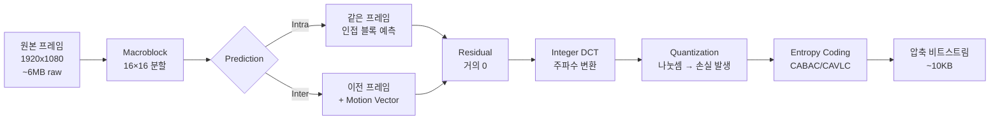

1080p 60fps 영상의 raw 데이터량을 계산해보면 1초에 약 **373MB**다. 1시간이면 **1.3TB**.

근데 OBS에서 같은 화질로 송출할 때 보통 6Mbps. 1초에 **750KB**. 

500배 차이. H.264는 이걸 가능하게 만드는 표준이다. 모든 스트리밍 인프라가 이 위에 올라가 있다.

[지난 글](../whip-whep-modern-ingest/)에서 스트리밍 프로토콜(RTMP/HLS/WebRTC/WHIP)을 정리했다면, 이번 글은 **그 안에 흐르는 영상 데이터가 어떻게 만들어지는지** 정리한 노트다. I/P/B 프레임, 매크로블록, 양자화, CABAC, NAL Unit, 그리고 OBS 인코딩 옵션의 진짜 의미.

---

## 1. H.264의 정체 — 두 표준 단체가 공동으로 만든 결과

```
공식 명칭:
- ITU-T H.264
- ISO/IEC 14496-10 (MPEG-4 Part 10)
- 통칭 AVC (Advanced Video Coding)
```

ITU-T와 ISO/IEC가 **공동 표준화** 했다. 매우 드문 일. 둘이 따로 만들면 산업 분열되니까 같이 만들기로 합의.

```
[H.264 출시 흐름]
2003년: 표준 발표
2004년: Adobe Flash가 H.264 지원
2007년: iPhone 첫 모델이 H.264 하드웨어 디코더
2009년: HLS가 H.264로 출시
2024년: 여전히 라이브 인프라의 90% 이상 점유
```

20년 지나도 표준. RTMP와 같은 패턴 — 호환성과 생태계 관성.

---

## 2. 압축의 3가지 원리 — 어디서 데이터를 줄이나

H.264는 영상의 **중복성**을 세 가지 방식으로 활용한다.

| 종류 | 원리 | 예시 |
|---|---|---|
| **공간적 중복** | 한 프레임 안에서 인접 픽셀이 비슷함 | 하늘은 거의 같은 파란색 |
| **시간적 중복** | 연속 프레임이 거의 같음 | 정적인 배경 |
| **통계적 중복** | 자주 나오는 값에 짧은 코드 부여 | 0이 많이 나옴 → 0에 1비트 |

각 중복을 다른 기법으로 압축. **공간 → Intra Prediction**, **시간 → Inter Prediction + Motion Vector**, **통계 → CABAC/CAVLC**.

---

## 3. I/P/B 프레임 — H.264의 압축 핵심

이게 영상 압축의 가장 큰 비밀이다.


```
[GOP — Group of Pictures]
I P B B P B B P
↑                ← 키프레임 (Full Image)
  ↑              ← P-frame: 이전 I/P 참조
    ↑↑           ← B-frame: 이전 + 미래 참조
```

| 프레임 | 의미 | 크기 (1080p 기준) | 디코딩 의존성 |
|---|---|---|---|
| **I (Intra)** | 전체 이미지 자체 저장 | ~50KB | 독립 |
| **P (Predicted)** | 이전 I/P와의 차분 | ~10KB | 이전 프레임 필요 |
| **B (Bi-predicted)** | 이전 + 미래 프레임 양쪽 참조 | ~3KB | 양쪽 모두 필요 |

압축 효율: B > P > I.  
디코딩 부담: B > P > I.  
복구 가능성: I만 독립.

### Motion Vector — P/B 프레임의 작동 원리

P-frame이 이전 프레임의 모든 픽셀을 다시 저장하지 않는 비밀.

```
[P-frame의 표현]
"이전 프레임 (10, 20) 위치의 16x16 블록을 가져와서
 (0, -5)만큼 이동시켜라 + 작은 차분"

→ 모션 벡터 (Δx=0, Δy=-5) + residual data (작음)
```

장면이 정적이면 모션 벡터 거의 0. 액션 장면이면 큰 값. 같은 1080p 영상도 **콘텐츠에 따라 비트레이트 5배 차이** 나는 이유.

### GOP 크기의 트레이드오프

```
[GOP 짧음 (1~2초)]
- 키프레임 자주 박힘
- 같은 비트레이트에서 화질 낮음
- 시킹 정확
- 라이브에 유리 (재접속 빠름)

[GOP 김 (5~10초)]
- 키프레임 드물게
- 같은 비트레이트에서 화질 높음
- 시킹 부정확 (키프레임 위치만 가능)
- VOD에 유리
```

HLS는 6초 GOP 표준. 세그먼트 경계가 GOP 경계.

---

## 4. H.264 인코딩 5단계 파이프라인

I/P/B 프레임을 만드는 실제 과정.




### Stage 1: Macroblock 분할

```
1920 × 1080 영상
= 120 × 67.5 매크로블록 (16x16)
= 8100개 블록
```

H.264는 모든 처리를 **16x16 단위**로 함. 더 작은 단위(4x4)로 나눠 처리하기도 함 (Variable block size).

### Stage 2: Prediction — 압축의 진짜 비밀

각 매크로블록에 대해 **이미 처리된 부분**(같은 프레임의 인접 블록 OR 이전 프레임의 비슷한 블록)으로 예측.

```
실제 블록    예측 블록    차분(residual)
[123 124   ]   [122 123   ]   [+1 +1   ]
[125 126   ]   [124 125   ]   [+1 +1   ]
...            ...            ...
```

차분은 **거의 0**. 0이 많은 데이터는 압축 잘 됨.

### Stage 3: Integer DCT — 주파수 변환

차분을 **주파수 도메인**으로 변환. DCT 비슷한 정수 변환(Integer DCT). 영상의 큰 패턴은 저주파, 디테일은 고주파.

```
공간 도메인          주파수 도메인
[+1 +1 +1 +1]       [+4  0  0  0]  ← 저주파에 집중
[+1 +1 +1 +1]   →   [ 0  0  0  0]
[+1 +1 +1 +1]       [ 0  0  0  0]
[+1 +1 +1 +1]       [ 0  0  0  0]
```

DCT가 끝나면 좌상단에 값이 집중되고 나머지는 거의 0.

### Stage 4: Quantization — 손실 압축의 본질

여기서 **데이터를 진짜로 버린다**.

```
DCT 결과    QP=10 나눗셈    결과
[+40]   →   ÷10 = 4         4
[+8]    →   ÷10 = 0.8 → 0   0  (손실!)
[+3]    →   ÷10 = 0.3 → 0   0  (손실!)
```

QP(Quantization Parameter) 값이 클수록 더 많이 버려짐. **화질 ↓ 파일 ↓**.

- QP 18: 거의 무손실 (5배 압축)
- QP 23: 표준 화질 (10배)
- QP 28: 보통 (20배)
- QP 35: 모바일 (50배)

OBS의 CRF 설정이 결국 QP를 자동 조절하는 것.

### Stage 5: Entropy Coding — 무손실 압축 마무리

양자화 후 남은 값들에 대해 **무손실 압축** 추가.

```
[CAVLC - Context-Adaptive Variable Length Coding]
- 단순, 빠름
- Baseline Profile
- 라이브에 유리

[CABAC - Context-Adaptive Binary Arithmetic Coding]
- 복잡, 느림
- 10~15% 더 압축
- Main/High Profile
- VOD에 유리
```

같은 파일을 CAVLC → CABAC 변경하면 10% 작아지지만 디코딩 부담 증가.

---

## 5. Profile과 Level — H.264의 두 축

각자 다른 걸 제한.

### Profile — 기능 집합

| Profile | 기능 | 호환성 | 사용처 |
|---|---|---|---|
| **Baseline** | 기본 (I/P만) | 최고 (피처폰) | 옛 모바일 |
| **Main** | + B-frame, CABAC | 좋음 | 일반 라이브 |
| **High** | + 8x8 transform, 가변 양자화 | 약간 제한적 | VOD, 고화질 |
| **High 10** | + 10-bit | 제한적 | HDR |

스트리밍 표준: **High Profile**. 10년 이상 된 디바이스까지 지원.

### Level — 처리 부담 상한

| Level | 최대 해상도 | 최대 FPS | 최대 비트레이트 |
|---|---|---|---|
| 3.0 | 720×480 | 30 | 10 Mbps |
| 3.1 | 1280×720 | 30 | 14 Mbps |
| 4.0 | 1920×1080 | 30 | 25 Mbps |
| 4.1 | 1920×1080 | 30 | 62 Mbps |
| 4.2 | 1920×1080 | 60 | 62 Mbps |
| 5.0 | 4K | 30 | 240 Mbps |
| 5.1 | 4K | 60 | 240 Mbps |

라이브 1080p60 표준: **Level 4.2**.

### 코덱 문자열 — `avc1.640028` 해부

브라우저에서 `MediaSource.isTypeSupported('video/mp4; codecs="avc1.640028"')` 같은 거 봤을 거다.

```
avc1.640028
└─┬─┘ │ │ │
   │  │ │ └── 28 = Level 4.0 (decimal 40, 16진수 28)
   │  │ └──── 00 = Constraint flags
   │  └────── 64 = Profile (decimal 100 = High Profile)
   └──────── avc1 = H.264 (AVC)

→ "H.264 High Profile Level 4.0"
```

매니페스트(M3U8/MPD)에 박혀있어서 플레이어가 미리 디코딩 가능 여부 판단.

---

## 6. NAL Unit — 비트스트림의 단위

압축된 H.264 데이터는 **NAL Unit (Network Abstraction Layer Unit)** 의 연속.

### NAL Unit 헤더 (1바이트)

```
 7 6 5 4 3 2 1 0
┌─┬─┬─┬─┬─┬─┬─┬─┐
│F│NRI│  Type   │
└─┴─┴─┴─┴─┴─┴─┴─┘
F   = Forbidden (0 강제)
NRI = Reference Idc (참조 중요도)
Type = NAL Unit 종류 (5비트)
```

### 주요 NAL Unit Type

| Type | 이름 | 의미 |
|---|---|---|
| 1 | Non-IDR Slice | P/B-frame 데이터 |
| 5 | IDR Slice | I-frame (키프레임) 데이터 |
| 6 | SEI | 보조 정보 (HDR 메타데이터 등) |
| 7 | **SPS** | Sequence Parameter Set |
| 8 | **PPS** | Picture Parameter Set |
| 9 | AUD | Access Unit Delimiter |

### SPS / PPS — 디코더의 설정값

```
SPS (Sequence Parameter Set):
- 해상도, fps, bit depth, profile, level
- 영상 전체에 한 번만 필요

PPS (Picture Parameter Set):
- 엔트로피 코딩 모드 (CABAC/CAVLC), 양자화 초기값
- 영상 전체 또는 일부에 적용
```

플레이어는 **첫 NAL Unit으로 SPS, PPS 받은 다음에야 디코딩 시작 가능**. 이래서 라이브 시청자가 중간에 들어오면 다음 IDR + SPS/PPS가 올 때까지 기다려야 한다.

### Annex B vs AVCC — 두 가지 포맷

같은 NAL Unit을 두 가지 방식으로 표현.

```
[Annex B - MPEG-TS, RTSP에서 사용]
00 00 00 01 [NAL Unit 1] 00 00 00 01 [NAL Unit 2] ...
└──┬──┘                  └──┬──┘
Start Code               Start Code

[AVCC - MP4, fMP4에서 사용]
[Length 4byte] [NAL Unit 1] [Length 4byte] [NAL Unit 2] ...
```

HLS의 .ts는 Annex B, fMP4는 AVCC. **hls.js의 transmuxing이 이 변환을 한다**.

---

## 7. 인코더 옵션 — 실전 튜닝

### x264 preset — 속도 vs 화질


{
  "tooltip": { "trigger": "axis" },
  "legend": { "data": ["인코딩 속도 (x)", "화질 (VMAF)"], "top": 0 },
  "grid": { "left": "12%", "right": "12%", "bottom": "12%", "top": "18%" },
  "xAxis": {
    "type": "category",
    "data": ["placebo", "veryslow", "slow", "medium", "fast", "veryfast", "ultrafast"]
  },
  "yAxis": [
    { "type": "value", "name": "속도 (x)", "position": "left", "min": 0, "max": 12 },
    { "type": "value", "name": "VMAF", "position": "right", "min": 80, "max": 100 }
  ],
  "series": [
    {
      "name": "인코딩 속도 (x)",
      "type": "bar",
      "yAxisIndex": 0,
      "itemStyle": { "color": "#3b82f6" },
      "data": [0.1, 0.3, 0.6, 1, 1.5, 3, 10]
    },
    {
      "name": "화질 (VMAF)",
      "type": "line",
      "smooth": true,
      "yAxisIndex": 1,
      "itemStyle": { "color": "#ef4444" },
      "data": [98, 96, 94, 92, 90, 87, 80]
    }
  ]
}


라이브 표준: **`veryfast`** (실시간 + 약간 화질 손해).  
VOD 표준: **`slow`** (한 번 인코딩, 화질 짜냄).

### Tune — 콘텐츠별 최적화

| Tune | 용도 |
|---|---|
| `film` | 영화 (필름 노이즈 유지) |
| `animation` | 애니메이션 (큰 단색 영역) |
| `grain` | 필름 그레인 보존 |
| `stillimage` | 슬라이드쇼 |
| `psnr` / `ssim` | 측정값 최적화 |
| **`zerolatency`** | **라이브 (B-frame 비활성, lookahead 0)** |

라이브는 무조건 `zerolatency`. B-frame 끄면 지연 -100ms.

### 비트레이트 제어 모드

```bash
# CRF (Constant Rate Factor) — 화질 일정, 비트레이트 가변
ffmpeg -c:v libx264 -crf 23 ...
# VOD 표준. CRF 23 = 표준, 18 = 거의 무손실, 28 = 모바일

# CBR (Constant Bit Rate) — 비트레이트 일정
ffmpeg -c:v libx264 -b:v 6000k -minrate 6000k -maxrate 6000k -bufsize 12000k ...
# 라이브 표준. 대역폭 예측 가능

# VBR (Variable Bit Rate) — 평균 일정, 순간 가변
ffmpeg -c:v libx264 -b:v 6000k -maxrate 12000k -bufsize 24000k ...
# VOD에서 가끔
```

### 라이브 인코딩 표준 명령

```bash
ffmpeg -i input \
  -c:v libx264 \
  -preset veryfast \
  -tune zerolatency \
  -profile:v high \
  -level 4.2 \
  -pix_fmt yuv420p \
  -b:v 6000k -minrate 6000k -maxrate 6000k -bufsize 12000k \
  -g 60 -keyint_min 60 \
  -sc_threshold 0 \
  -f flv rtmp://...
```

각 옵션의 의미:
- `preset veryfast`: 실시간 인코딩
- `tune zerolatency`: B-frame 끔, 지연 최소화
- `profile:v high -level 4.2`: 1080p60 호환
- `pix_fmt yuv420p`: 모든 디바이스 호환
- `g 60`: 2초 GOP (60fps × 2초)
- `sc_threshold 0`: scene change에 의한 자동 키프레임 비활성 (GOP 일정 유지)

---

## 8. 화질 평가 — PSNR vs SSIM vs VMAF

같은 인코딩 결과를 어떻게 평가할지.

| 지표 | 측정 | 사람 인지와 상관관계 |
|---|---|---|
| **PSNR** (Peak Signal-to-Noise Ratio) | 픽셀 차이의 평균 | 낮음 |
| **SSIM** (Structural Similarity) | 구조적 유사성 | 보통 |
| **VMAF** (Netflix) | ML 기반, 사람 평가 학습 | **높음** |

```
PSNR > 40 dB: 시각적 무손실
PSNR 35~40: 좋음
PSNR < 30: 명확한 손실

VMAF > 90: 시각적으로 원본과 동등
VMAF 70~90: 좋음
VMAF < 60: 명확한 손실
```

Netflix가 VMAF를 만든 이유: PSNR로는 "PSNR은 같은데 사람이 보면 한쪽이 명확히 더 좋은" 경우가 많아서. ML로 사람 평가 학습.

업계 표준이 VMAF로 옮겨가는 중. Per-title encoding (이전 글에서 본 그것)도 VMAF 기반.

---

## 9. Two-pass 인코딩 — 화질 짜내기

라이브에선 불가능하지만 VOD에선 표준.

```bash
# 1st pass: 분석만
ffmpeg -i input -c:v libx264 -b:v 6000k -pass 1 -f null /dev/null

# 2nd pass: 1st pass 결과로 최적 비트레이트 배분
ffmpeg -i input -c:v libx264 -b:v 6000k -pass 2 output.mp4
```

**같은 비트레이트에서 1-pass 대비 화질 향상 (VMAF +2~3점)**. 인코딩 시간 2배.

Netflix, YouTube의 VOD가 다 2-pass. 라이브엔 시간 없어서 못 씀.

---

## 정리하면

H.264는 영상의 **공간·시간·통계 중복**을 동시에 압축하는 표준이다.

1. **출신** — 2003년 ITU + ISO 공동 표준화. AVC = MPEG-4 Part 10
2. **압축 비밀** — 시간 중복(Inter Prediction + Motion Vector)으로 1프레임을 ~10KB까지
3. **I/P/B** — I 독립(50KB), P 이전 참조(10KB), B 양방향 참조(3KB)
4. **5단계 파이프라인** — Macroblock 분할 → Prediction → Integer DCT → Quantization(손실) → Entropy(무손실)
5. **Profile/Level** — High Profile + Level 4.2가 1080p60 표준. 코덱 문자열 `avc1.640028`
6. **NAL Unit** — SPS/PPS가 디코더 설정. Annex B(.ts) vs AVCC(.mp4)
7. **인코더 옵션** — 라이브 `veryfast + zerolatency + CBR`, VOD `slow + CRF + 2-pass`
8. **화질 평가** — PSNR(약함) < SSIM < VMAF(Netflix, 최고). Per-title encoding 기반

다음 글에선 **H.264의 후계자 H.265 (HEVC)** 를 본다. 30% 압축 효율 향상의 비밀과, 왜 시청자 측엔 잘 안 깔리는지.

---

**참고**
- [ITU-T H.264 표준 문서](https://www.itu.int/rec/T-REC-H.264)
- [x264 공식 문서](https://www.videolan.org/developers/x264.html)
- [Netflix VMAF GitHub](https://github.com/Netflix/vmaf)
- [H.264 비트스트림 분석 도구 - h264bitstream](https://github.com/aizvorski/h264bitstream)
