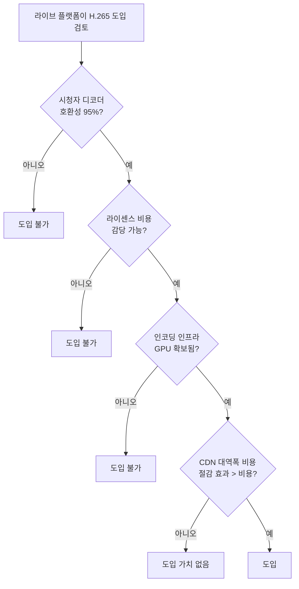

H.265는 H.264보다 같은 화질에 **비트레이트 50% 절감**. 객관적으로 압도적이다. 그런데 2024년 라이브 시장에서 점유율은 1% 미만. RTMP보다도 못한 보급률.

Netflix는 4K HDR에 H.265 적극 사용. 그런데 Twitch, YouTube Live는 안 쓴다. Apple은 iPhone 4K 녹화를 H.265로 강제. 그런데 같은 Apple의 FaceTime은 H.264. 

이 모순의 정체가 **라이센스 지옥**이다.

[지난 글](../h264-deep-dive/)에서 H.264 압축 원리를 봤다면, 이번 글은 **그 후계자 H.265, 그리고 HDR의 진짜 의미**를 정리한 노트다. 왜 만들어졌고, 기술적으로 더 좋은데 왜 라이브에 안 깔리고, HDR이라는 게 정확히 무엇이고, 라이브에서 4K HDR이 왜 불가능에 가까운지.

---

## 1. 4K + H.264 = 비현실적 비트레이트

H.264의 한계가 명확해지는 지점이 4K.

```
1080p H.264: 6 Mbps (OK)
1440p H.264: 12 Mbps (살짝)
4K (2160p) H.264: 25~40 Mbps (시청자 대역폭 부담)
8K H.264: 100 Mbps+ (불가능)
```

4K 시청에 25 Mbps 필요하면 시청자 70%가 못 봄. 4K가 의미 없어짐. **압축 효율을 한 단계 끌어올릴 새 코덱 필요**.

---

## 2. H.265의 등장 — 2013년

ITU-T + ISO/IEC가 H.264 만들 때처럼 또 공동 작업.

```
공식 명칭:
- ITU-T H.265 (2013년 4월)
- ISO/IEC 23008-2 (MPEG-H Part 2)
- 통칭 HEVC (High Efficiency Video Coding)
```

### H.265가 H.264보다 좋은 이유

| 항목 | H.264 | H.265 |
|---|---|---|
| 매크로블록 크기 | 16×16 고정 | 64×64 가변 (CTU) |
| 인트라 예측 방향 | 9 | **33** |
| 모션 벡터 정밀도 | 1/4 픽셀 | 1/4 픽셀 + 향상 |
| 엔트로피 코딩 | CABAC/CAVLC | **CABAC 개선** |
| 같은 화질 비트레이트 | 기준 | **40~50% 절감** |
| 4K 처리 | 부적합 | **표준** |
| HDR | 비표준 | **공식 표준 (Main10)** |

핵심은 **CTU (Coding Tree Unit)** — 16×16 매크로블록 대신 64×64까지 가변 분할. 큰 평면 영역을 한 번에 처리해서 효율 폭증.

---

## 3. H.265의 진짜 문제 — 라이센스 지옥

기술적으로는 명확한 진화. 그런데 보급이 막힌 진짜 원인.


H.264는 라이센스 풀이 **1개** (MPEG-LA). 디바이스당 약 $0.10 + 연간 캡. 단순.

H.265는 **3개 풀** + 콘텐츠 로열티까지.

| 라이센스 풀 | 비용 | 포함 회사 |
|---|---|---|
| **MPEG-LA** | 디바이스당 $0.20 + 캡 | 원본 특허 |
| **HEVC Advance / Access Advance** | 디바이스당 $0.40 + 콘텐츠 로열티 0.5% | Dolby, GE, Mitsubishi 등 |
| **Velos Media** | 별도 협상 | Ericsson, Sharp, Sony 등 |

### 비용 예시

```
[시청자 1억 명 + 콘텐츠 매출 $1B 서비스]
H.264 라이센스: ~$10M/년
H.265 라이센스: ~$50M/년 + 콘텐츠 매출 0.5% = $5M
→ 총 $55M/년
```

5배 비용. 그러고도 **어느 풀에 안 들어간 특허가 또 있을 수 있다**는 불확실성. 이게 YouTube/Twitch가 H.265 안 쓴 진짜 이유. 

AV1이 만들어진 직접적 동기가 이 라이센스 지옥에서 탈출.

### 그런데 Netflix는 왜 H.265 씀?

Netflix는 자체 라이센스 협상. 시청자는 디바이스 라이센스 (TV, 스마트폰)로 이미 커버. Netflix는 인코딩 측 라이센스만 부담.

Apple도 같음. iPhone 4K 녹화 H.265는 디바이스 라이센스로 커버.

**일반 라이브 플랫폼은 콘텐츠 로열티 부담**이 추가됨. 그게 차이.

---

## 4. 인코딩 비용 — H.264 대비 큰 부담

라이센스가 없어도 인코딩 자체가 무겁다.

```
[같은 화질 인코딩 시간 — x265 medium 기준]
x264 medium: 1x (기준)
x265 medium: 4~6x 느림
```

라이브 1080p60을 x265 medium으로 못 함. 가능한 옵션:

```bash
# CPU 인코딩 (느림)
ffmpeg -i input -c:v libx265 -preset veryfast \
  -tag:v hvc1 -crf 28 output.mp4

# GPU 인코딩 (NVENC, 빠름)
ffmpeg -i input -c:v hevc_nvenc -preset p4 \
  -tag:v hvc1 -b:v 4000k output.mp4
```

NVENC는 H.265를 H.264와 비슷한 속도로 인코딩. **4K 라이브는 GPU 강제**.

`-tag:v hvc1` 옵션이 중요. 다음 섹션에서 설명.

---

## 5. hvc1 vs hev1 — iOS 호환의 함정

같은 H.265 영상도 컨테이너 태그가 두 가지.

| 태그 | 의미 | iOS Safari 호환 |
|---|---|---|
| `hvc1` | Out-of-band 파라미터 | ✅ |
| `hev1` | In-band 파라미터 | ❌ |

```bash
# 올바른 명령 (iOS 호환)
ffmpeg ... -c:v libx265 -tag:v hvc1 output.mp4

# 잘못된 명령 (iOS Safari 재생 안 됨)
ffmpeg ... -c:v libx265 output.mp4
# 기본 태그 hev1로 박힘
```

이걸 모르고 H.265 인코딩한 결과 iOS에서 안 나오는 경우가 정말 많음. **`-tag:v hvc1` 무조건 명시**.

H.265 코덱 문자열:

```
hvc1.1.6.L120.B0
└──┘ │ │  │    │
  │  │ │  │    └── B0 = constraint flags
  │  │ │  └─────── L120 = Level 4.0
  │  │ └────────── 6 = Profile compatibility
  │  └──────────── 1 = Profile (Main)
  └─────────────── hvc1 = H.265 hvc1 tag
```

---

## 6. Profile/Level

H.264와 비슷한 구조.

| Profile | 용도 |
|---|---|
| **Main** | 일반 (8-bit 4:2:0) |
| **Main 10** | **HDR (10-bit 4:2:0)** |
| **Main 4:2:2 10** | 프로덕션 |
| **Main 4:4:4 12** | 최고 품질 |

HDR을 하려면 **무조건 Main 10**.

Level은 H.264와 동일한 4K/8K 처리 능력 매트릭스. 4K 60fps는 Level 5.1.

---

## 7. HDR이 정확히 뭔가

HDR (High Dynamic Range) = "더 밝고 더 어두운 영역을 동시에 표현". 그런데 **이게 시각적으로 무엇을 의미하는지**가 진짜 핵심.


```
[SDR (Rec.709, 8-bit, 100 nits 기준)]
- 최대 밝기: 100 nits
- 색공간: Rec.709 (Full HD TV 표준)
- 색심도: 8-bit (1670만 색)
- 결과: 태양은 하얀 덩어리로 클리핑, 그림자는 검은 덩어리, 그라데이션에 banding

[HDR (Rec.2020, 10-bit, 1000 nits)]
- 최대 밝기: 1000+ nits (10배)
- 색공간: Rec.2020 (4K HDR 표준)
- 색심도: 10-bit (10억 색)
- 결과: 태양의 디테일, 그림자 텍스처, 부드러운 그라데이션
```

**"HDR = 더 밝음"이 아니라 "더 넓은 표현 범위"**. 같은 영상의 같은 일출 장면을 SDR과 HDR로 보면 완전히 다른 영상처럼 보임.

### HDR의 4가지 표준

| 표준 | 메타데이터 | 라이센스 | 용도 |
|---|---|---|---|
| **HDR10** | 정적 (영상 전체에 1세트) | 무료 | **표준 HDR** (Netflix, Disney+, YouTube) |
| **HDR10+** | 동적 (장면별 다름) | 무료 | Amazon Prime, Samsung |
| **HLG** (Hybrid Log-Gamma) | 없음 | 무료 | **방송, 라이브** (BBC, NHK) |
| **Dolby Vision** | 동적 + 12-bit | 비쌈 | **프리미엄** (Netflix, Apple TV+) |

```
[선택 기준]
호환성 + 무료: HDR10
프리미엄 화질: Dolby Vision
라이브 방송: HLG
```

### 왜 HLG가 라이브에 적합

HDR10/HDR10+/Dolby Vision은 **메타데이터** 필요. 영상 인코딩 시 "이 영상의 최대 밝기는 1000 nits" 같은 정보를 박아야 함. 전체 영상을 분석한 후 결정해야 해서 라이브에 부적합.

HLG는 메타데이터 없음. **신호 자체에 HDR 정보가 인코딩**됨. 라이브 송출 시 그냥 보내면 됨. 디바이스가 자동 디코딩.

BBC가 4K HDR 올림픽 중계할 때 HLG.

---

## 8. 10-bit 색심도 — HDR의 필수 조건

H.265 Main 10 Profile이 필수인 이유.

```
8-bit:  2^8 = 256 단계
10-bit: 2^10 = 1024 단계 (4배)

색 (RGB):
8-bit: 256³ = 1670만 색
10-bit: 1024³ = 10억 색 (64배)
```

HDR 그라데이션이 부드러운 진짜 이유: **8-bit로는 banding 불가피, 10-bit는 매끄러움**.

해 지는 하늘의 그라데이션을 8-bit로 표현하면 색이 띠처럼 끊겨 보임 (banding). 10-bit로는 자연스러움.

```bash
# 10-bit 인코딩
ffmpeg -i input -c:v libx265 -pix_fmt yuv420p10le \
  -tag:v hvc1 -profile:v main10 output.mp4
```

`pix_fmt yuv420p10le`가 10-bit YUV. 8-bit는 `yuv420p`.

---

## 9. Chroma Subsampling — 왜 4:2:0이 표준인가

영상 압축의 중요한 트릭. 사람 눈의 한계를 활용.


```
사람 눈의 특성:
- 명도(밝기, Luma) 감지 ≫ 색상(Chroma) 감지
- 명도는 픽셀 단위로 인식
- 색은 인접 픽셀과 평균으로 인식
```

이걸 이용해서 **색 정보를 줄여도 사람이 못 알아챈다**.

| 형식 | 명도 (Y) | 색 (Cb, Cr) | 데이터 크기 |
|---|---|---|---|
| **4:4:4** | 모든 픽셀 | 모든 픽셀 | 100% (기준) |
| **4:2:2** | 모든 픽셀 | 2픽셀당 1 | 67% |
| **4:2:0** | 모든 픽셀 | **2×2 블록당 1** | **50%** |

**4:2:0이 스트리밍 표준**. HLS, YouTube, Netflix 다 4:2:0. 색 정보를 50% 버리지만 시청자는 차이 거의 못 느낌.

`-pix_fmt yuv420p` (8-bit 4:2:0) 또는 `yuv420p10le` (10-bit 4:2:0)가 모든 스트리밍에서 기본.

---

## 10. H.265의 디코딩 측 — 시청자 디바이스 호환성

코덱 변경의 진짜 어려움은 **시청자**.

```
[2024년 H.265 디코딩 지원 디바이스 추정]
iOS (iPhone 6+ / iOS 11+): 100%
Android 5.0+: 95%
Smart TV (2017+): 95%
PC Chrome: 70% (디스크리트 디코더만)
PC Firefox: 30%
구형 디바이스: 0%
```

PC Chrome이 약점. 일부 시스템에선 H.265 디코더 못 찾음.

Twitch가 H.265 베타에서 막힌 이유. 시청자 30%가 못 본다 → 비즈니스 손해 > 비트레이트 절감.

---

## 11. 라이브 H.265 — 거의 안 보급된 현실



이 게이트를 다 통과해야 도입. **실질적으로 Netflix급 OTT만 가능**.

### 실제 도입 현황

| 서비스 | H.265 | 비고 |
|---|---|---|
| **Netflix** | ✅ 4K HDR | 자체 라이센스 협상 |
| **Apple TV+** | ✅ 4K HDR | 자체 디코더, Apple 인프라 |
| **Disney+** | ✅ 4K HDR | 4K 한정 |
| **Amazon Prime** | ✅ 4K HDR | |
| **YouTube** | ⭕ 일부 4K | VP9/AV1 우선 |
| **YouTube Live** | ❌ | 라이브엔 H.264 |
| **Twitch** | ⭕ 베타 | RTX 4000+ 스트리머만 |
| **치지직 / SOOP** | ❌ | 한국 라이브 H.264 |

OTT (VOD) = H.265 적극.  
라이브 = H.264 유지.

---

## 12. Netflix 4K HDR 인코딩

업계 표준 명령 예시.

```bash
# Per-Title Encoding 분석 후
ffmpeg -i master_4k_dolby_vision.mov \
  -c:v libx265 \
  -preset slow \
  -tag:v hvc1 \
  -profile:v main10 \
  -pix_fmt yuv420p10le \
  -x265-params "colorprim=bt2020:transfer=smpte2084:colormatrix=bt2020nc:hdr-opt=1:repeat-headers=1:master-display=G(13250,34500)B(7500,3000)R(34000,16000)WP(15635,16450)L(10000000,1):max-cll=1000,400" \
  -b:v 15M -maxrate 18M -bufsize 36M \
  -c:a eac3 -b:a 768k \
  output_4k_hdr10.mp4
```

각 옵션의 의미:
- `colorprim=bt2020`: Rec.2020 색공간
- `transfer=smpte2084`: PQ (Perceptual Quantizer, HDR10 표준)
- `master-display`: 마스터 모니터의 사양 (메타데이터)
- `max-cll=1000,400`: 최대 콘텐츠 밝기 / 평균 (메타데이터)

이게 HDR10 콘텐츠의 표준 인코딩. Netflix가 영화 한 편마다 이런 옵션을 콘텐츠에 맞게 튜닝.

---

## 13. 라이브 4K HDR — HLG로

올림픽급 라이브.

```bash
ffmpeg -i camera_input \
  -c:v hevc_nvenc \
  -preset p4 \
  -tag:v hvc1 \
  -profile:v main10 \
  -pix_fmt yuv420p10le \
  -tune ll \
  -rc cbr \
  -b:v 30M -maxrate 30M -bufsize 60M \
  -color_primaries bt2020 \
  -color_trc arib-std-b67 \
  -colorspace bt2020nc \
  -g 60 \
  -c:a aac -b:a 192k \
  -f flv rtmp://...
```

핵심:
- `hevc_nvenc`: GPU 인코딩 (CPU로는 4K HDR 실시간 불가)
- `color_trc arib-std-b67`: HLG transfer (라이브용)
- 메타데이터 없음 (HLG 특징)

BBC 4K HDR 올림픽 송출이 이런 셋업.

---

## 14. ABR Ladder for 4K HDR

| 화질 | 코덱 | 비트레이트 | HDR | 비고 |
|---|---|---|---|---|
| 4K HDR | H.265 Main10 | 25 Mbps | HDR10 | 프리미엄 시청자 |
| 4K SDR | H.265 Main | 18 Mbps | SDR | 호환성 |
| 1080p HDR | H.265 Main10 | 10 Mbps | HDR10 | 모바일 HDR |
| 1080p SDR | H.264 | 6 Mbps | SDR | 일반 |
| 720p | H.264 | 3 Mbps | SDR | 모바일 |
| 480p | H.264 | 1.5 Mbps | SDR | 데이터 절약 |

같은 콘텐츠를 6단계로 인코딩. 시청자 디바이스/네트워크에 따라 자동 선택.

H.265 인코딩 비용 + H.264 인코딩 비용 둘 다 부담. **OTT 인프라 비용 증가의 큰 요인**.

---

## 15. 트랜스코딩 비용 비교


{
  "tooltip": { "trigger": "axis" },
  "grid": { "left": "20%", "right": "10%", "bottom": "12%", "top": "8%" },
  "xAxis": {
    "type": "value",
    "name": "트랜스코딩 시간 (분)"
  },
  "yAxis": {
    "type": "category",
    "data": ["AV1 (svt-av1, CPU)", "H.265 (x265 medium)", "H.265 (NVENC)", "H.264 (NVENC)"]
  },
  "series": [{
    "type": "bar",
    "data": [
      { "value": 360, "itemStyle": { "color": "#ef4444" } },
      { "value": 240, "itemStyle": { "color": "#f59e0b" } },
      { "value": 12, "itemStyle": { "color": "#3b82f6" } },
      { "value": 6, "itemStyle": { "color": "#10b981" } }
    ],
    "label": { "show": true, "position": "right", "formatter": "{c}분" }
  }]
}


GPU 인코딩 (NVENC) 없이는 H.265 도입 불가. 4K 1시간을 4시간 동안 인코딩하는 건 라이브에선 의미 없음.

---

## 16. iPhone HDR 영상의 처리 — 실무 케이스

iPhone 12+ 부터 4K Dolby Vision HDR 녹화. 이걸 일반 웹에 올리려면 변환 필수.

```bash
# iPhone HDR → HDR10 (Netflix 같은 OTT용)
ffmpeg -i iphone_hdr.mov \
  -c:v libx265 -tag:v hvc1 \
  -profile:v main10 -pix_fmt yuv420p10le \
  -x265-params "colorprim=bt2020:transfer=smpte2084:colormatrix=bt2020nc:hdr-opt=1" \
  -b:v 15M \
  output_hdr10.mp4

# iPhone HDR → SDR (Twitter, Instagram 같은 일반 웹)
ffmpeg -i iphone_hdr.mov \
  -vf "zscale=t=linear:npl=100,format=gbrpf32le,zscale=p=bt709,tonemap=tonemap=hable:desat=0,zscale=t=bt709:m=bt709:r=tv,format=yuv420p" \
  -c:v libx264 -crf 23 \
  output_sdr.mp4
```

두 번째 명령의 `tonemap=hable`이 **HDR → SDR Tone Mapping**. HDR의 넓은 밝기 범위를 SDR의 좁은 범위에 압축. Hable 알고리즘이 표준.

Tone Mapping 안 하고 그냥 SDR 변환하면 영상이 어둡거나 색이 깨짐.

---

## 17. 한국 라이브 시장의 H.265

| 플랫폼 | H.265 도입 |
|---|---|
| 치지직 | ❌ |
| SOOP (전 아프리카TV) | ❌ |
| 네이버 라이브 | ❌ |
| 카카오 TV (운영 종료) | - |
| 쿠팡플레이 라이브 | ⭕ 일부 4K |

한국 라이브 시장은 보수적. H.264 + HLS 인프라 안정성 우선. 4K HDR 라이브 수요 자체가 적음 (스포츠 중계 정도).

대안: AV1. 라이센스 무료라 일부 도입 검토 중. 다음 글에서 다룸.

---

## 정리하면

H.265는 **기술적으로 명백한 진화지만, 비기술적 요인으로 보급이 막힌 코덱**이다.

1. **출신** — 2013년 ITU+ISO 공동 표준화. CTU 가변 분할로 H.264 대비 50% 압축 향상
2. **라이센스 지옥** — 3개 풀 + 콘텐츠 로열티. AV1 등장의 직접 원인
3. **인코딩 비용** — x265는 x264의 4~6배 느림. NVENC GPU로 해결
4. **iOS 호환 함정** — `-tag:v hvc1` 필수
5. **Profile** — Main10 (HDR 필수), 코덱 문자열 `hvc1.1.6.L120.B0`
6. **HDR 실체** — "더 밝음"이 아니라 "넓은 표현 범위" (1000 nits + Rec.2020 + 10-bit)
7. **HDR 4표준** — HDR10(무료, OTT) / HDR10+(동적) / HLG(라이브) / Dolby Vision(프리미엄)
8. **Chroma Subsampling** — 4:2:0이 표준. 사람 눈의 색 둔감성 활용
9. **시청자 도달** — H.265 디코더 95% 보급, 그러나 PC Chrome이 약점
10. **OTT vs 라이브** — Netflix/Apple TV+ 적극, Twitch/YouTube Live 안 씀
11. **한국 시장** — 미도입. AV1으로 점프 가능성

다음 글에선 **AV1 — H.265 라이센스 지옥을 피하려고 만든 무료 표준**, 그리고 **VP9**까지 정리한다.

---

**참고**
- [ITU-T H.265 표준](https://www.itu.int/rec/T-REC-H.265)
- [HEVC Patent Pool 비교](https://www.streamingmedia.com/Articles/ReadArticle.aspx?ArticleID=145460)
- [BBC HLG White Paper](https://www.bbc.co.uk/rd/publications/whitepaper309)
- [Netflix HDR Encoding Pipeline](https://netflixtechblog.com/dynamic-optimizer-a-perceptual-video-encoding-optimization-framework-e19f1e3a277f)
- [Apple HEVC Tag 가이드](https://developer.apple.com/documentation/http-live-streaming/about-the-common-media-application-format-with-hls)
