스트리머가 OBS에서 "방송 시작"을 누르는 순간부터 시청자 화면에 첫 프레임이 뜨기까지 **6.2초**. 그 안에 인제스트 인증, 트랜스코딩 노드 할당, NVENC 인코딩, ABR Ladder 5단계, CMAF 패키징, Origin 저장, CDN Pre-positioning, 엣지 캐시 워밍이 다 일어난다.

이 6.2초의 뒷면엔 **7층 마이크로서비스 인프라**가 있다. 인제스트 / 트랜스코딩 / 패키저 / Origin / CDN / 관제 / 시청자 — 각 층이 다른 자원 패턴, 다른 인스턴스, 다른 스케일링 전략.

이번 글은 [지난 글](../ffmpeg-deep-dive/)의 FFmpeg, [지난 글](../abr-ladder-design/)의 ABR Ladder, [지난 글](../nvenc-gpu-transcoding/)의 NVENC, [지난 글](../cmaf-deep-dive/)의 CMAF를 다 합쳐서 **라이브 트랜스코딩 인프라 운영의 모든 것** — 아키텍처 / 스케줄러 / 큐 / 장애 처리 / 비용 최적화 — 를 정리한 노트다.

---

## 1. 7층 마이크로서비스 — 라이브 트랜스코딩의 전체 그림


각 층은 자원 패턴이 다르다.

| # | 층 | 자원 패턴 | 인스턴스 | 가격 (월) |
|---|---|---|---|---|
| 1 | Streamer | Client | OBS/XSplit | - |
| 2 | Ingest | Network-bound (10 Gbps NIC) | c6i.4xlarge | $504 |
| 3 | Transcoding | GPU-bound (NVENC) | g5.xlarge (A10) | $725 |
| 4 | Packager | CPU-bound (가벼움) | c6i.2xlarge | $246 |
| 5 | Origin Storage | I/O-bound | Redis Cluster + S3 | 가변 |
| 6 | Origin Shield + CDN | 글로벌 분산 | Multi-CDN | 트래픽 비례 |
| 7 | Viewer | Client | Player | - |

**같은 노드에 다 묶으면 자원 효율 0.** GPU 강한 노드에 인제스트 묶으면 NIC가 놀고, 인제스트 강한 노드에 트랜스코딩 넣으면 GPU 모자람. 분리해야 인스턴스 타입 맞추기 가능.

---

## 2. 한 방송의 0초~6.2초 여정


각 단계 누적 지연을 ECharts로 분해.


{
  "tooltip": { "trigger": "axis", "axisPointer": { "type": "shadow" } },
  "grid": { "left": "25%", "right": "10%", "bottom": "12%", "top": "8%" },
  "xAxis": { "type": "value", "name": "누적 지연 (ms)" },
  "yAxis": {
    "type": "category",
    "data": ["8. 시청자 매니페스트 수신", "7. Origin Shield → Edge", "6. 첫 .m4s PUT", "5. 패키저 첫 출력", "4. FFmpeg + NVENC spawn", "3. 스케줄러 할당", "2. RTMP 인증", "1. OBS Start"]
  },
  "series": [{
    "type": "bar",
    "data": [
      { "value": 6200, "itemStyle": { "color": "#10b981" } },
      { "value": 6100, "itemStyle": { "color": "#10b981" } },
      { "value": 6000, "itemStyle": { "color": "#3b82f6" } },
      { "value": 1000, "itemStyle": { "color": "#3b82f6" } },
      { "value": 500, "itemStyle": { "color": "#f59e0b" } },
      { "value": 200, "itemStyle": { "color": "#f59e0b" } },
      { "value": 100, "itemStyle": { "color": "#ef4444" } },
      { "value": 0, "itemStyle": { "color": "#94a3b8" } }
    ],
    "label": { "show": true, "position": "right", "formatter": "{c}ms" }
  }]
}


5초까지는 인프라가 빠르고, 마지막 5초는 **6초 세그먼트 인코딩 대기**가 거의 전부. LL-HLS로 가면 이 5초가 1초로.

---

## 3. 비용 분배 — 어디서 절감해야 ROI 큰가


{
  "tooltip": { "trigger": "item", "formatter": "{b}: {c}% ({d}%)" },
  "legend": { "orient": "vertical", "left": "left", "top": "middle" },
  "series": [{
    "name": "비용 분배",
    "type": "pie",
    "radius": ["40%", "70%"],
    "center": ["62%", "50%"],
    "data": [
      { "value": 45, "name": "CDN 트래픽", "itemStyle": { "color": "#ef4444" } },
      { "value": 25, "name": "트랜스코딩 GPU", "itemStyle": { "color": "#f59e0b" } },
      { "value": 10, "name": "스토리지", "itemStyle": { "color": "#3b82f6" } },
      { "value": 10, "name": "관제/네트워크", "itemStyle": { "color": "#a78bfa" } },
      { "value": 5, "name": "인제스트", "itemStyle": { "color": "#10b981" } },
      { "value": 5, "name": "패키저", "itemStyle": { "color": "#76b900" } }
    ]
  }]
}


**CDN(45%) + 트랜스코딩(25%) = 70%.** 이 둘에서 절감해야 효과 큼. 인제스트/패키저 5%씩은 최적화 ROI 낮음.

---

## 4. 인스턴스 가격 vs 처리량 — GPU 선택의 진실


{
  "tooltip": { "trigger": "axis" },
  "legend": { "data": ["동시 채널", "월 가격 ($)"], "top": 0 },
  "grid": { "left": "10%", "right": "12%", "bottom": "12%", "top": "18%" },
  "xAxis": { "type": "category", "data": ["c6i.4xl x264 (32코어)", "g4dn.xlarge T4", "g5.xlarge A10", "RTX 4080 (자체)"] },
  "yAxis": [
    { "type": "value", "name": "동시 채널", "position": "left", "max": 12 },
    { "type": "value", "name": "월 $", "position": "right", "max": 2500 }
  ],
  "series": [
    { "name": "동시 채널", "type": "bar", "yAxisIndex": 0, "data": [1.6, 5, 10, 8.5], "itemStyle": { "color": "#3b82f6" } },
    { "name": "월 가격 ($)", "type": "line", "smooth": true, "yAxisIndex": 1, "data": [504, 380, 725, 2000], "itemStyle": { "color": "#ef4444" }, "lineStyle": { "width": 3 } }
  ]
}


채널당 단가: T4 $76, A10 $73, RTX 4080 $235, c6i CPU $315. **A10이 처리량 2배에 가격 1.9배**. T4보다 약간 우위. 대형 인프라가 A10으로 옮겨가는 이유.

---

## 5. 인제스트 클러스터

| 항목 | 값 |
|---|---|
| 인스턴스 | c6i.4xlarge (16 vCPU, 32GB) |
| NIC | 12.5 Gbps |
| 가격 | $0.70/시간 ($504/월) |
| 소프트웨어 | Nginx-RTMP / SRS / 자체 Go |
| 한 노드 동시 인제스트 | ~200~300 채널 (RTMP 연결 수 한계) |

부하는 네트워크보다 **TCP 연결 수**. Anycast IP로 지역별 라우팅.

```nginx
rtmp {
  server {
    listen 1935;
    application live {
      live on;
      on_publish http://auth-service/verify;
      push rtmp://transcoder-primary/live;
      push rtmp://transcoder-backup/live;
      record off;
    }
  }
}
```

`on_publish`로 스트림 키 검증. `push` 두 개로 active-active.

---

## 6. 트랜스코딩 클러스터 — A10이 가성비 정점

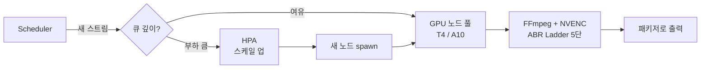

채널 패킹:
```
방송 1개 = ABR 5단 ladder
= 1080p60 + 720p60 + 720p30 + 480p30 + 360p30
≈ A10 NVENC 처리량 5/15 = 33%
→ A10 1대당 방송 3개 (안전 마진)
```

---

## 7. 패키저 클러스터

| 항목 | 값 |
|---|---|
| 인스턴스 | c6i.2xlarge (8 vCPU, 16GB) |
| 가격 | $0.34/시간 ($246/월) |
| 소프트웨어 | Shaka Packager + 매니페스트 생성기 (Go) |
| 한 노드 처리 | 50~100 채널 |

CMAF 변환 가벼움. 인스턴스 적게.

---

## 8. Origin Storage — Hot/Warm/Cold 계층


| 계층 | 저장소 | 보관 기간 | 가격/GB/월 | 접근 |
|---|---|---|---|---|
| Hot | Redis / SSD | 라이브 + 1시간 | $0.100 | 즉시 |
| Warm | S3 Standard | 7일 | $0.023 | 초 |
| IA | S3 Infrequent Access | 30일 | $0.0125 | 초 |
| Cold | S3 Glacier | 365일 | $0.004 | 분 |

자동 라이프사이클:
```yaml
Rules:
  - Hot → Standard after 1 hour
  - Standard → IA after 7 days
  - IA → Glacier after 30 days
  - Expire after 365 days
```

```python
# Pull Origin 통합 라우팅
def get_segment(path):
    if redis.exists(path): return redis.get(path)
    if s3.exists(path):    return s3.get(path)
    return 404
```

---

## 9. Multi-CDN GSLB 라우팅

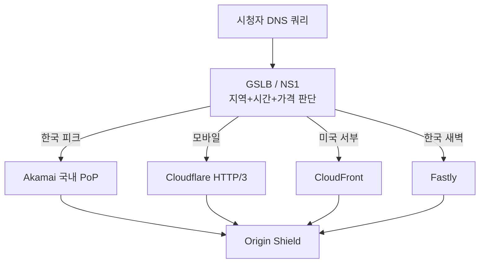

CDN 한 곳 장애 시 즉시 가중치 0으로 만들어 차단. 다른 CDN으로 100% 전환.

---

## 10. Origin Shield — Origin 트래픽 90% 절감


```
Edge 100개가 Origin 직접 Pull   →  Origin 트래픽 100배
Edge 100개 → Shield 5개 → Origin → Origin 트래픽 1배
```

Shield 노드의 hit rate 99%. **Origin egress 비용 -90%**. Multi-CDN 통합 Origin Shield가 정석.

---

## 11. 스케줄러 4종 알고리즘 비교

| 스케줄러 | 장점 | 단점 | 노드 활용률 |
|---|---|---|---|
| Round Robin | 단순 | 부하 무시, 죽은 노드 할당 | 균등 |
| Least-Load | 부하 균등 | Bin packing 안 됨 | 균등 |
| **Bin Packing** | **빈 노드 종료 → 30% 절감** | 한 노드 집중 부담 | 양극화 |
| Tier | 인기 스트리머 우선 | 복잡 | 등급별 |

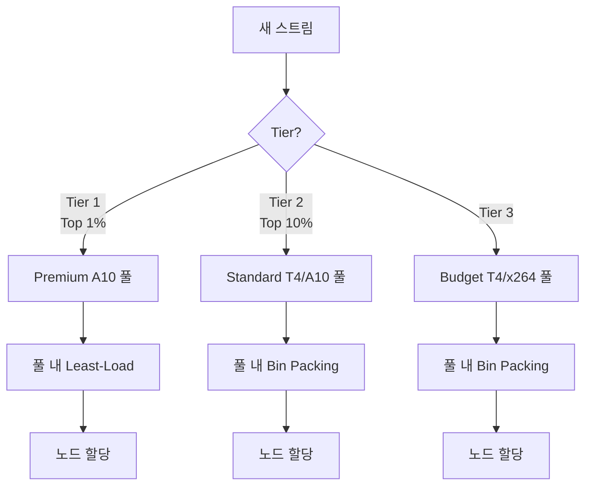

---

## 12. Bin Packing vs Load Balancing — 빈 노드 끄기



{
  "tooltip": { "trigger": "axis" },
  "legend": { "data": ["Load Balancing", "Bin Packing"], "top": 0 },
  "grid": { "left": "10%", "right": "10%", "bottom": "12%", "top": "18%" },
  "xAxis": { "type": "category", "data": ["노드 1", "노드 2", "노드 3", "노드 4", "노드 5"] },
  "yAxis": { "type": "value", "name": "GPU 사용률 (%)", "max": 100 },
  "series": [
    { "name": "Load Balancing", "type": "bar", "data": [60, 60, 60, 60, 60], "itemStyle": { "color": "#3b82f6" } },
    { "name": "Bin Packing", "type": "bar", "data": [85, 85, 85, 0, 0], "itemStyle": { "color": "#10b981" } }
  ]
}


**Load Balancing: 5대 다 60%** → 끌 수 없음.
**Bin Packing: 3대 85% + 2대 OFF** → 40% 비용 절감.

```python
def assign(stream):
    candidates = [(n, load(n)) for n in healthy() if load(n) < 0.85]
    candidates.sort(key=lambda x: -x[1])  # 부하 높은 순
    return candidates[0][0] if candidates else spawn_new()
```

---

## 13. Tier Scheduling — 인기에 따른 GPU 차등



{
  "tooltip": { "trigger": "axis" },
  "legend": { "data": ["스트리머 수 (%)", "인프라 비용 비중 (%)"], "top": 0 },
  "grid": { "left": "10%", "right": "10%", "bottom": "12%", "top": "18%" },
  "xAxis": { "type": "category", "data": ["Tier 1 (Top 1%)", "Tier 2 (Top 10%)", "Tier 3 (일반)"] },
  "yAxis": { "type": "value", "name": "비중 (%)", "max": 100 },
  "series": [
    { "name": "스트리머 수 (%)", "type": "bar", "data": [1, 9, 90], "itemStyle": { "color": "#3b82f6" } },
    { "name": "인프라 비용 비중 (%)", "type": "bar", "data": [40, 30, 30], "itemStyle": { "color": "#ef4444" } }
  ]
}


Top 1%가 시청자 80% 차지 → 인프라 비용 40% 정당화. 일반 90%는 budget 풀로 보내 비용 압축. **전체 비용 25% 절감.**

---

## 14. 큐 시스템 — Redis Streams vs Kafka vs SRT

| 큐 | 처리량 | 운영 부담 | 지연 | 적합 규모 |
|---|---|---|---|---|
| **SRT (큐 없음)** | 채널당 자체 버퍼 | 0 | 120ms | 소규모 |
| **Redis Streams** | ~10만 msg/s | 중 | <10ms | 중규모 |
| **Kafka** | 100만+ msg/s | 큼 | <50ms | 대규모 |

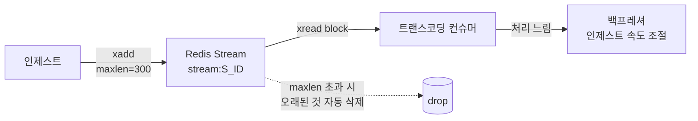

`maxlen=300` (6초 @ 50fps) — 라이브용 짧은 버퍼.

```python
# Redis Streams 푸시
r.xadd(f'stream:{sid}', {'data': chunk, 'pts': pts}, maxlen=300)

# Kafka 파티션 키 = stream_id → 순서 보장
producer.produce('live-streams', key=sid.encode(), value=chunk)
```

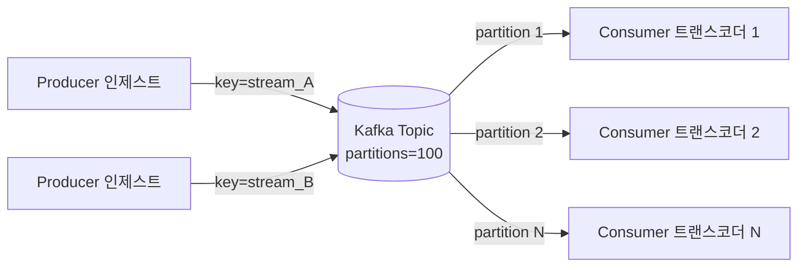

같은 stream_id는 항상 같은 파티션 → 순서 보장.

---

## 15. HPA 비대칭 스케일링

| | 스케일 업 | 스케일 다운 |
|---|---|---|
| 안정화 윈도우 | 30초 | 600초 (10분) |
| 변화율 | +50% / 60초 | -10% / 300초 |
| 트리거 | GPU > 70% 또는 큐 지연 > 2s | GPU < 50% |

**늘릴 땐 빨리, 줄일 땐 천천히** — 라이브 중인 방송 못 끔.


{
  "tooltip": { "trigger": "axis" },
  "grid": { "left": "10%", "right": "10%", "bottom": "12%", "top": "8%" },
  "xAxis": { "type": "category", "data": ["t=0", "t=30s", "t=1m", "t=2m", "t=5m", "t=10m", "t=15m", "t=20m"] },
  "yAxis": { "type": "value", "name": "노드 수" },
  "series": [{
    "type": "line",
    "smooth": true,
    "data": [10, 15, 22, 30, 35, 35, 33, 30],
    "areaStyle": {},
    "itemStyle": { "color": "#3b82f6" },
    "lineStyle": { "width": 3 },
    "markArea": {
      "itemStyle": { "color": "rgba(239, 68, 68, 0.1)" },
      "data": [[{ "xAxis": "t=0" }, { "xAxis": "t=2m" }]]
    }
  }]
}


붉은 영역 = 폭증 대응 구간. 30초만에 50% 증가, 그러나 다운은 10분 걸쳐 천천히.

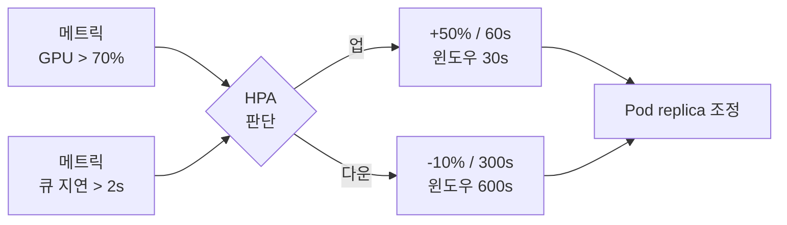

---

## 16. 예측 기반 스케일링 — 피크 5분 전 미리

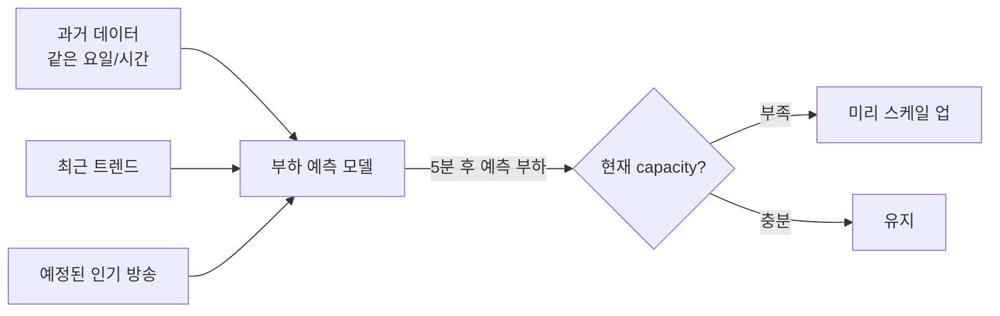


{
  "tooltip": { "trigger": "axis" },
  "legend": { "data": ["반응형 (HPA만)", "예측형 + HPA"], "top": 0 },
  "grid": { "left": "10%", "right": "10%", "bottom": "12%", "top": "18%" },
  "xAxis": { "type": "category", "data": ["17:55", "18:00", "18:05", "18:10", "18:15", "18:20"] },
  "yAxis": { "type": "value", "name": "Rebuffering 영향 (ms)", "max": 800 },
  "series": [
    { "name": "반응형 (HPA만)", "type": "line", "smooth": true, "data": [50, 700, 600, 200, 80, 50], "itemStyle": { "color": "#ef4444" }, "lineStyle": { "width": 3 } },
    { "name": "예측형 + HPA", "type": "line", "smooth": true, "data": [60, 100, 80, 70, 60, 50], "itemStyle": { "color": "#10b981" }, "lineStyle": { "width": 3 } }
  ]
}


18:00 피크 직격 시 반응형은 700ms rebuffering, 예측형은 100ms 이하.

---

## 17. 우선순위 QoS — 부하 폭증 시 누구부터

| Priority | 대상 | 부하 폭증 시 |
|---|---|---|
| P1 | Top 1% | 무조건 처리 |
| P2 | 광고/이벤트 진행 중 | 무조건 처리 |
| P3 | Top 10% | 정상 처리 |
| P4 | 일반 | 처리 |
| P5 | 베타 테스터 | **거부/지연** |

부하 95% 넘으면 P5부터 거부. 핵심 스트리머 보호.

---

## 18. Stream Migration — 방송 중 노드 이동

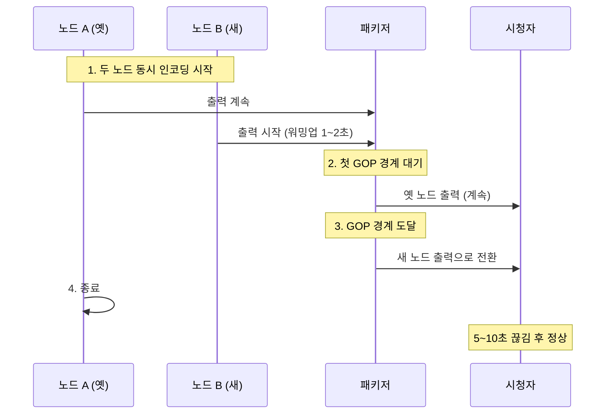

Spot 인스턴스 회수 시 미리 알람 받아 graceful drain.

---

## 19. 월간 장애 빈도 — 실제 운영 데이터


{
  "tooltip": { "trigger": "axis", "axisPointer": { "type": "shadow" } },
  "grid": { "left": "30%", "right": "10%", "bottom": "12%", "top": "8%" },
  "xAxis": { "type": "value", "name": "월간 건수" },
  "yAxis": {
    "type": "category",
    "data": ["데이터센터 부분 정전", "CDN Origin Shield 장애", "Kafka 파티션 lag", "NVENC 세션 누수", "GPU 드라이버 hang", "SRT 패킷 손실 폭증", "스트리머 OBS 인코딩 변경"]
  },
  "series": [{
    "type": "bar",
    "data": [
      { "value": 1, "itemStyle": { "color": "#94a3b8" } },
      { "value": 1, "itemStyle": { "color": "#94a3b8" } },
      { "value": 2, "itemStyle": { "color": "#3b82f6" } },
      { "value": 4, "itemStyle": { "color": "#3b82f6" } },
      { "value": 8, "itemStyle": { "color": "#f59e0b" } },
      { "value": 15, "itemStyle": { "color": "#f59e0b" } },
      { "value": 50, "itemStyle": { "color": "#ef4444" } }
    ],
    "label": { "show": true, "position": "right", "formatter": "{c}건" }
  }]
}


가장 흔한 게 **스트리머 측 변경**. 인프라 장애가 아니라서 자동 복구 불가 — 알림만.

---

## 20. 장애 종류별 자동 복구 매핑

| 장애 | 감지 신호 | 자동 복구 | MTTR |
|---|---|---|---|
| GPU 드라이버 hang | nvidia-smi 타임아웃 | 3단계 복구 시퀀스 | 30~60s |
| FFmpeg 좀비 | 출력 mtime > 10s | 프로세스 kill + 재spawn | 5~15s |
| NVENC 세션 누수 | 세션 수 증가 모니터링 | FFmpeg 재시작 | 10s |
| SRT 패킷 손실 | 손실율 > 5% | SRT_LATENCY 증가 | 자동 |
| Kafka lag | consumer lag > 임계 | 컨슈머 추가 | 1~5분 |
| Region 장애 | 트랜스코딩 응답 90% 실패 | DNS 전환 또는 Active-Active | 5~10분 / 즉시 |
| CDN 장애 | 에러율 > 5% / p99 > 1s | GSLB 가중치 0 | 30s |

---

## 21. GPU Hang 3단계 자동 복구

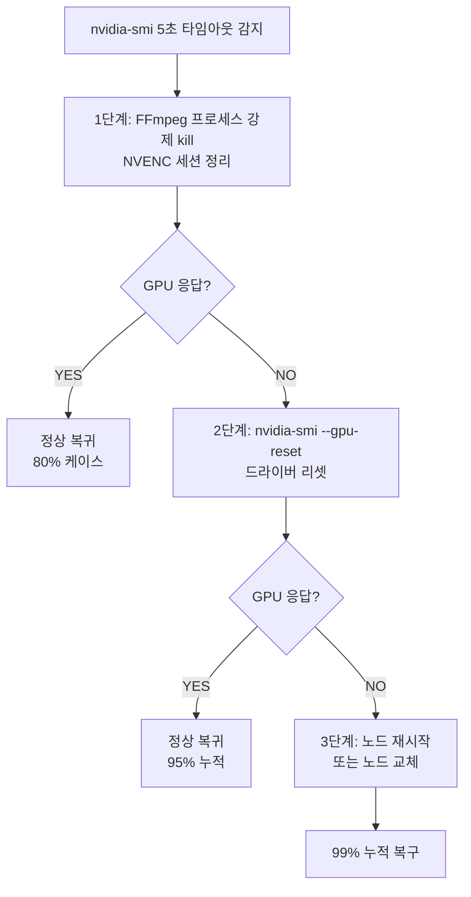


{
  "tooltip": { "trigger": "axis" },
  "grid": { "left": "10%", "right": "10%", "bottom": "12%", "top": "8%" },
  "xAxis": { "type": "category", "data": ["1단계 (kill)", "2단계 (GPU reset)", "3단계 (reboot)"] },
  "yAxis": { "type": "value", "name": "누적 성공률 (%)", "max": 100 },
  "series": [{
    "type": "bar",
    "data": [
      { "value": 80, "itemStyle": { "color": "#3b82f6" } },
      { "value": 95, "itemStyle": { "color": "#10b981" } },
      { "value": 99, "itemStyle": { "color": "#76b900" } }
    ],
    "label": { "show": true, "position": "top", "formatter": "{c}%" }
  }]
}


---

## 22. FFmpeg 좀비 감지

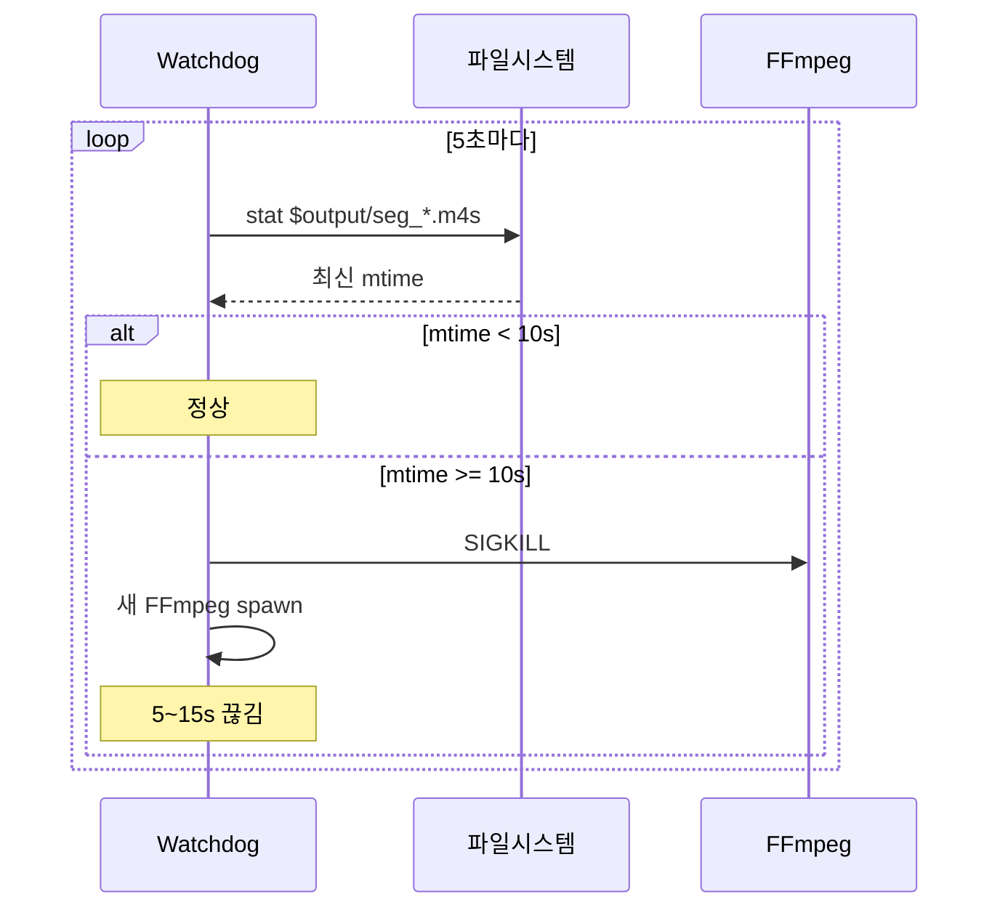

CPU는 살아있는데 출력 안 나오는 좀비 상태 잡는 유일한 방법.

---

## 23. Discontinuity 자동 처리

```mermaid
flowchart LR
  D[스트림 중단 감지<br/>PTS 점프 또는 재시작] --> N[새 init.mp4 생성<br/>init_v(N+1).mp4]
  N --> M[매니페스트 갱신<br/>#EXT-X-DISCONTINUITY<br/>#EXT-X-MAP:URI=init_v(N+1).mp4]
  M --> S[시퀀스 +100 점프<br/>안전 마진]
  S --> P[플레이어 디코더 리셋<br/>~5초 끊김 후 정상]
```

코덱 설정 도중 바뀐 케이스도 같은 처리.

---

## 24. Region Active-Active

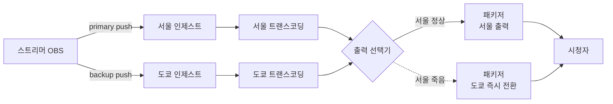

| | Active-Active | Passive Failover |
|---|---|---|
| 비용 | 2배 | 1배 |
| 끊김 시간 | 0초 | 5~10분 (DNS TTL) |
| 적용 대상 | Top 1% 스트리머 | 일반 |
| 인제스트 송출 | OBS 두 번 송신 | 한 번만 |


{
  "tooltip": { "trigger": "axis", "axisPointer": { "type": "shadow" } },
  "grid": { "left": "25%", "right": "10%", "bottom": "12%", "top": "8%" },
  "xAxis": { "type": "value", "name": "끊김 (초)" },
  "yAxis": {
    "type": "category",
    "data": ["Active-Active (Top 1%)", "Passive Failover (일반)"]
  },
  "series": [{
    "type": "bar",
    "data": [
      { "value": 0, "itemStyle": { "color": "#10b981" } },
      { "value": 480, "itemStyle": { "color": "#ef4444" } }
    ],
    "label": { "show": true, "position": "right", "formatter": "{c}s" }
  }]
}


---

## 25. Region Failover DNS 전환

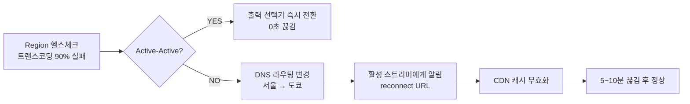

---

## 26. CDN Failover GSLB 전환

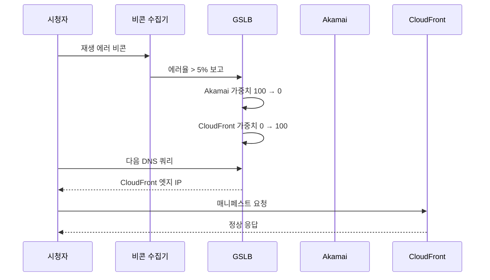

DNS TTL 30초로 짧게 → 빠른 전환.

---

## 27. 알람 P0/P1/P2 분류

| 레벨 | 대응 시간 | 예시 | 월 목표 빈도 |
|---|---|---|---|
| **P0** | 5분 이내 호출 | 전체 인제스트 장애 / GPU 95% / CDN 장애 | 5건 이하 |
| **P1** | 1시간 이내 | Region 트랜스코딩 노드 일부 / VMAF 회귀 / Rebuffering 2%+ | 20건 이하 |
| **P2** | 업무 시간 | 비용 예산 80% / 디스크 85% / 인증 지연 | 무제한 (대시보드) |


{
  "tooltip": { "trigger": "axis", "axisPointer": { "type": "shadow" } },
  "grid": { "left": "10%", "right": "10%", "bottom": "12%", "top": "8%" },
  "xAxis": { "type": "category", "data": ["P0 (즉시)", "P1 (1시간)", "P2 (정보)"] },
  "yAxis": { "type": "value", "name": "월 건수" },
  "series": [{
    "type": "bar",
    "data": [
      { "value": 4, "itemStyle": { "color": "#ef4444" } },
      { "value": 18, "itemStyle": { "color": "#f59e0b" } },
      { "value": 350, "itemStyle": { "color": "#94a3b8" } }
    ],
    "label": { "show": true, "position": "top", "formatter": "{c}건" }
  }]
}


P0 = 알람 피로 방지 핵심. 5건 초과면 룰 조정.

---

## 28. Chaos Engineering — 일부러 죽이기

| 기법 | 동작 | 검증하는 것 |
|---|---|---|
| Random Pod Kill | 무작위 K8s pod 종료 | HPA + Stream Migration |
| Network Partition | iptables로 일시 차단 | Region Failover |
| CPU Stress | 인위적 CPU 부하 | 스케줄러 회피 |
| GPU Throttle | NVIDIA 클럭 제한 | 헬스체크 + 자동 복구 |
| Latency Inject | 일시 패킷 지연 | SRT 재전송 + 버퍼 |

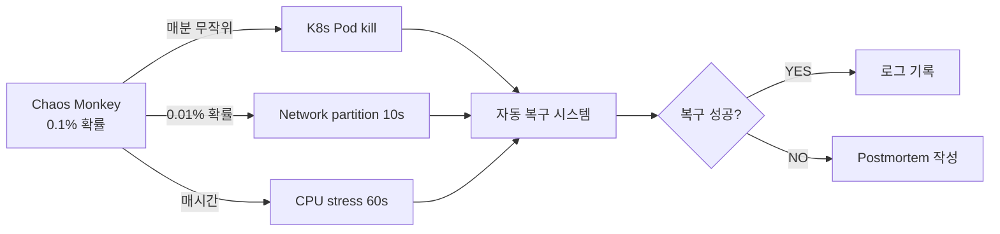

비프로덕션에서 매일 굴림. 운영 환경엔 약하게.

---

## 29. Runbook as Code

```python
# runbooks/gpu_hang.py
class GPUHangRunbook:
    description = "GPU 드라이버 hang 자동 복구"
    
    def check_trigger(self, alert):
        return alert.type == "gpu_unresponsive"
    
    def execute(self, alert):
        node = alert.affected_node
        if self.reset_gpu(node): return "RECOVERED"
        if self.reboot_node(node): return "RECOVERED"
        self.replace_node(node)
        return "RECOVERED_REPLACEMENT"
```

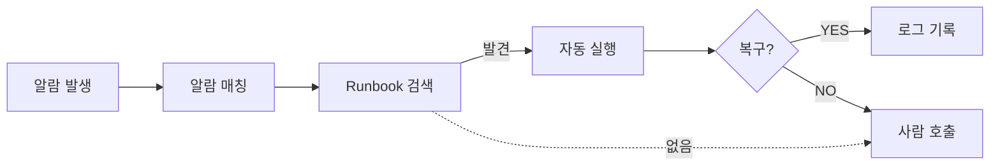

**자동 복구가 우선, 사람 호출이 차선.** 문서 대신 코드.

---

## 30. Postmortem 사이클

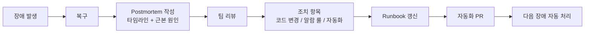

같은 장애 두 번 안 나게. 작성 의무 + 액션 트래킹.

---

## 31. Pre-positioning — 인기 방송 캐시 워밍

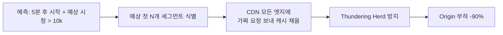

방송 시작 직후 시청자 폭증 시 Origin 직격 막음.

---

## 32. Reserved + On-Demand + Spot — 시간축 분배


{
  "tooltip": { "trigger": "axis" },
  "legend": { "data": ["Reserved (80% 할인)", "On-Demand", "Spot (90% 할인)"], "top": 0 },
  "grid": { "left": "10%", "right": "10%", "bottom": "12%", "top": "18%" },
  "xAxis": { "type": "category", "data": ["3시", "8시", "12시", "14시", "18시", "20시", "22시", "1시"] },
  "yAxis": { "type": "value", "name": "동시 채널" },
  "series": [
    { "name": "Reserved (80% 할인)", "type": "line", "stack": "total", "areaStyle": {}, "data": [50, 200, 200, 200, 200, 200, 200, 200], "itemStyle": { "color": "#3b82f6" } },
    { "name": "On-Demand", "type": "line", "stack": "total", "areaStyle": {}, "data": [0, 0, 200, 100, 100, 300, 300, 100], "itemStyle": { "color": "#10b981" } },
    { "name": "Spot (90% 할인)", "type": "line", "stack": "total", "areaStyle": {}, "data": [0, 0, 0, 0, 0, 500, 300, 100], "itemStyle": { "color": "#f59e0b" } }
  ]
}


| 인스턴스 | 할인 | 중단 위험 | 용도 |
|---|---|---|---|
| Reserved (1년) | 80% | 없음 | 상시 부하 |
| On-Demand | 0% | 없음 | 평균 변동 |
| Spot | 90% | 있음 | 피크 분 |

**전체 비용 30~40% 절감.** Spot 회수 시 graceful drain.

---

## 33. CDN 비용 절감 Waterfall


{
  "tooltip": { "trigger": "axis" },
  "grid": { "left": "10%", "right": "10%", "bottom": "12%", "top": "8%" },
  "xAxis": { "type": "category", "data": ["기본", "Multi-CDN 협상", "+Origin Shield", "+TTL 분리", "+Pre-positioning", "최종"] },
  "yAxis": { "type": "value", "name": "월 비용 ($K)" },
  "series": [
    { "type": "bar", "stack": "Total", "data": [0, 45, 31.5, 25.2, 22.7, 0], "itemStyle": { "color": "rgba(0,0,0,0)" } },
    { "type": "bar", "stack": "Total", "data": [45, 0, 0, 0, 0, 22.7], "label": { "show": true, "position": "top", "formatter": "${c}K" }, "itemStyle": { "color": "#3b82f6" } },
    { "type": "bar", "stack": "Total", "data": [0, -13.5, -6.3, -2.5, -2.5, 0], "label": { "show": true, "position": "top", "formatter": "{c}K" }, "itemStyle": { "color": "#10b981" } }
  ]
}


$45K → $22.7K로 약 50% 절감. 누적 기법 효과.

---

## 34. CDN 단가 협상별 비교

| 등급 | GB 단가 | 월 트래픽 조건 |
|---|---|---|
| 소규모 약정 | $0.080 | < 10 TB |
| CloudFront 표준 | $0.050 | 일반 |
| 대량 협상 | $0.030 | > 1 PB |
| Akamai 대형 고객 | $0.020 | > 10 PB + 다년 |

협상력 = 트래픽 규모. Multi-CDN으로 경쟁시키면 추가 인하.

---

## 35. 코덱 라이센스 비용


{
  "tooltip": { "trigger": "axis", "axisPointer": { "type": "shadow" } },
  "grid": { "left": "12%", "right": "10%", "bottom": "12%", "top": "8%" },
  "xAxis": { "type": "category", "data": ["H.264", "H.265 (단순)", "H.265 (복잡)", "VP9", "AV1"] },
  "yAxis": { "type": "value", "name": "연 라이센스 ($K, log)", "type": "log" },
  "series": [{
    "type": "bar",
    "data": [
      { "value": 250, "itemStyle": { "color": "#3b82f6" } },
      { "value": 500, "itemStyle": { "color": "#f59e0b" } },
      { "value": 1500, "itemStyle": { "color": "#ef4444" } },
      { "value": 1, "itemStyle": { "color": "#10b981" } },
      { "value": 1, "itemStyle": { "color": "#76b900" } }
    ],
    "label": { "show": true, "position": "top", "formatter": "${c}K" }
  }]
}


**AV1/VP9는 0** (AOMedia 오픈소스, Google). 라이브 플랫폼이 AV1 도입하는 큰 이유 중 하나.

---

## 36. Per-Title + 카테고리별 절감 효과


{
  "tooltip": { "trigger": "axis", "axisPointer": { "type": "shadow" } },
  "grid": { "left": "20%", "right": "10%", "bottom": "12%", "top": "8%" },
  "xAxis": { "type": "value", "name": "Kbps" },
  "yAxis": {
    "type": "category",
    "data": ["발로란트", "그림 그리기", "저스트 채팅 (정적)"]
  },
  "series": [
    { "name": "표준 사다리", "type": "bar", "data": [6000, 6000, 6000], "itemStyle": { "color": "#94a3b8" } },
    { "name": "카테고리 절감 사다리", "type": "bar", "data": [8000, 4500, 3000], "itemStyle": { "color": "#10b981" }, "label": { "show": true, "position": "right", "formatter": "{c}k" } }
  ]
}


평균 30% 비트레이트 절감 → CDN + 트랜스코딩 동시 절감.

---

## 37. 채널당 단가 분포


{
  "tooltip": { "trigger": "axis", "axisPointer": { "type": "shadow" } },
  "grid": { "left": "25%", "right": "10%", "bottom": "12%", "top": "8%" },
  "xAxis": { "type": "value", "name": "USD / 시간" },
  "yAxis": {
    "type": "category",
    "data": ["VOD 시청", "720p30 축소 사다리", "1080p60 풀 사다리 + Per-Title"]
  },
  "series": [{
    "type": "bar",
    "data": [
      { "value": 0.03, "itemStyle": { "color": "#10b981" } },
      { "value": 0.05, "itemStyle": { "color": "#3b82f6" } },
      { "value": 0.25, "itemStyle": { "color": "#ef4444" } }
    ],
    "label": { "show": true, "position": "right", "formatter": "${c}" }
  }]
}


이 단가가 매일 추적하는 핵심 지표. 갑자기 튀면 누가 잘못 설정한 것.

---

## 38. A/B 테스트 — 비용 절감의 매출 영향 검증

| 지표 | A: 표준 (6000k) | B: 절감 (4500k) |
|---|---|---|
| 평균 시청 시간 | 38분 | 37분 (-3%) |
| Rebuffering | 0.4% | 0.6% (+0.2%p) |
| 채널당 비용 | $0.12/시간 | $0.09/시간 (-25%) |
| 추정 매출 | $0.95 | $0.93 (-2%) |
| **마진** | **$0.83** | **$0.84 (+1%)** |


{
  "tooltip": { "trigger": "axis" },
  "legend": { "data": ["A: 표준", "B: 절감"], "top": 0 },
  "grid": { "left": "10%", "right": "10%", "bottom": "12%", "top": "18%" },
  "xAxis": { "type": "category", "data": ["채널당 비용", "추정 매출", "마진"] },
  "yAxis": { "type": "value", "name": "USD" },
  "series": [
    { "name": "A: 표준", "type": "bar", "data": [0.12, 0.95, 0.83], "itemStyle": { "color": "#3b82f6" }, "label": { "show": true, "position": "top", "formatter": "${c}" } },
    { "name": "B: 절감", "type": "bar", "data": [0.09, 0.93, 0.84], "itemStyle": { "color": "#10b981" }, "label": { "show": true, "position": "top", "formatter": "${c}" } }
  ]
}


**마진 1% 우위 → B 도입.** 시청 시간 감소가 비용 절감보다 작을 때만 절감 정당.

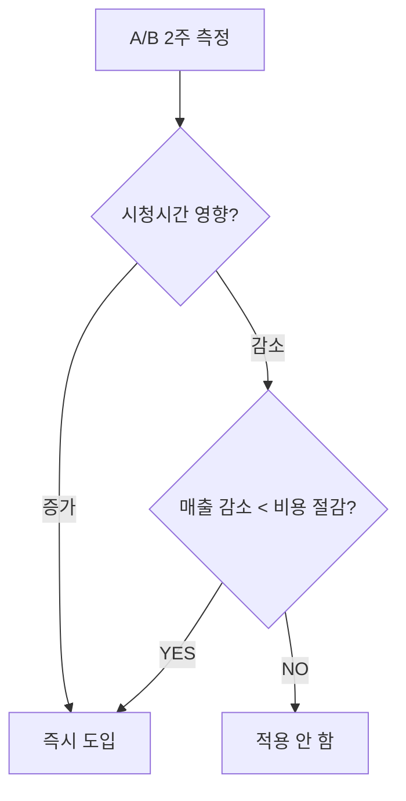

---

## 39. 캐시 TTL 권장값

| 자원 | TTL | 이유 |
|---|---|---|
| 세그먼트 (.m4s) | 24시간 | 한 번 생성 후 안 변함 |
| 라이브 매니페스트 | 1~2초 | 6초마다 변함 |
| VOD 매니페스트 | 30분 | 변할 일 거의 없음 |
| init.mp4 | 24시간 | 코덱 설정 안 바뀌면 고정 |

---

## 40. FinOps 3단계

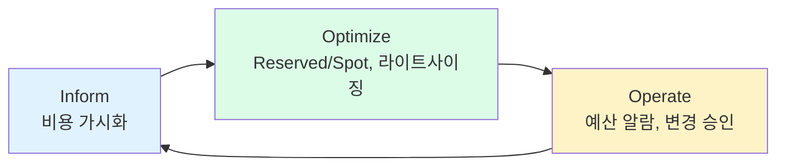

| 단계 | 활동 | KPI |
|---|---|---|
| Inform | 팀별/서비스별 비용 분배 | 채널당 단가 가시화 |
| Optimize | 인스턴스 라이트사이징, Reserved/Spot | 월 비용 -20% |
| Operate | 예산 자동 알람, 변경 승인 | 예산 초과 0건 |

---

## 41. 비용 거버넌스 승인 흐름

```mermaid
flowchart TB
  PR[설정 변경 PR] --> EST[자동 비용 영향 추정]
  EST --> D{월 영향?}
  D -->|< $1K| AUTO[엔지니어 자율]
  D -->|$1K ~ $10K| LEAD[팀 리드 승인]
  D -->|> $10K| DIR[디렉터 승인]
  AUTO --> MERGE[Merge]
  LEAD --> MERGE
  DIR --> MERGE
  MERGE --> TRACK[월 비용 추적]
```

설정 변경 PR마다 비용 영향 자동 첨부. 예산 책임 분산.

---

## 정리하면

라이브 트랜스코딩 인프라는 **7층 마이크로서비스 + 자동 복구 + 비용 최적화**의 종합 운영이다.

1. **7층 분리**가 정석 — 자원 패턴 달라 각 인스턴스 타입 맞춤
2. **방송 시작 6.2초** — 마지막 5초가 세그먼트 인코딩 대기 (LL-HLS로 1초 단축 가능)
3. **CDN 45% + 트랜스코딩 25%** = 비용 70% → 절감 우선순위
4. **A10이 가성비 정점** — T4 대비 처리량 2배, 가격 1.9배
5. **Bin Packing**으로 빈 노드 종료 → 30~40% 절감
6. **Tier Scheduling** — Top 1%만 Premium GPU, 일반은 Budget
7. **큐 선택**: SRT (소규모) / Redis Streams (중규모) / Kafka (대규모)
8. **HPA 비대칭**: 업 30초, 다운 10분 — 라이브 방송 보호
9. **예측 + HPA 결합**으로 피크 5분 전 미리 확장
10. **우선순위 QoS** — 부하 폭증 시 P5부터 거부
11. **Stream Migration**으로 GOP 경계에서 노드 이동 (5~10초 끊김)
12. **장애 자동 복구 = Runbook as Code** — 사람 호출은 차선
13. **GPU 3단계 복구**: kill → reset → reboot (99% 자동 복구)
14. **FFmpeg 좀비 = 출력 mtime 헬스체크** — 유일한 방법
15. **Region Active-Active** = Top 1%만 (0초 끊김), 일반은 Passive (5~10분)
16. **Multi-CDN GSLB** — CDN 한 곳 장애 시 30초 내 가중치 전환
17. **P0 알람 월 5건 이하** — 더 많으면 룰 조정
18. **Chaos Engineering** + Postmortem 사이클로 같은 장애 반복 방지
19. **Pre-positioning**으로 Thundering Herd 차단
20. **Reserved 50% + On-Demand 30% + Spot 20%** = 비용 30~40% 절감
21. **Origin Shield 99% hit** = Origin egress -90%
22. **카테고리별 사다리** = 30% 비트 절감 → CDN + 트랜스코딩 동시
23. **AV1/VP9 라이센스 0** — H.264 대비 $250K/년 절감 (디바이스 보급 따라 점진)
24. **A/B 테스트로 비용 절감의 매출 영향 검증** — 마진 기준 결정
25. **TTL 분리**: 세그먼트 24h, 매니페스트 1~2s
26. **FinOps 3단계** — Inform → Optimize → Operate
27. **비용 거버넌스**: PR마다 영향 추정, $1K/$10K 단계별 승인

이 글로 **레벨 4 (트랜스코딩과 인프라)** 정리 종료. 다음 글에선 **CDN 멀티 벤더 / Origin Shield / 글로벌 전송 깊이** 또는 **WebRTC 기반 인터랙티브 라이브**로 넘어간다.

---

**참고**
- [Kubernetes HPA 문서](https://kubernetes.io/docs/tasks/run-application/horizontal-pod-autoscale/)
- [NVIDIA Device Plugin for Kubernetes](https://github.com/NVIDIA/k8s-device-plugin)
- [AWS Spot Instance Best Practices](https://docs.aws.amazon.com/AWSEC2/latest/UserGuide/spot-best-practices.html)
- [Netflix Chaos Engineering](https://netflixtechblog.com/the-netflix-simian-army-16e57fbab116)
- [FinOps Foundation](https://www.finops.org/)
- [Apache Kafka 공식 문서](https://kafka.apache.org/documentation/)
- [Redis Streams 가이드](https://redis.io/docs/data-types/streams/)
