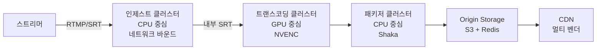
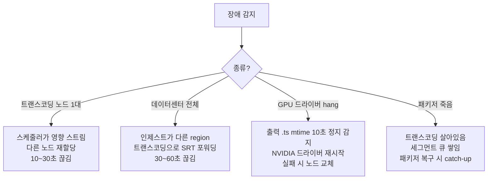
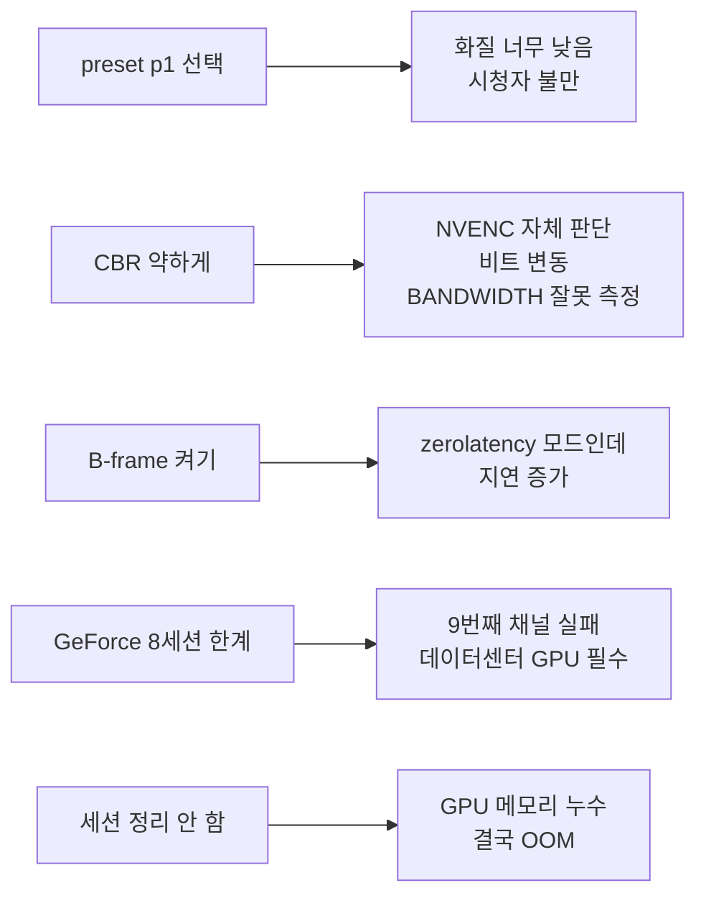

치지직이 동시 방송 1000개를 처리한다고 치자. 1080p60 한 채널을 x264 veryfast로 돌리면 32코어 서버 1대에 8채널. 1000채널 × ABR 5단계 = 200~300대 서버. 서버당 월 $500이면 트랜스코딩만 **월 1.5억원**.

같은 일을 NVIDIA T4 GPU로 하면? T4 한 대당 ABR 통합 5~7채널. 서버 약 150~200대 → 월 $380 인스턴스. 비용 **40~60% 절감**. 거기다 GPU는 게임하면서도 인코딩이 된다. 왜? NVENC는 CUDA 코어를 안 쓰기 때문이다. 별도 칩이라서.

이번 글은 [지난 글](../ffmpeg-deep-dive/)의 FFmpeg, [지난 글](../abr-ladder-design/)의 ABR Ladder 위에서 굴러가는 **GPU 트랜스코딩 인프라**의 전모 — NVENC 세대/옵션/대안 인코더/K8s 운영까지 — 정리한 노트다.

---

## 1. NVENC는 GPU의 별도 ASIC이다


같은 GPU 안에 4개 칩이 따로 박혀있다.

- **CUDA Cores** — 게임/AI 연산
- **Tensor Cores** — AI 가속
- **NVENC** — 인코딩 전용 ASIC (Application-Specific IC)
- **NVDEC** — 디코딩 전용 ASIC

ASIC이라서 GPU 사용률에 거의 영향 없음. **게임하면서 OBS NVENC 송출**이 부드러운 이유. CUDA 코어는 게임에, NVENC는 인코딩에 독립적으로 일함.

---

## 2. x264 vs NVENC — 채널 처리량 차이


{
  "tooltip": { "trigger": "axis", "axisPointer": { "type": "shadow" } },
  "grid": { "left": "28%", "right": "10%", "bottom": "12%", "top": "8%" },
  "xAxis": { "type": "value", "name": "동시 채널" },
  "yAxis": {
    "type": "category",
    "data": ["x264 medium (CPU 32코어)", "x264 veryfast (CPU 32코어)", "NVENC RTX 4080", "NVENC T4 (데이터센터)"]
  },
  "series": [{
    "type": "bar",
    "data": [
      { "value": 2, "itemStyle": { "color": "#94a3b8" } },
      { "value": 8, "itemStyle": { "color": "#3b82f6" } },
      { "value": 17, "itemStyle": { "color": "#10b981" } },
      { "value": 18, "itemStyle": { "color": "#76b900" } }
    ],
    "label": { "show": true, "position": "right", "formatter": "{c}채널" }
  }]
}


채널당 월 비용:

| 인프라 | 월 가격 | 채널/대 | **채널당** |
|---|---|---|---|
| x264 veryfast (32코어 CPU) | $500 | 8 | **$62** |
| RTX 4080 (자체 서버) | $2,000 | 17 | $118 |
| AWS g4dn.xlarge (T4) | $380 | 18 | **$21** |

소비자 GPU는 오히려 비싸지만 **데이터센터 GPU (T4/A10)는 채널당 $21**. CPU의 1/3. 대형 플랫폼이 T4 클러스터로 간 이유.

---

## 3. NVENC 세대 — Turing부터가 진짜


- **Kepler~Pascal (2012~2016)**: 화질 안 좋아서 라이브 인프라에선 안 씀
- **Turing (RTX 2000, 2018)**: x264 veryfast 화질 도달 — **라이브 표준 시작점**
- **Ampere (RTX 3000)**: Turing 개선
- **Ada (RTX 4000, 2022)**: **AV1 인코딩 추가** — 차세대 코덱 실시간

같은 GPU라도 NVENC 세대에 따라 화질이 다름. 인프라 도입 시 반드시 Turing 이상.

---

## 4. NVENC 화질 — VMAF로 본 현실


{
  "tooltip": { "trigger": "axis", "axisPointer": { "type": "shadow" } },
  "grid": { "left": "22%", "right": "10%", "bottom": "12%", "top": "8%" },
  "xAxis": { "type": "value", "name": "VMAF", "min": 80, "max": 100 },
  "yAxis": {
    "type": "category",
    "data": ["NVENC P4 (라이브)", "NVENC P7 (Ada)", "x264 veryfast", "NVENC P7 (Turing)", "x264 medium", "x264 slow"]
  },
  "series": [{
    "type": "bar",
    "data": [
      { "value": 85, "itemStyle": { "color": "#94a3b8" } },
      { "value": 89, "itemStyle": { "color": "#10b981" } },
      { "value": 88, "itemStyle": { "color": "#3b82f6" } },
      { "value": 87, "itemStyle": { "color": "#76b900" } },
      { "value": 92, "itemStyle": { "color": "#f59e0b" } },
      { "value": 95, "itemStyle": { "color": "#ef4444" } }
    ],
    "label": { "show": true, "position": "right", "formatter": "VMAF {c}" }
  }]
}


**라이브에선 NVENC가 정답** — veryfast급 화질을 1/3 비용으로. **VOD 최고 화질엔 x264 slow** — VMAF 95는 NVENC가 못 따라옴.

---

## 5. NVENC 옵션 — x264 옵션과의 매핑

라이브 전환할 때 헷갈리는 부분.

| x264 | NVENC | 의미 |
|---|---|---|
| `-preset veryfast` | `-preset p4` | 속도/화질 트레이드오프 |
| `-tune zerolatency` | `-tune ll` | 저지연 |
| `-crf 23` | `-cq 23` (constqp) | 품질 기반 |
| `-b:v 6000k` | `-b:v 6000k` | 동일 |
| `-maxrate / -bufsize` | `-maxrate / -bufsize` | 동일 |
| `-sc_threshold 0` | `-no-scenecut 1` | **이름만 다름** |
| `-g 120` | `-g 120` | 동일 |
| `-bf 0` | `-bf 0` | 동일 |

`sc_threshold` → `no-scenecut`만 주의하면 거의 그대로 이동.

---

## 6. preset p1~p7 — x264와 다른 체계

```
NVENC preset 체계
p1: 최고 속도, 최저 화질
p2~p3:
p4: 균형  ← 라이브 표준
p5~p6:
p7: 최저 속도, 최고 화질

x264 매핑 (대략)
NVENC p1 ≈ x264 ultrafast
NVENC p4 ≈ x264 veryfast
NVENC p7 ≈ x264 medium
```

**같은 화질을 NVENC가 10배 이상 빠르게.** 라이브 = p3~p4, VOD = p6~p7.

---

## 7. tune와 rc — 라이브 모드 선택

| `-tune` | 용도 | 비고 |
|---|---|---|
| `hq` | VOD | 화질 우선 |
| `ll` | 라이브 (HLS) | 저지연 |
| `ull` | 화상회의 (WebRTC) | B-frame/lookahead 0, ~100ms |
| `lossless` | 무손실 | 보관용 |

| `-rc` | 모드 | 용도 |
|---|---|---|
| `cbr` | CBR | 라이브 기본 |
| `cbr_hq` | CBR + 화질 향상 | **라이브 권장** (VMAF +1~2) |
| `vbr` | VBR | VOD |
| `constqp` | 양자화 고정 | 비트 예측 불가 |

라이브 표준: `-tune ll -rc cbr_hq`. 그냥 `cbr`보다 화질 +1~2점, 추가 비용 없음.

---

## 8. NVENC 라이브 표준 명령

```bash
ffmpeg \
  -hwaccel cuda -hwaccel_output_format cuda \
  -re -i rtmp://input/live/key \
  \
  -c:v h264_nvenc \
  -preset p4 -tune ll -rc cbr_hq \
  -b:v 6000k -maxrate 6000k -bufsize 12000k \
  -g 120 -keyint_min 120 -no-scenecut 1 \
  -bf 0 \
  -profile:v high -level 4.0 -pix_fmt yuv420p \
  \
  -c:a aac -b:a 128k -ar 48000 \
  -f flv rtmp://output/live/key
```

`-hwaccel cuda` + `-hwaccel_output_format cuda`가 핵심. **디코딩→스케일→인코딩 전부 GPU 메모리 안에서**. CPU↔GPU 메모리 복사 없음.

---

## 9. 진짜 화질 짜내기 — 라이브에서 가능한 2-pass

x264 2-pass는 전체 영상 2번. 라이브 불가. NVENC는 **lookahead로 즉시 2-pass**.

```bash
ffmpeg ... \
  -c:v h264_nvenc -preset p4 -tune ll -rc cbr_hq \
  -2pass 1 \
  -rc-lookahead 32 \
  -spatial-aq 1 -temporal-aq 1 -aq-strength 8 \
  -weighted_pred 1 \
  -b:v 6000k -maxrate 6000k -bufsize 12000k \
  -g 120 -no-scenecut 1 -bf 0 \
  ...
```

옵션별 효과:

| 옵션 | 효과 | 지연 추가 |
|---|---|---|
| `-2pass 1` | 즉시 2-pass | +50ms |
| `-rc-lookahead 32` | 32프레임 미리 분석 | +500ms |
| `-spatial-aq 1` | 평탄 영역 비트 절약, 텍스처에 투자 | 0 |
| `-temporal-aq 1` | 정적 배경 절약, 움직임에 투자 | 0 |
| `-weighted_pred 1` | 페이드/밝기 변화 효율 | 미미 |

---

## 10. 지연 vs 화질 — 옵션 조합의 트레이드오프


{
  "tooltip": { "trigger": "axis" },
  "legend": { "data": ["지연 (ms)", "VMAF"], "top": 0 },
  "grid": { "left": "12%", "right": "12%", "bottom": "18%", "top": "18%" },
  "xAxis": {
    "type": "category",
    "data": ["zerolatency", "+ cbr_hq", "+ 2pass", "+ lookahead 32", "+ B-frame 3"],
    "axisLabel": { "rotate": 15 }
  },
  "yAxis": [
    { "type": "value", "name": "지연 (ms)", "position": "left", "max": 800 },
    { "type": "value", "name": "VMAF", "position": "right", "min": 80, "max": 95 }
  ],
  "series": [
    { "name": "지연 (ms)", "type": "bar", "yAxisIndex": 0, "data": [150, 150, 200, 700, 800], "itemStyle": { "color": "#ef4444" } },
    { "name": "VMAF", "type": "line", "smooth": true, "yAxisIndex": 1, "data": [85, 87, 88, 90, 91], "itemStyle": { "color": "#10b981" }, "lineStyle": { "width": 3 } }
  ]
}


운영 선택:
- **LL-HLS / WebRTC**: zerolatency만 (지연 150ms, VMAF 85)
- **일반 HLS**: + cbr_hq + lookahead 32 (지연 700ms, VMAF 90) — 권장
- **지연 무관 라이브**: 전부 적용 (지연 800ms, VMAF 91)

---

## 11. NVENC H.265 / AV1 — 차세대 코덱 실시간

같은 NVENC 칩으로 H.265, AV1까지 지원.


{
  "tooltip": { "trigger": "axis", "axisPointer": { "type": "shadow" } },
  "grid": { "left": "20%", "right": "10%", "bottom": "12%", "top": "8%" },
  "xAxis": { "type": "value", "name": "비트레이트 (Kbps)" },
  "yAxis": {
    "type": "category",
    "data": ["AV1 NVENC (Ada+)", "H.265 NVENC", "H.264 NVENC"]
  },
  "series": [{
    "type": "bar",
    "data": [
      { "value": 2500, "itemStyle": { "color": "#10b981" } },
      { "value": 3500, "itemStyle": { "color": "#f59e0b" } },
      { "value": 5000, "itemStyle": { "color": "#3b82f6" } }
    ],
    "label": { "show": true, "position": "right", "formatter": "{c}k" }
  }]
}


```bash
# H.265
ffmpeg ... -c:v hevc_nvenc -preset p4 -tune ll -rc cbr_hq \
  -b:v 3500k ... 

# AV1 (Ada / RTX 4000+)
ffmpeg ... -c:v av1_nvenc -preset p4 -tune ll -rc cbr_hq \
  -b:v 2500k ...
```

라이브 인프라가 H.265/AV1 안 쓰는 이유는 인코더가 아니라 **시청자 디코더 호환성**. 저가폰이 못 풀음. Twitch가 RTX 4000 보유 스트리머 대상 AV1 베타 시작 (호환성 자동 폴백). 점진적 도입.

---

## 12. 하드웨어 인코더 4진영 — NVENC만 있는 게 아니다


| 진영 | 위치 | 특징 |
|---|---|---|
| **NVIDIA NVENC** | T4/A10/H100 데이터센터 GPU | 라이브 인프라 메인 |
| **Intel QSV / Arc** | CPU iGPU + Arc dGPU | **AV1 NVIDIA보다 먼저** (2022 Arc) |
| **AMD AMF** | Radeon GPU | 클라우드 인스턴스 거의 없음 |
| **Apple VideoToolbox** | M 시리즈, iPhone | 클라이언트 (OBS Mac, iOS 송출) |

**의외 케이스**: Backblaze가 **M1 Mac mini 클러스터**로 트랜스코딩 운영. NVIDIA보다 와트당 효율 우수. 사물 인터넷 같은 한정 콘텐츠엔 답이 될 수 있음.

Intel Arc는 **AV1 인코딩에서 NVIDIA보다 먼저** 양산. Twitch가 비용 압박으로 Arc 인프라 일부 도입.

---

## 13. 인코더 비교 매트릭스

| 인코더 | 화질 (VMAF) | 채널/대 1080p60 | AV1 | 용도 |
|---|---|---|---|---|
| NVENC (T4) | 87~89 | 15~20 | ❌ | 라이브 메인 |
| NVENC (RTX 4080) | 87~89 | 15~17 | ✅ | 프리미엄/베타 |
| QSV (13세대) | 85~87 | 5~8 | ✅ | 소규모 |
| QSV (Arc A770) | 86~88 | 12~15 | ✅ | AV1 신규 |
| AMD AMF | 85~86 | 10~12 | ✅ | 비주류 |
| VideoToolbox (M2 Pro) | 87~88 | 8~10 | ❌ | 클라이언트 |
| x264 veryfast (CPU) | 88 | 8 | - | 라이브 (CPU만) |
| x264 medium (CPU) | 92 | 2 | - | VOD 화질 |

---

## 14. 자체 GPU 인프라 vs 클라우드 트랜스코딩 — 손익분기


{
  "tooltip": { "trigger": "axis" },
  "legend": { "data": ["자체 GPU 인프라", "AWS MediaLive"], "top": 0 },
  "grid": { "left": "14%", "right": "10%", "bottom": "12%", "top": "18%" },
  "xAxis": { "type": "category", "data": ["100", "500", "1000", "5000", "10000"], "name": "동시 채널" },
  "yAxis": { "type": "value", "name": "월 비용 (USD, log)", "type": "log" },
  "series": [
    { "name": "자체 GPU 인프라", "type": "line", "smooth": true, "data": [20000, 30000, 50000, 200000, 400000], "itemStyle": { "color": "#3b82f6" }, "lineStyle": { "width": 3 } },
    { "name": "AWS MediaLive", "type": "line", "smooth": true, "data": [43200, 216000, 432000, 2160000, 4320000], "itemStyle": { "color": "#ef4444" }, "lineStyle": { "width": 3 } }
  ]
}


AWS MediaLive HD ABR ladder 1채널 = 약 $0.60/시간 × 720시간 = $432/월.

```
[손익분기]
1000채널 기준: 자체 인프라 약 2개월에 본전
 500채널 기준: 약 4개월
 100채널 기준: 1년 이상

치지직 규모 = 자체
소형 OTT = 클라우드
```

대신 자체 인프라는 **엔지니어 2명 + 장애 대응 비용**이 들어감. 채널 1000개 미만이면 클라우드 답.

---

## 15. 인제스트/트랜스코딩/패키저 분리 — 왜?



같은 노드에 인제스트+트랜스코딩 묶으면:
- 인제스트는 네트워크 바운드, 트랜스코딩은 GPU 바운드 → **자원 사용 패턴 다름**
- 한쪽만 늘리고 줄일 수 없음

분리하면:
- 인제스트: 10Gbps NIC, GPU 없음, CPU 16~32코어
- 트랜스코딩: T4 GPU, NVMe 임시 스토리지
- 패키저: CPU 8~16코어, 빠른 NVMe (세그먼트 IO)
- **각 레이어 독립 스케일링**

---

## 16. Kubernetes GPU 할당 — NVIDIA Device Plugin

```yaml
apiVersion: apps/v1
kind: StatefulSet
metadata:
  name: transcoder
spec:
  replicas: 5
  template:
    spec:
      nodeSelector:
        gpu-type: nvidia-t4
      containers:
      - name: ffmpeg
        image: registry/nvenc-transcoder:v1.2
        resources:
          limits:
            nvidia.com/gpu: 1
            cpu: 8
            memory: 16Gi
```

**한 GPU 분할**은 NVIDIA MIG (Multi-Instance GPU, A100+):

| MIG 슬라이스 | 1080p60 채널 |
|---|---|
| 1g.5gb (1/7) | 2채널 |
| 3g.20gb (3/7) | 8채널 |
| 7g.40gb (전체) | 20채널 |

A100 1대를 7조각으로 쪼개서 채널 패킹 효율 극대화.

---

## 17. HPA로 자동 스케일링

```yaml
apiVersion: autoscaling/v2
kind: HorizontalPodAutoscaler
spec:
  minReplicas: 5
  maxReplicas: 100
  metrics:
  - type: External
    external:
      metric: { name: nvidia_gpu_utilization }
      target: { type: AverageValue, averageValue: "70" }
  behavior:
    scaleUp:   { stabilizationWindowSeconds: 30 }   # 빨리 늘림
    scaleDown: { stabilizationWindowSeconds: 300 }  # 천천히 줄임
```

**비대칭 스케일링이 핵심**. 늘릴 땐 30초 안에 (방송 시작 폭발), 줄일 땐 5분 천천히 (방송 중 종료 금지).

---

## 18. 시간대별 트래픽 + Reserved/Spot 혼합


{
  "tooltip": { "trigger": "axis" },
  "legend": { "data": ["Reserved (상시)", "On-Demand (평균)", "Spot (피크)"], "top": 0 },
  "grid": { "left": "10%", "right": "10%", "bottom": "12%", "top": "18%" },
  "xAxis": { "type": "category", "data": ["3시", "8시", "12시", "14시", "18시", "20시", "22시", "1시"] },
  "yAxis": { "type": "value", "name": "동시 채널" },
  "series": [
    { "name": "Reserved (상시)", "type": "line", "stack": "total", "areaStyle": {}, "data": [50, 200, 200, 200, 200, 200, 200, 200], "itemStyle": { "color": "#3b82f6" } },
    { "name": "On-Demand (평균)", "type": "line", "stack": "total", "areaStyle": {}, "data": [0, 0, 200, 100, 100, 300, 300, 100], "itemStyle": { "color": "#10b981" } },
    { "name": "Spot (피크)", "type": "line", "stack": "total", "areaStyle": {}, "data": [0, 0, 0, 0, 0, 500, 300, 100], "itemStyle": { "color": "#f59e0b" } }
  ]
}


피크/오프피크 비율 **20:1**. 피크 기준으로 인프라 잡으면 80% 시간 낭비.

```
Reserved (예약 인스턴스, 80% 할인): 200채널 상시 부하
On-Demand: 평균 부하 채움
Spot (90% 할인, 중단 가능): 피크 처리
```

**전체 비용 30~40% 절감**. Spot 중단 시 graceful drain — 새 노드로 마이그레이션 (5~10초 끊김).

---

## 19. 장애 시나리오별 대응



핵심 헬스체크: **출력 파일 mtime**. GPU가 인코딩하는 척만 하고 실제 출력 안 나오는 좀비 상태 (드라이버 hang) 잡는 유일한 방법.

```python
def check_node_health(stream_dir):
    latest = max(os.path.getmtime(f) for f in os.listdir(stream_dir))
    return time.time() - latest < 10  # 10초 미생성 → 재시작
```

---

## 20. NVENC 함정 — 라이브 운영에서 실제로 터지는 것



| 함정 | 해결 |
|---|---|
| preset 너무 빠름 | p4 기본 유지 |
| 약한 CBR | `-maxrate -bufsize` 명시 |
| B-frame in zerolatency | `-bf 0` 강제 |
| GeForce 8세션 | T4/A10 데이터센터 GPU |
| 메모리 누수 | FFmpeg 정상 종료 (SIGTERM 후 wait) |

---

## 21. Multi-Vendor 추상화 — 벤더 락인 방어

같은 FFmpeg 빌드에 모든 인코더 포함.

```bash
ffmpeg -encoders | grep -E "nvenc|qsv|amf|videotoolbox"

V..... h264_nvenc / hevc_nvenc / av1_nvenc
V..... h264_qsv   / hevc_qsv   / av1_qsv
V..... h264_amf   / hevc_amf
V..... h264_videotoolbox / hevc_videotoolbox
```

런타임에 가용 인코더 선택:

```python
def select_encoder():
    if nvidia_available():    return "h264_nvenc"
    elif intel_qsv_available(): return "h264_qsv"
    elif apple_silicon():     return "h264_videotoolbox"
    else:                      return "libx264"  # 폴백
```

대형 플랫폼은 보통:
- **80%**: 자체 NVIDIA T4 클러스터
- **20%**: AWS MediaLive 백업 (region 장애 시)
- 인기 스트리머만 T4 → A10 업그레이드

---

## 22. 모니터링 — 알람 우선순위

| 레벨 | 지표 | 임계 | 대응 |
|---|---|---|---|
| **Critical (즉시)** | NVENC speed | < 1.0x | PagerDuty 호출 |
| **Critical** | 인제스트 연결 실패율 | > 1% | PagerDuty |
| **Critical** | 패키저 출력 지연 | > 10s | PagerDuty |
| **Warning** | GPU 사용률 | > 90% | Slack, 확장 검토 |
| **Warning** | VMAF 회귀 | -2점 | Slack |
| **Info** | 채널당 평균 비용 | - | Grafana |

비용 지표도 모니터링: **채널당 평균 비용**이 갑자기 튀면 누가 잘못 설정한 것. 자동 알람.

---

## 정리하면

GPU 트랜스코딩은 **인코더 칩 이해 + FFmpeg 옵션 + 인프라 운영**의 종합이다.

1. **NVENC는 GPU 내 별도 ASIC** — CUDA와 독립, 게임하면서 인코딩 가능
2. **Turing부터 라이브 표준** — x264 veryfast 화질 도달
3. **Ada부터 AV1 NVENC** — 차세대 코덱 실시간
4. **데이터센터 T4 = 채널당 $21** — CPU의 1/3
5. **라이브 표준 옵션**: `p4 + ll + cbr_hq + no-scenecut 1 + bf 0`
6. **전체 GPU 파이프라인**: `hwaccel cuda` + `scale_cuda` — CPU 5% 이하
7. **2-pass + lookahead + AQ + weighted_pred** — VMAF +5점, 지연 +500ms 트레이드오프
8. **지연 vs 화질**: LL-HLS는 zerolatency만, 일반 HLS는 lookahead 32 권장
9. **하드웨어 인코더 4진영**: NVIDIA 메인, Intel Arc AV1, Apple Silicon 클라이언트, AMD 비주류
10. **자체 vs 클라우드 손익분기 = 1000채널 / 2개월**
11. **3계층 분리**: 인제스트(네트워크) / 트랜스코딩(GPU) / 패키저(CPU)
12. **K8s + NVIDIA device plugin + MIG**로 GPU 분할 패킹
13. **비대칭 HPA**: 늘릴 땐 30초, 줄일 땐 5분
14. **Reserved + On-Demand + Spot 혼합**으로 30~40% 비용 절감
15. **헬스체크 = 출력 파일 mtime** — GPU 좀비 잡는 유일한 방법
16. **Multi-Vendor 추상화**로 벤더 락인 방어
17. **알람 = NVENC speed / 연결 실패율 / 출력 지연**이 Critical
18. **VMAF 회귀**도 추적 — 인코더 옵션 회귀 자동 감지

다음 글에선 **CDN 멀티 벤더 전략** — Origin Shield, 멀티 CDN 부하 분산, 비용 최적화 — 를 다룬다.

---

**참고**
- [NVIDIA Video Codec SDK 문서](https://docs.nvidia.com/video-technologies/video-codec-sdk/)
- [FFmpeg NVENC 가이드](https://trac.ffmpeg.org/wiki/HWAccelIntro)
- [Intel Quick Sync Video 문서](https://www.intel.com/content/www/us/en/architecture-and-technology/quick-sync-video/quick-sync-video-general.html)
- [Apple VideoToolbox 문서](https://developer.apple.com/documentation/videotoolbox)
- [AWS MediaLive 가격](https://aws.amazon.com/medialive/pricing/)
