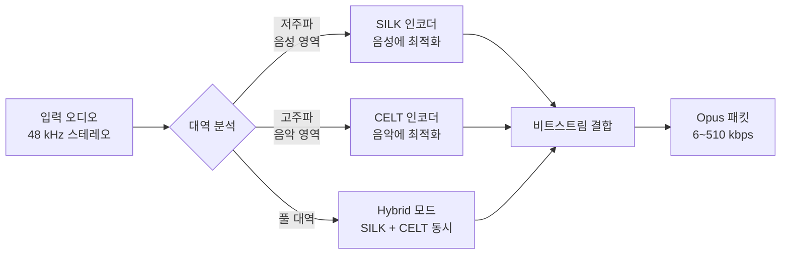
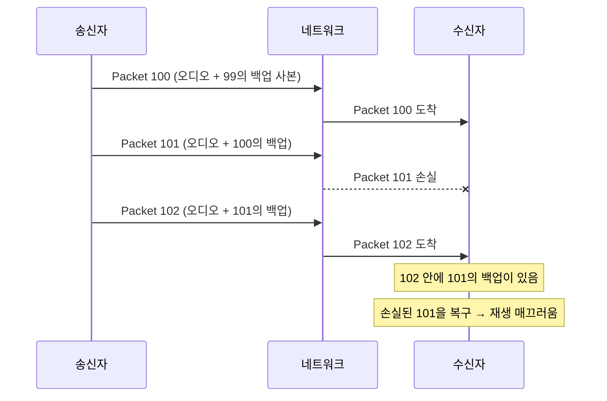
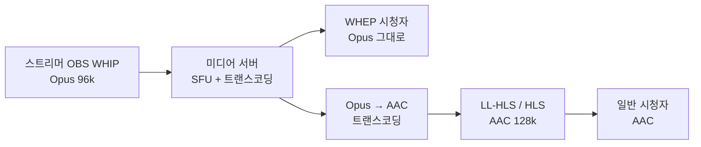

Discord 음성 채팅을 켜놓고 게임할 때, 통신사가 LTE 약전계에 진입해도 목소리가 거의 안 끊기는 경험. WhatsApp 보이스 메시지가 1990년대 모뎀 같은 인터넷에서도 들리는 경험. Zoom이 카페 와이파이에서도 화면은 깨져도 음성은 계속 들리는 경험.

이게 다 같은 코덱 덕분이다. **Opus**.

[지난 글](../aac-and-friends/)에서 AAC와 함께 Opus를 잠깐 봤다면, 이번 글은 **Opus만 따로 깊이** 파헤친 노트다. SILK + CELT 두 알고리즘이 어떻게 결합되어 한 코덱이 됐고, FEC와 DTX 같은 기법이 어떻게 통신사 약전계에서 음성을 살리고, 실전 WebRTC/Discord/Whisper에서 어떻게 다루는지.

---

## 1. Opus의 출신 — 두 회사가 합쳐서 만든 이상한 표준

대부분의 코덱은 한 회사/단체에서 만든다. Opus는 다르다.

```
[Opus의 두 부모]
1. SILK — Skype가 만든 음성 통화 코덱
   - 음성에 최적화
   - 8~16 kHz 대역
   - 저비트레이트 강함 (6 kbps도 가능)

2. CELT — Xiph.org가 만든 저지연 음악 코덱
   - 음악에 최적화
   - 48 kHz 풀 대역
   - 5 ms 초저지연
```

IETF가 둘을 합치자고 제안. Skype와 Xiph가 동의. **2012년 IETF RFC 6716으로 Opus 발표**.

```
공식 명칭: Opus Interactive Audio Codec
표준: IETF RFC 6716 (2012)
라이센스: 완전 무료 (BSD 라이센스)
```

이게 결정적이었다. AAC/MP3/AC-3가 모두 라이센스 있는 환경에서 **Opus만 완전 무료**. WebRTC 표준 코덱이 된 직접적 이유.

---

## 2. SILK + CELT 결합 — Opus의 진짜 비밀

Opus가 한 코덱처럼 보이지만 내부적으로 **두 알고리즘**이 다 살아있다.



| 모드 | 사용 알고리즘 | 적합한 콘텐츠 |
|---|---|---|
| **SILK only** | SILK만 | 순수 음성 (전화 통화) |
| **CELT only** | CELT만 | 음악, 풀 대역 |
| **Hybrid** | SILK + CELT | 음성 + 배경음악 (Discord 게임 방송) |

Opus 인코더가 입력 분석 후 자동 선택. **사람이 신경 안 써도 됨**.

```
[비트레이트별 자동 모드 선택]
6~20 kbps:   SILK only (음성)
20~36 kbps:  Hybrid (음성 + 일부 음악)
36~510 kbps: CELT only (음악 풀 대역)
```

Discord에서 게임 중 갑자기 음악 켜면 자동으로 CELT 모드로 전환. **사용자가 모드 선택할 필요 없음**.

---

## 3. AAC vs Opus — 깊이 비교

[지난 글](../aac-and-friends/)에서 같은 비트레이트의 음질을 ECharts로 비교했다. 그 외 차이점.

| 항목 | AAC-LC | Opus |
|---|---|---|
| 최저 비트레이트 | 32 kbps (HE-AAC v2 16k) | **6 kbps** |
| 최고 비트레이트 | 320 kbps | **510 kbps** |
| 지연 (최소 프레임) | ~100 ms | **2.5 ms** |
| 풀 대역 | 24 kHz | **24 kHz (48kHz 샘플)** |
| 손실 복구 (FEC) | ❌ | ✅ 내장 |
| 침묵 감지 (DTX) | ❌ | ✅ 내장 |
| 라이센스 | 만료된 풀 | **완전 무료** |
| HLS 표준 | ✅ 의무 | ❌ |
| WebRTC 표준 | ❌ | ✅ 의무 |

**같은 비트레이트에서 음질은 Opus 우수, 라이브 시청은 AAC**. 영역이 다름.

### 지연 차이가 결정적

```
[프레임 크기 비교]
AAC: 1024 샘플 = 21.3 ms (48 kHz 기준)
Opus: 2.5 / 5 / 10 / 20 / 40 / 60 ms 중 선택
```

실시간 통신에서 21 ms 지연은 의식 못 하지만, 100 ms 넘어가면 자연스러운 대화 어려움. Opus는 2.5 ms까지 내릴 수 있어서 **체스 시계 같은 초정밀 통신**에도 사용 가능.

---

## 4. FEC — Opus의 손실 복구 비밀

Opus가 약전계 환경에서 안 끊기는 진짜 비밀.



**각 패킷에 이전 패킷의 저품질 백업을 포함**. 다음 패킷이 도착하면 손실된 패킷을 백업으로 재구성.

```bash
# FEC 활성화 (Opus 표준)
opusenc --packet-loss 10 input.wav output.opus
# --packet-loss N: 예상 손실률 N%
```

`--packet-loss 10`은 "패킷 손실 10% 정도 예상"이라는 힌트. Opus가 백업 비트레이트를 적절히 할당.

**Discord/WhatsApp이 약전계에서 안 끊기는 핵심**. AAC에는 없는 기능.

---

## 5. DTX — 침묵 시 대역폭 절약

대화는 대부분 침묵이다. 사람이 말할 때만 데이터 보내자.

```
[DTX (Discontinuous Transmission)]
사람 말함 → 정상 패킷 (32 kbps)
사람 침묵 → "Comfort Noise" 짧은 패킷 (1 kbps)
```

Discord 음성 채팅 100명 방. 동시에 말하는 사람 거의 없음. DTX 없으면 100명 × 32 kbps = 3.2 Mbps. DTX 있으면 평균 200 kbps.

```bash
# DTX 활성화
ffmpeg -i input -c:a libopus -b:a 32k -dtx 1 output.opus
```

WebRTC는 기본 활성화.

### Comfort Noise — 침묵의 진짜 의미

DTX로 데이터를 안 보내면 수신자는 **완전한 무음**을 듣는다. 통화가 끊긴 것 같음.

해결: 수신자 측에서 **인공 배경 노이즈** 생성. 미세하게 들리는 "쉬익" 소리. 사용자가 "연결돼 있다"고 느끼게.

이 노이즈 특성을 송신자가 가끔 업데이트해서 보냄. 1 kbps 수준.

---

## 6. 프레임 크기 트레이드오프

Opus의 강점이자 복잡함의 원인.


{
  "tooltip": { "trigger": "axis" },
  "legend": { "data": ["지연 (ms)", "오버헤드 비율 (%)"], "top": 0 },
  "grid": { "left": "12%", "right": "12%", "bottom": "12%", "top": "18%" },
  "xAxis": {
    "type": "category",
    "data": ["2.5", "5", "10", "20", "40", "60"],
    "name": "프레임 크기 (ms)"
  },
  "yAxis": [
    { "type": "value", "name": "지연 (ms)", "position": "left", "min": 0, "max": 70 },
    { "type": "value", "name": "오버헤드 (%)", "position": "right", "min": 0, "max": 40 }
  ],
  "series": [
    {
      "name": "지연 (ms)",
      "type": "bar",
      "yAxisIndex": 0,
      "itemStyle": { "color": "#ef4444" },
      "data": [2.5, 5, 10, 20, 40, 60]
    },
    {
      "name": "오버헤드 비율 (%)",
      "type": "line",
      "smooth": true,
      "yAxisIndex": 1,
      "itemStyle": { "color": "#3b82f6" },
      "data": [35, 25, 15, 8, 4, 2]
    }
  ]
}


각 프레임에 헤더가 박힘. 프레임이 작을수록 헤더 비중 ↑ = 오버헤드 ↑. 프레임이 클수록 지연 ↑.

### 사용처별 권장

| 프레임 크기 | 권장 용도 |
|---|---|
| **2.5 ms** | 게임 음성 (체스 시계 같은) |
| **5 ms** | 초저지연 통화 |
| **10 ms** | 일반 화상회의 |
| **20 ms** | **WebRTC 기본** (균형) |
| **40 ms** | 음성 메시지 |
| **60 ms** | 음악 스트리밍 |

WebRTC가 20 ms를 기본으로 잡은 게 절묘. 지연/효율 균형점.

---

## 7. WebRTC SDP에서 Opus 협상

[WebRTC 글](../webrtc-deep-dive/)에서 SDP를 봤다. Opus 협상 부분 깊이.

```
m=audio 9 UDP/TLS/RTP/SAVPF 111
a=rtpmap:111 opus/48000/2
a=fmtp:111 minptime=10;useinbandfec=1;usedtx=1;maxaveragebitrate=32000
a=rtcp-fb:111 transport-cc
```

`fmtp` 라인의 옵션:
- `minptime=10`: 최소 프레임 10 ms
- `useinbandfec=1`: FEC 활성화
- `usedtx=1`: DTX 활성화
- `maxaveragebitrate=32000`: 최대 평균 비트레이트 32 kbps

### 비트레이트 동적 조정

WebRTC는 네트워크 상황에 따라 Opus 비트레이트를 실시간 조정.

```javascript
// Sender 측 코드
const sender = pc.getSenders().find(s => s.track.kind === 'audio');
const params = sender.getParameters();
params.encodings[0].maxBitrate = 32000; // 32 kbps 상한
await sender.setParameters(params);
```

네트워크 좋을 때 32k 풀로 송출, 나빠지면 6k까지 자동 다운. AAC는 이런 동적 조정 못 함.

---

## 8. 실전 사용처 — 어디서 Opus를 만나나

| 플랫폼 | Opus 용도 | 비트레이트 | 비고 |
|---|---|---|---|
| **Discord** | 음성 채널 | 64~96 kbps | Hybrid 모드 (음성+음악) |
| **Zoom** | 화상회의 음성 | 32~64 kbps | DTX + FEC |
| **Google Meet** | 화상회의 | 32~64 kbps | |
| **WhatsApp** | 통화 + 음성 메시지 | 16~32 kbps | 모바일 데이터 절약 |
| **Telegram** | 통화 | 32 kbps | DTX 강함 |
| **Signal** | 통화 | 16 kbps | 최저 보안 우선 |
| **FaceTime** | 통화 | 24~64 kbps | 자체 + AAC 혼합 |
| **YouTube** | 일부 VOD | 128~192 kbps | VP9/AV1 + Opus |
| **Twitch** | ❌ 안 씀 | - | AAC만 |
| **치지직** | ❌ 안 씀 | - | AAC만 |

라이브 스트리밍 (HLS) = AAC. 실시간 통신 = Opus. 명확히 분리.

---

## 9. Opus FFmpeg 명령

라이센스 무료라 FFmpeg에 기본 내장.

```bash
# 일반 인코딩
ffmpeg -i input.wav -c:a libopus -b:a 96k output.opus

# 음성 위주 (Discord 봇)
ffmpeg -i mic.wav \
  -c:a libopus \
  -b:a 32k \
  -application voip \
  -frame_duration 20 \
  output.opus

# 음악 위주 (음악 봇)
ffmpeg -i music.mp3 \
  -c:a libopus \
  -b:a 128k \
  -application audio \
  -frame_duration 20 \
  output.opus

# VOIP + FEC
ffmpeg -i input \
  -c:a libopus \
  -b:a 24k \
  -application voip \
  -packet_loss 10 \
  output.opus
```

핵심 옵션:
- `application voip`: 음성 최적화 (SILK 우선)
- `application audio`: 음악 최적화 (CELT 우선)
- `frame_duration`: 프레임 크기 (ms)
- `packet_loss`: 예상 손실률 → FEC 자동 조정

---

## 10. WebM 컨테이너 — Opus의 표준 그릇

AAC가 MP4 컨테이너에 담기듯, Opus는 **WebM**에 담는다.

```
WebM = Matroska (.mkv) 기반 Google 표준
컨테이너: WebM
비디오 코덱: VP8, VP9, AV1
오디오 코덱: Opus, Vorbis
용도: 웹 영상 + 음성
```

YouTube가 VP9 + Opus + WebM 조합 적극 사용. **MP4 (H.264 + AAC) 대비 라이센스 무료**.

```bash
# Opus를 WebM 컨테이너에
ffmpeg -i input.wav -c:a libopus -b:a 96k output.webm

# Opus만 추출
ffmpeg -i video.webm -vn -c:a copy output.opus
```

---

## 11. Opus → AAC 변환 (실무)

라이브 송출 환경. WebRTC 인제스트(Opus) → HLS 시청(AAC) 트랜스코딩이 핵심.

```bash
# WHEP/WebRTC로 받은 Opus → HLS용 AAC
ffmpeg -i input.opus \
  -c:a aac -b:a 128k \
  -ar 48000 -ac 2 \
  output.m4a
```

WHIP으로 송출한 영상이 시청자에게 HLS로 전달되려면 무조건 거쳐야 하는 단계.



OvenMediaEngine 같은 서버가 이걸 자동 처리.

---

## 12. Whisper 음성 인식에 Opus 입력

OpenAI Whisper는 PCM 16 kHz를 받는다. Opus 파일을 직접 못 받음.

```bash
# Opus → Whisper 입력용 WAV
ffmpeg -i discord_voice.opus \
  -ar 16000 -ac 1 -c:a pcm_s16le \
  whisper_input.wav

# Whisper 실행
whisper whisper_input.wav --model medium --language ko
```

Discord 봇이 음성 채널에서 Opus 받음 → WAV 변환 → Whisper로 텍스트 변환 → DB 저장. **음성 분석 파이프라인의 표준 패턴**.

---

## 13. Opus 모니터링 — WebRTC Stats API

브라우저에서 실시간 Opus 통계 확인 가능.

```javascript
const pc = new RTCPeerConnection();

setInterval(async () => {
  const stats = await pc.getStats();
  stats.forEach(report => {
    if (report.type === 'inbound-rtp' && report.kind === 'audio') {
      console.log({
        bitrate: report.bytesReceived * 8 / report.timestamp,
        packetsLost: report.packetsLost,
        jitter: report.jitter,
        codec: report.codecId, // opus
      });
    }
  });
}, 1000);
```

`packetsLost`가 핵심 지표. 1% 넘으면 FEC가 작동 중. 5% 넘으면 음질 저하 시작.

---

## 14. Opus의 미래 — 라이브 스트리밍 진입?

WHIP/WHEP 표준화로 Opus가 라이브 시청에도 들어올 가능성.

```
[현재]
시청자 측: HLS(AAC) 압도적
실시간 통신: WebRTC(Opus) 표준

[가능한 미래]
WHEP 보급으로 라이브 시청에도 Opus
저지연 라이브 → Opus 자연스러움
```

근데 [지난 WHIP/WHEP 글](../whip-whep-modern-ingest/)에서 본 것처럼 **WHEP은 CDN 비용 문제로 대규모 라이브엔 부적합**. 인터랙티브 라이브(경매, 라이브 쇼핑)에서만 Opus 채택 가능성.

대규모 라이브 표준은 여전히 AAC.

---

## 정리하면

Opus는 **두 코덱의 결합으로 실시간 통신을 정복**한 무료 표준이다.

1. **출신** — 2012년 IETF, SILK(Skype) + CELT(Xiph) 결합. 완전 무료
2. **이중 알고리즘** — SILK(음성) + CELT(음악) + Hybrid. 자동 모드 선택
3. **비트레이트 범위** — 6 kbps ~ 510 kbps. AAC보다 훨씬 넓음
4. **저지연** — 최소 2.5 ms 프레임. AAC의 1/40
5. **FEC** — 각 패킷에 이전 패킷 백업. 손실 10%에도 복구
6. **DTX** — 침묵 시 1 kbps. Discord 100명 방 대역폭 절약
7. **WebRTC 표준** — `useinbandfec=1, usedtx=1, minptime=10` 표준 SDP
8. **실전** — Discord/Zoom/WhatsApp/Telegram. 라이브엔 안 씀
9. **AAC와 영역 분리** — 시청 = AAC (HLS), 통신 = Opus (WebRTC)
10. **Opus → AAC 변환** — WHIP 인제스트 → HLS 트랜스코딩의 표준 단계

다음 글에선 **차세대 영상 코덱 AV1 + 옛 VP9** — H.265 라이센스 지옥을 피하려고 만든 무료 표준의 진화 — 를 본다.

---

**참고**
- [Opus IETF RFC 6716](https://datatracker.ietf.org/doc/html/rfc6716)
- [Opus 공식 사이트](https://opus-codec.org/)
- [Xiph.org 기술 문서](https://wiki.xiph.org/Opus)
- [WebRTC SDP Opus 옵션](https://datatracker.ietf.org/doc/html/rfc7587)
- [Discord 음성 인프라 블로그](https://discord.com/blog/how-discord-handles-two-and-half-million-concurrent-voice-users-using-webrtc)
