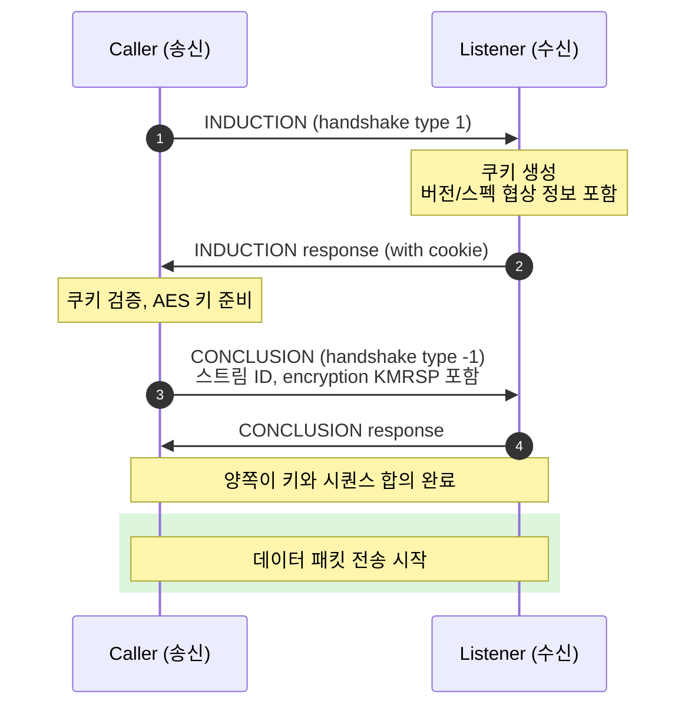

올림픽이나 월드컵 중계를 보면 현장 카메라 → 본사 → 시청자로 신호가 흐른다. 옛날엔 위성/전용선이었다. 한 번 깔면 안정적이지만 한 번 쏘는 데 수천만 원.

2010년대 들어서 방송사들이 결심한다. **그냥 인터넷으로 보내자.** 그런데 인터넷은 패킷이 막 손실되고 순서가 뒤바뀐다. RTMP는 TCP 기반이라 손실 시 무한 대기 → 끊김. WebRTC는 인터랙티브용으로 만들어져서 안정성이 떨어짐.

이 사이를 노리고 등장한 게 **SRT (Secure Reliable Transport)**.

[지난 글](../ll-hls-deep-dive/)에서 시청자 측 저지연 표준 LL-HLS를 봤다면, 이번 글은 **방송 업계의 새 송출 표준**인 SRT를 정리한 노트다. 왜 만들어졌고, UDP인데 어떻게 신뢰성을 챙기고, OBS에서 RTMP 대신 SRT로 송출하면 뭐가 다른지.

---

## 1. SRT의 출신 — 방송 업계가 인터넷을 길들인 방법

2013년 캐나다 방송 장비 회사 **Haivision**이 SRT 개발 시작. 당시 방송사들의 고민은 명확했다.

```
[2013년 방송 업계의 송출 옵션]
- 위성: 안정 ⭐⭐⭐⭐⭐ / 비용 💸💸💸💸💸
- 전용선 (광케이블): 안정 ⭐⭐⭐⭐⭐ / 비용 💸💸💸💸
- RTMP (TCP): 안정 ⭐⭐ / 비용 0 → 끊김 잦음
- UDP raw: 빠름 / 손실 복구 없음
```

위성/전용선은 너무 비싸고, RTMP는 끊기고, UDP raw는 손실 복구 안 됨. **UDP 위에 신뢰성 메커니즘만 직접 박자**.

2017년 Haivision이 SRT를 **오픈소스로 공개** (MPL 라이선스). 이후 SRT Alliance 결성 (Microsoft, Avid 등 합류). 방송 업계 사실상 표준이 됨.

---

## 2. UDP인데 어떻게 신뢰성을 챙기나 — ARQ

SRT의 핵심 아이디어는 **ARQ (Automatic Repeat reQuest)** — 패킷 손실 시 받는 쪽이 보낸 쪽에게 "그거 다시 보내줘" 요청.

이건 TCP에도 있다. 그런데 TCP는 손실 시 **무한정 기다린다**. SRT는 다르다.


```
[TCP]
seq:3 손실 → seq:4, 5가 도착해도 애플리케이션에 전달 안 함
재전송 도착할 때까지 무한 대기 (수십~수백 ms)
→ 라이브 영상 끊김

[SRT]
seq:3 손실 → NAK (Negative ACK) 즉시 발송
120ms 안에 재전송 도착하면 → 정상 처리
120ms 안에 못 오면 → 버리고 seq:4부터 진행
→ 작은 손실 감수, 지연 보장
```

이게 **방송에 적합한 트레이드오프**다. 영상 한 프레임 깨지는 건 시청자가 거의 못 느끼지만, 1초 멈춤은 명확히 보인다. SRT는 "예측 가능한 지연 + 작은 화질 손실"을 선택.

---

## 3. Latency 모드 — SRT의 핵심 트레이드오프

`latency`가 SRT 설정의 가장 중요한 파라미터다. 클수록 안정적, 작을수록 저지연.


{
  "tooltip": { "trigger": "axis" },
  "legend": { "data": ["손실 복구 가능률 (%)", "총 송출 지연 (ms)"], "top": 0 },
  "grid": { "left": "12%", "right": "12%", "bottom": "12%", "top": "18%" },
  "xAxis": {
    "type": "category",
    "data": ["50ms", "120ms", "250ms", "500ms", "1000ms", "2000ms"],
    "name": "latency 설정"
  },
  "yAxis": [
    { "type": "value", "name": "복구율 (%)", "min": 50, "max": 100, "position": "left" },
    { "type": "value", "name": "지연 (ms)", "position": "right" }
  ],
  "series": [
    {
      "name": "손실 복구 가능률 (%)",
      "type": "line",
      "smooth": true,
      "yAxisIndex": 0,
      "itemStyle": { "color": "#10b981" },
      "areaStyle": { "opacity": 0.15 },
      "data": [55, 80, 92, 97, 99, 99.5]
    },
    {
      "name": "총 송출 지연 (ms)",
      "type": "line",
      "smooth": true,
      "yAxisIndex": 1,
      "itemStyle": { "color": "#ef4444" },
      "areaStyle": { "opacity": 0.15 },
      "data": [80, 150, 280, 530, 1030, 2030]
    }
  ]
}


업계 권장:

```
같은 도시/안정 회선: 120ms
국내 (서울 ↔ 부산):   250ms
국제 (서울 ↔ LA):     500–1000ms
초저지연이 필요한 경우: 80–120ms (손실 감수)
방송용 안정성 최우선:   2000ms
```

SRT 표준은 **(왕복 RTT) × 2.5** 권장. 서울 ↔ LA의 RTT 150ms × 2.5 = 375ms.

---

## 4. SRT의 5단계 핸드셰이크

연결이 시작되기 전에 5단계 협상을 거친다. 이게 SRT가 보안과 협상 정보를 한 번에 처리하는 메커니즘.



`INDUCTION` 단계의 쿠키 검증이 **DDoS 방지** 메커니즘. 가짜 SYN flood 같은 공격을 받아도 쿠키 검증 없이는 다음 단계로 못 감.

`CONCLUSION` 단계에서 **암호화 키 교환** + **Stream ID** 같이 처리. RTMP가 별도 단계로 처리하던 걸 SRT는 한 번에.

---

## 5. SRT의 4가지 연결 모드

연결 방향이 다양함. NAT/방화벽 통과 옵션이 풍부.

```
[Caller 모드]
스트리머 → 서버에 연결 요청
   가장 일반적. RTMP와 같음.

[Listener 모드]
서버가 listen → 스트리머가 connect
   거의 caller와 같지만 역할 명시적.

[Rendezvous 모드]
양쪽이 동시에 connect 시도
   NAT 양쪽에 있어도 통과 가능 (UDP hole punching)

[Caller + Listener 양방향]
양쪽이 둘 다 됨. 자동 fallback.
```

Rendezvous가 흥미롭다. 양쪽이 다 NAT 뒤에 있어도 UDP 홀 펀칭으로 직접 연결. RTMP/HLS는 못 하는 것. **P2P 라이브 송출** 시나리오에서 가치 큼.

---

## 6. Bonding — 다중 회선 송출

SRT가 방송 차량에서 결정적인 이유. **여러 인터넷 회선을 묶어서 송출**.


```
[현장 라이브 차량 (Mobile OB Van)]
카메라 → 인코더 → 4G + 5G + WiFi 각각 SRT 송출
                ↓
        본사가 세 스트림을 받아 재조합
                ↓
         완전한 영상 복원
```

장점:
- **대역폭 합산**: 4G 5Mbps + 5G 15Mbps + WiFi 10Mbps = 30Mbps
- **장애 대응**: 한 회선 죽어도 나머지로 송출 계속
- **지연 마스킹**: 다른 회선이 빠르게 도착하면 그걸로 채움

스포츠 중계차, 시위 현장, 야외 촬영에서 표준. 한 회선만 쓰면 차량 이동 중 LTE 약전계 진입하면 끊김. 본딩하면 거의 안 끊김.

업계 솔루션: LiveU, Mobile Viewpoint, Haivision Pro. SRT 기반.

---

## 7. SRT vs RTMP vs WHIP — 인제스트 프로토콜 비교

각자 다른 강점.


{
  "tooltip": { "trigger": "axis", "axisPointer": { "type": "shadow" } },
  "grid": { "left": "22%", "right": "8%", "bottom": "12%", "top": "8%" },
  "xAxis": { "type": "log", "name": "지연 (ms)", "min": 50 },
  "yAxis": {
    "type": "category",
    "data": ["WHIP (WebRTC)", "SRT (120ms latency)", "SRT (500ms latency)", "RTMP (TCP)"]
  },
  "series": [{
    "type": "bar",
    "data": [
      { "value": 100, "itemStyle": { "color": "#f59e0b" } },
      { "value": 200, "itemStyle": { "color": "#10b981" } },
      { "value": 600, "itemStyle": { "color": "#3b82f6" } },
      { "value": 2500, "itemStyle": { "color": "#94a3b8" } }
    ],
    "label": { "show": true, "position": "right", "formatter": "{c}ms" }
  }]
}


| 항목 | RTMP | SRT | WHIP |
|------|------|-----|------|
| 기반 | TCP | UDP + ARQ | UDP + WebRTC |
| 지연 | 2–3초 | 0.1–0.5초 | 0.1–0.3초 |
| 손실 복구 | 무한 대기 | latency 윈도우 내 재전송 | FEC + 재전송 |
| 멀티 오디오 | ❌ | ✅ (MPEG-TS PID) | ✅ |
| 암호화 | RTMPS만 | 기본 내장 (AES) | DTLS 기본 |
| 방화벽 | 1935 차단 잦음 | UDP 어디든 | UDP + STUN/TURN |
| OBS 지원 | ⭐⭐⭐⭐⭐ | ⭐⭐⭐⭐ | ⭐⭐⭐ |
| Bonding | ❌ | ✅ | ⭕ (간접) |

각자 영역:
- **RTMP**: 일반 라이브 송출 (Twitch, 치지직, YouTube) — 관성
- **SRT**: 방송, 현장 중계, B2B 송출 — 안정성
- **WHIP**: 신규 프로토콜, 저지연 인터랙티브 — 미래

---

## 8. FFmpeg에서 SRT 송출 실전

OBS에서도 가능하지만 FFmpeg로 더 정확히 제어.

```bash
# 기본 SRT 송출
ffmpeg -re -i input.mp4 \
  -c:v libx264 -preset veryfast -tune zerolatency \
  -b:v 6000k -maxrate 6000k -bufsize 12000k \
  -c:a aac -b:a 128k \
  -f mpegts \
  "srt://srt.example.com:9000?streamid=mykey&latency=250000&passphrase=mysecret"
```

핵심 SRT URL 옵션:

```
streamid=mykey          → 스트림 식별 + 인증
latency=250000          → 250ms (마이크로초 단위!)
passphrase=mysecret     → AES 암호화 키
pbkeylen=16             → AES-128 (16) / AES-256 (32)
mode=caller             → caller/listener/rendezvous
maxbw=8000000           → 최대 대역폭 8Mbps
inputbw=6000000         → 입력 대역폭 힌트
```

`latency` 단위가 **마이크로초**라는 게 첫 함정. 250ms = 250000.

### Stream ID로 인증

```
streamid=#!::r=live/streamA,m=publish,u=user1,t=PASSWORD123
```

SRT의 Stream ID는 단순 키가 아니라 **구조화된 메타데이터** 가능. 라우팅 + 인증을 한 번에.

서버 측에서 파싱:
```python
streamid = "#!::r=live/streamA,m=publish,u=user1,t=PASSWORD123"
parsed = parse_srt_streamid(streamid)
# parsed = {'r': 'live/streamA', 'm': 'publish', 'u': 'user1', 't': 'PASSWORD123'}
```

이게 RTMP의 단순 스트림 키보다 표현력 우수. 멀티테넌트 SRT 서버 운영에 핵심.

---

## 9. SRS로 SRT 서버 구축

오픈소스 SRT 서버. SRS (Simple Realtime Server) 사용.

```yaml
# srs.conf
listen 1935;
srt_server {
  enabled on;
  listen 10080;
  maxbw 1000000000;
  connect_timeout 4000;
  peer_idle_timeout 30000;
  
  default_app live;
}

rtmp_to_rtc on;
rtc_to_rtmp on;
```

SRS는 SRT 송출을 받아서 자동으로 RTMP나 HLS로 변환 가능. **레거시 RTMP 인프라와 호환되는 SRT 게이트웨이**.

```
스트리머 (SRT) → SRS → 트랜스코딩 → HLS → 시청자
```

치지직 같은 플랫폼이 점진적으로 SRT 인제스트 도입할 때 이런 패턴.

---

## 10. PokeClip에서 SRT를 쓴 이유

내가 만들고 있는 PokeClip 라이브 분석 파이프라인이 SRT + MPEG-TS 조합.

```
[게임 캡처 + 마이크 + 디스코드 + 후원 알림]
           ↓
   각자 다른 오디오 트랙
           ↓
    MPEG-TS (PID로 트랙 분리)
           ↓
       SRT 전송
           ↓
    서버에서 트랙별 분리
           ↓
    각 트랙 독립 분석
```

RTMP를 안 쓴 이유는 [예전 글에서 본](../rtmp-still-alive/) 것 — **RTMP는 멀티 오디오 트랙 불가**. SRT는 MPEG-TS의 PID 구조를 그대로 활용해서 가능.

게임 소리만 따로 분석해서 하이라이트 자동 추출, 마이크 음성으로 발언 분석, 디스코드로 팀 협업 분석... 각 트랙 독립이 핵심이다.

---

## 정리하면

SRT는 **방송 업계가 인터넷을 길들이려고 만든 프로토콜**이다.

1. **출신** — 2013년 Haivision, 2017년 오픈소스 공개. SRT Alliance가 표준 관리
2. **핵심 메커니즘** — UDP + ARQ. TCP의 무한 대기를 latency 윈도우(120ms~)로 제한
3. **트레이드오프** — latency 클수록 안정성 ↑, 지연 ↑. RTT × 2.5가 기준
4. **연결 모드** — Caller / Listener / Rendezvous. NAT 양쪽도 UDP 홀 펀칭으로 통과
5. **Bonding** — 4G + 5G + WiFi 묶어 송출. 방송 차량의 핵심 기술
6. **vs RTMP** — 지연 1/10, 멀티 오디오 가능, 기본 암호화
7. **vs WHIP** — WHIP이 더 빠르지만 SRT가 더 안정. 영역 다름
8. **활용** — 방송 송출, 현장 중계, B2B 영상 전송, 라이브 분석 파이프라인 (PokeClip)

다음 글부터는 진짜 저지연이 필요한 영역 — **WebRTC**를 본다. UDP 기반 P2P 통신 표준.

---

**참고**
- [SRT 공식 사이트](https://www.srtalliance.org/)
- [SRT GitHub (Haivision)](https://github.com/Haivision/srt)
- [SRT IETF 인터넷 드래프트](https://datatracker.ietf.org/doc/draft-sharabayko-srt/)
- [SRS (Simple Realtime Server)](https://github.com/ossrs/srs)
