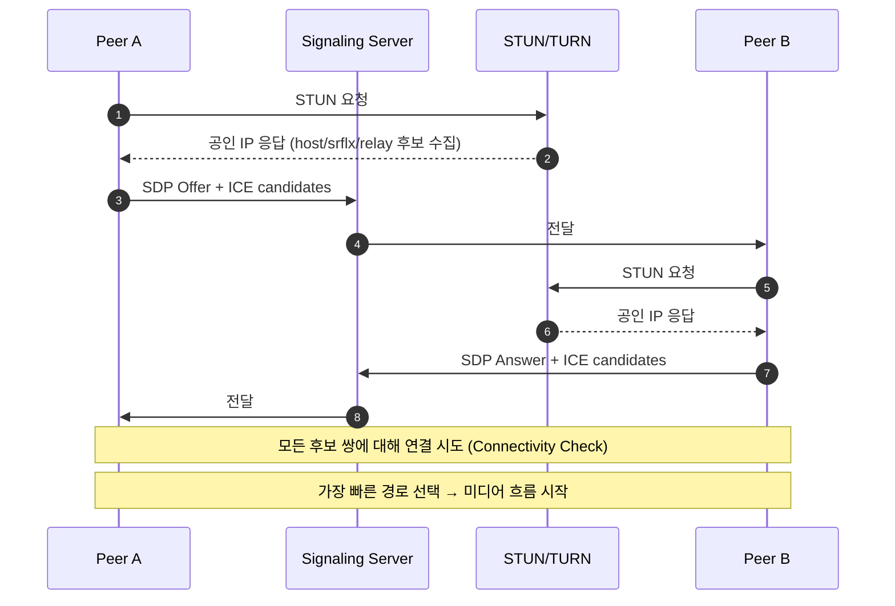

2010년만 해도 화상 통화는 **무조건 별도 프로그램 설치**가 필요했다. Skype, MSN Messenger, 시스코의 WebEx. 브라우저에서 카메라/마이크에 접근할 방법이 없었다. 자체 P2P 프로토콜은 폐쇄적이었고, 기업이 가입자를 가두는 도구였다.

Google이 이걸 깨버린다. 2011년 **WebRTC를 발표**하고 2013년 Chrome에 표준 탑재. "브라우저에서 코드 몇 줄로 화상 통화"가 가능해졌다. Skype의 시대가 끝나고 Zoom, Google Meet, Discord, Whereby 같은 새 세대가 그 위에 올라탔다.

[지난 글](../srt-broadcaster-protocol/)에서 방송 업계가 인터넷을 길들인 SRT를 봤다면, 이번 글은 **브라우저가 실시간 통신을 표준화한** WebRTC를 정리한 노트다. NAT 통과의 까다로움(STUN/TURN), 다인 통화의 진화(P2P → MCU → SFU), 그리고 한 사용자가 여러 화질을 만드는 두 가지 전략(Simulcast/SVC)까지.

---

## 1. WebRTC가 뭔가 — 3줄 정의

```
WebRTC = 브라우저 + 모바일 앱에 내장된 실시간 통신 표준
  - 카메라/마이크 접근 (getUserMedia)
  - P2P 미디어 전송 (RTCPeerConnection)
  - P2P 데이터 채널 (RTCDataChannel)
2017년 W3C 표준화, 모든 메이저 브라우저 지원
```

기존 Flash + RTMP 시대와 비교하면:

| | Flash (RTMP) | WebRTC |
|---|---|---|
| 설치 | Flash Player 필요 | 브라우저 자체 |
| 전송 방향 | 단방향 (서버 ↔ 클라이언트) | **양방향 P2P** |
| 지연 | 2–3초 | **100–500ms** |
| 미디어 | 영상/음성 | 영상/음성/**임의 데이터** |
| 표준화 | Adobe 단독 | **W3C + IETF** |

---

## 2. 세 가지 핵심 API

WebRTC의 모든 기능이 결국 이 셋 위에서 굴러간다.

### `getUserMedia` — 카메라/마이크 접근

```javascript
// 카메라 + 마이크 접근 (사용자 권한 팝업 자동 표시)
const stream = await navigator.mediaDevices.getUserMedia({
  video: { width: 1280, height: 720, frameRate: 30 },
  audio: { echoCancellation: true, noiseSuppression: true }
});

// video 태그에 띄우기
document.querySelector('video').srcObject = stream;
```

이전엔 Flash 같은 플러그인이 운영체제 API를 호출해야 했다. WebRTC는 **브라우저가 표준 API로 노출**.

### `RTCPeerConnection` — P2P 미디어 전송

```javascript
const pc = new RTCPeerConnection({
  iceServers: [
    { urls: 'stun:stun.l.google.com:19302' },
    { urls: 'turn:turn.example.com', username: 'u', credential: 'p' }
  ]
});

// 내 미디어 추가
stream.getTracks().forEach(track => pc.addTrack(track, stream));

// 상대 미디어 받기
pc.ontrack = (event) => {
  remoteVideo.srcObject = event.streams[0];
};
```

여기서 신기한 게 **시그널링은 표준에 없다**. 브라우저는 두 피어가 어떻게 만나는지 안다 (Offer/Answer). 근데 *두 피어가 서로의 존재를 어떻게 알게 되는지*는 개발자가 직접 처리해야 함. WebSocket, Firebase, 자체 서버 무엇이든.

### `RTCDataChannel` — 임의 데이터 P2P

```javascript
const channel = pc.createDataChannel('chat');
channel.onmessage = (e) => console.log('받음:', e.data);
channel.send('안녕');
```

미디어 외에 **임의 바이너리/텍스트**를 P2P로. 게임 멀티플레이어의 실시간 좌표 동기화, P2P 파일 전송, 협업 도구 데이터 동기화에 쓰임.

---

## 3. WebRTC의 진짜 어려움 — NAT 통과

여기가 WebRTC의 90% 복잡도가 모여있는 곳이다.

대부분 컴퓨터/폰은 **공유기 뒤(NAT)** 에 있다. 사설 IP(192.168.x.x)를 갖고, 외부에 노출되는 공인 IP는 공유기가 가짐. 그래서 두 브라우저가 **서로의 공인 IP를 모르고, 직접 연결도 불가능**.


### STUN — "내 공인 IP가 뭐야?"

```
브라우저 A: STUN 서버에 UDP 패킷 전송
STUN 서버: "너의 공인 IP는 203.0.113.5, 포트 54321이야"
→ A가 자기 공인 주소를 알게 됨
→ 시그널링 채널로 B에게 전달
→ A와 B가 서로의 공인 IP를 알고 UDP 홀 펀칭으로 직접 연결
```

UDP 홀 펀칭: 한쪽이 먼저 패킷을 보내면 NAT가 "이 주소로부터의 응답은 열어둠"으로 처리. 양쪽이 동시에 시도하면 연결됨. **약 80% 케이스에서 성공**.

### TURN — 마지막 보루, 릴레이

```
[Symmetric NAT, 엄격한 방화벽]
홀 펀칭 실패 → TURN 서버가 모든 트래픽을 중계
A → TURN → B
B → TURN → A
```

대학교, 기업, 일부 통신사 NAT는 홀 펀칭 안 됨. 그 20%를 위해 TURN 서버가 필요.

**TURN의 비용**:
- 모든 미디어 트래픽이 TURN 서버를 통과 = 대역폭 비용 큼
- 시청자 100명, 각 1Mbps면 100Mbps 트래픽
- AWS에서 TURN 서버 운영 시 월 수천 달러 가능

P2P가 안 되는 케이스를 위한 보험인데, 대규모 서비스에선 거의 모든 트래픽이 TURN을 거치게 되는 함정. 그래서 다음에 볼 SFU로 진화.

### ICE — STUN/TURN을 조정하는 프레임워크

ICE (Interactive Connectivity Establishment)는 위 과정을 자동화한다.



이 시퀀스가 100–500ms 안에 끝나는 게 WebRTC의 매력. 브라우저가 자동으로 모든 후보를 시도하고 가장 빠른 경로 선택.

---

## 4. SDP — 미디어 협상의 언어

두 피어가 "어떤 코덱으로, 어떤 화질로 주고받을지" 합의해야 한다. 이 협상 형식이 **SDP (Session Description Protocol)**.

SDP는 평문 텍스트.

```
v=0
o=- 1234567 2 IN IP4 127.0.0.1
s=-
t=0 0
a=group:BUNDLE 0 1
m=video 9 UDP/TLS/RTP/SAVPF 96 97
a=rtpmap:96 VP8/90000
a=rtpmap:97 H264/90000
a=mid:0
a=sendrecv
m=audio 9 UDP/TLS/RTP/SAVPF 111
a=rtpmap:111 opus/48000/2
a=mid:1
a=sendrecv
```

핵심 라인 의미:

| 라인 | 의미 |
|---|---|
| `m=video` | 비디오 트랙 시작 |
| `a=rtpmap:96 VP8/90000` | RTP payload type 96은 VP8 코덱 |
| `a=group:BUNDLE 0 1` | 비디오/오디오를 한 ICE 연결로 묶음 (BUNDLE) |
| `a=sendrecv` | 양방향 송수신 |
| `UDP/TLS/RTP/SAVPF` | 미디어 전송 스택 |

Offer/Answer 패턴:
1. A가 자기가 지원하는 코덱 목록을 SDP Offer로 전송
2. B가 교집합을 골라 SDP Answer로 응답
3. 양쪽이 같은 코덱으로 합의 완료

---

## 5. P2P의 한계 — 인원이 많아지면

여기서 WebRTC의 진짜 흥미로운 부분이 시작된다.

2명 통화는 P2P가 깔끔하다. 그런데 **4명이 통화하면 P2P가 안 된다**.


### P2P Mesh — 안 됨

```
4명 통화 = 모두가 모두와 직접 연결
연결 수: 4 × 3 / 2 = 6개
각 사용자: 자기 영상을 3개 인코딩해서 3명에게 송출
       + 3명의 영상을 디코딩
```

10명이면 연결 45개, 각자 9번 인코딩. **노트북이 녹아내림**.

### MCU (Multipoint Control Unit) — 옛날 방식

```
모두가 서버로 송출
서버가 4개 영상을 디코딩 → 2x2 그리드로 합성 → 다시 인코딩
시청자는 1개 영상만 받음 (합쳐진 그리드)
```

서버 부담 큼 (디코딩 + 합성 + 재인코딩). 화상회의 전용 하드웨어 시스템.

옛 Polycom, Cisco WebEx 1세대가 MCU. **CPU/GPU가 비싸서 회의실 1개에 서버 1대가 흔했음**.

### SFU (Selective Forwarding Unit) — 현대의 표준

```
모두가 서버로 송출
서버가 디코딩/합성 안 함, 그냥 패킷을 라우팅
각 시청자는 다른 3명의 영상 스트림을 별도로 받음
```

서버는 **단순 패킷 포워더**. CPU 거의 안 씀. 클라이언트가 알아서 그리드 합성.

```
[클라이언트 부담]
업로드: 1개 스트림 (자기 영상)
다운로드: 3개 스트림 (다른 3명)
CPU: 자기 인코딩 1번 + 디코딩 3번
```

대역폭 부담은 살짝 있지만 **서버 비용이 압도적으로 싸다**. Zoom, Google Meet, Discord, Twitch Spaces 다 SFU.

---

## 6. Simulcast vs SVC — 시청자별 화질 맞춤

SFU의 진짜 어려움: 시청자마다 네트워크 환경이 다르다. 누군 5G고 누군 LTE 약전계. 어떻게 맞춤?

답은 **한 사용자가 여러 화질을 동시에 보내는 것**. 두 가지 전략.


### Simulcast — 여러 독립 스트림

```
사용자 인코더가 동시에 3개 인코딩:
  1080p @ 6 Mbps
  720p @ 2 Mbps
  360p @ 500 kbps

SFU가 시청자별로 1개 선택해서 전달
```

장점: 단순. 어떤 코덱이든 가능 (H.264, VP8, VP9, AV1).
단점: 인코더가 3배 일함. 모바일 배터리/CPU 부담.

**Zoom, 대부분의 H.264 배포가 Simulcast**.

### SVC (Scalable Video Coding) — 레이어드 스트림

```
사용자 인코더가 1개의 레이어드 스트림 인코딩:
  Base layer: 360p (500 kbps)
  Enhancement 1: 720p 차분 (1.5 Mbps 추가)
  Enhancement 2: 1080p 차분 (4 Mbps 추가)

SFU가 시청자별로 몇 개 레이어를 보낼지 선택
저화질 시청자 → Base만
고화질 시청자 → Base + E1 + E2
```

장점: 인코더 1번. 모든 레이어를 합쳐도 총 비트레이트 ↓.
단점: 코덱 제약 (AV1, VP9만 SVC 표준 잘 지원).

**Google Meet가 AV1 SVC**. 이게 Meet의 저전력 + 부드러운 화질 전환의 비밀.

---

## 7. WebRTC 지연 — 다른 프로토콜과 비교


{
  "tooltip": { "trigger": "axis", "axisPointer": { "type": "shadow" } },
  "grid": { "left": "22%", "right": "8%", "bottom": "12%", "top": "8%" },
  "xAxis": { "type": "log", "name": "지연 (ms)", "min": 50 },
  "yAxis": {
    "type": "category",
    "data": ["WebRTC (P2P)", "WebRTC (SFU)", "LL-HLS", "일반 HLS"]
  },
  "series": [{
    "type": "bar",
    "data": [
      { "value": 150, "itemStyle": { "color": "#10b981" } },
      { "value": 300, "itemStyle": { "color": "#3b82f6" } },
      { "value": 2000, "itemStyle": { "color": "#f59e0b" } },
      { "value": 22000, "itemStyle": { "color": "#94a3b8" } }
    ],
    "label": { "show": true, "position": "right", "formatter": "{c}ms" }
  }]
}


WebRTC가 가장 빠르지만 **시청자 1000명 이상 확장이 어렵다**. SFU 노드 한 대에 동시 시청자 500–1000명 한계. 그 이상은 SFU 캐스케이드 (계층적 SFU) 필요.

---

## 8. WebRTC를 라이브 방송에 쓰려면

원래 화상회의용이지만 라이브 방송에도 도입 중.

| 방향 | 표준 | 용도 |
|---|---|---|
| **시청자 → 서버** | WHIP (RFC 9725) | 스트리머 송출 (RTMP 대체 시도) |
| **서버 → 시청자** | WHEP | 저지연 시청 (LL-HLS 대체 시도) |

[지난 글](../rtmp-still-alive/)에서 봤듯 WHIP은 OBS 30부터 지원. RTMP의 후계자 후보 1번.

WHEP은 더 새로움. AWS IVS, Twitch가 베타 운영 중. **CDN과 안 맞는 게 채택 발목** — WebRTC는 UDP 기반 + 양방향 연결이라 정적 CDN 캐시 불가.

해결책: **SFU를 글로벌하게 분산 배치**해서 CDN 역할.

```
스트리머 → 한국 SFU → 일본 SFU → 일본 시청자
                 ↓
                미국 SFU → 미국 시청자
```

이런 인프라가 비싸서 보급 느림. **5–10년에 걸쳐 RTMP/HLS를 점진 대체**할 것이라는 게 업계 예측.

---

## 9. 실전 도입 가이드

언제 WebRTC를 써야 할까.

```
[WebRTC가 정답]
- 화상회의 (Zoom, Meet)
- 라이브 인터랙티브 (Twitch Spaces, 음성 채팅방)
- 라이브 경매, 라이브 커머스
- 게임 음성 채팅
- 원격 협업 도구 (Figma 멀티커서)

[WebRTC 부적합]
- VOD (HLS가 맞음, 지연 무관)
- 1만 명 이상 시청 라이브 (HLS의 CDN이 압도)
- 모바일 통신사 환경 (UDP 차단 흔함)
```

치지직, Twitch 같은 대형 라이브가 WebRTC로 안 가는 이유는 **CDN 비용**. SFU 캐시드를 글로벌하게 운영하는 것보다 HLS + CDN이 시청자 1만 명 이상에선 100배 싸다.

대신 **저지연이 비즈니스 가치인 곳** — 라이브 경매, 라이브 쇼핑 — 은 WebRTC 도입 가속 중.

---

## 정리하면

WebRTC는 **Google이 Skype 독점을 깨려고 만든 표준**이고, 그 결과 화상회의 시장 전체가 재편됐다.

1. **출신** — 2011년 Google 발표, 2017년 W3C 표준화. 브라우저 내장
2. **3대 API** — `getUserMedia` (미디어 접근) / `RTCPeerConnection` (P2P) / `RTCDataChannel` (임의 데이터)
3. **NAT 통과** — STUN으로 공인 IP 알아내기 + UDP 홀 펀칭. 실패 시 TURN 릴레이
4. **시그널링** — 표준에 없음. 개발자가 WebSocket 같은 걸로 직접 처리
5. **SDP Offer/Answer** — 코덱 협상, BUNDLE로 트랙 한 연결에 묶음
6. **다인 진화** — P2P Mesh (안 됨) → MCU (서버 부담 ↑) → **SFU** (현대 표준)
7. **화질 맞춤** — Simulcast (간단, 인코더 3배) / SVC (효율, 코덱 제약)
8. **지연** — 100–500ms. LL-HLS의 1/5
9. **CDN 부재** — 대규모 라이브에 부적합. WHIP/WHEP으로 점진 대체 시도

다음 글에선 **WHIP/WHEP** — WebRTC를 라이브 방송에 표준 적용하려는 IETF 시도를 본다.

---

**참고**
- [WebRTC W3C 표준](https://www.w3.org/TR/webrtc/)
- [WebRTC for the Curious (오픈소스 책)](https://webrtcforthecurious.com/)
- [LiveKit (오픈소스 SFU)](https://github.com/livekit/livekit)
- [mediasoup (오픈소스 SFU)](https://mediasoup.org/)
