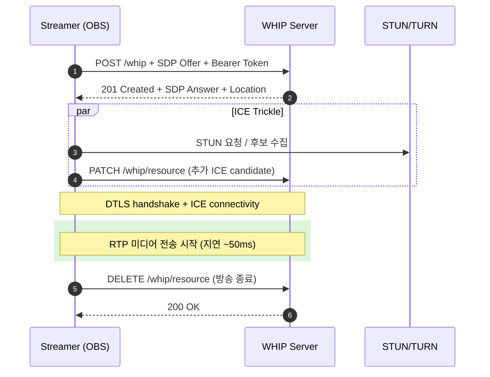

[지난 시리즈](../rtmp-still-alive/)에서 RTMP가 20년이 지나도 안 죽는 이유를 봤다. 도입 비용 0, 호환성 100%, 생태계 관성.

근데 그 글 마지막에서 **"진짜 후계자 후보는 WHIP"** 이라고 언급했었다. 2023년 IETF가 RFC 9725로 표준화한 신생 프로토콜. **OBS 30부터 기본 지원**. YouTube, Twitch가 베타 운영 중.

그리고 그 짝인 WHEP — WHIP의 시청자 측 버전 — 도 이미 표준화됐다. WHIP은 송출(ingest), WHEP은 시청(egress).

[지난 글](../webrtc-deep-dive/)에서 WebRTC의 P2P 통신 표준을 봤다면, 이번 글은 **그 WebRTC를 라이브 방송 산업에 표준 적용하려는 IETF의 시도**를 정리한 노트다. 왜 만들어졌고, 진짜 RTMP를 대체할 수 있는지, 그리고 현실의 하이브리드 아키텍처는 어떻게 구성되는지.

---

## 1. 문제의 본질 — WebRTC가 표준화 안 한 영역

WebRTC는 강력한 표준이지만 **시그널링은 표준에 포함 안 됨**. 이게 라이브 도입의 핵심 발목.

```
[WebRTC가 정의하는 것]
- 미디어 협상 (SDP)
- NAT 통과 (ICE/STUN/TURN)
- 미디어 전송 (SRTP)
- DataChannel

[WebRTC가 정의 안 하는 것]
- 두 피어가 어떻게 만나는지 (시그널링)
- SDP를 어떻게 교환하는지
- Authorization 방식
```

각 회사가 자체 WebSocket/Firebase/REST로 처리. 그래서 **A의 WHIP 클라이언트가 B의 서버에 송출 못 함**. 호환성 0.

라이브 방송 산업에서 OBS, 인코더, 플랫폼이 다 다른 회사 제품인데 시그널링 표준이 없으면 RTMP 대체 못 한다. 이게 2010년대 내내 WebRTC가 라이브 시장 못 깬 이유.

---

## 2. WHIP의 발표 — 2023년 IETF RFC 9725

해법은 단순했다. **"SDP 교환을 HTTP POST 한 번으로 끝내자"**.

```
[WHIP의 정의 - RFC 9725]
WHIP = WebRTC HTTP Ingestion Protocol
스트리머 → 서버: HTTP POST /whip with SDP Offer
서버 → 스트리머: HTTP 201 with SDP Answer
이후: ICE 연결 + WebRTC 미디어 전송
```

이게 전부다. 별도 시그널링 서버 X, WebSocket X, 복잡한 인증 핸드셰이크 X.


### RTMP와 비교

| 단계 | RTMP | WHIP |
|---|---|---|
| 1 | TCP SYN/SYN-ACK/ACK | HTTP POST /whip + SDP Offer + Bearer Token |
| 2 | RTMP Handshake (C0+C1 / S0+S1+S2 / C2, 9KB 교환) | HTTP 201 Created + SDP Answer |
| 3 | NetConnection.connect("live") | ICE Connectivity Check |
| 4 | NetStream.createStream | DTLS Handshake |
| 5 | NetStream.publish(streamkey) | **RTP 미디어 전송 시작** |
| 6 | Video Messages 전송 시작 | |
| 총 RTT | 5회 (~135ms) | 1회 (~50ms) |

WHIP의 1라운드트립 vs RTMP의 5라운드트립.

### 실제 HTTP 요청

```http
POST /whip/live/streamkey-abc123 HTTP/1.1
Host: ingest.example.com
Content-Type: application/sdp
Authorization: Bearer eyJhbGc...

v=0
o=- 12345 2 IN IP4 127.0.0.1
s=-
m=video 9 UDP/TLS/RTP/SAVPF 96
a=rtpmap:96 H264/90000
a=sendonly
m=audio 9 UDP/TLS/RTP/SAVPF 111
a=rtpmap:111 opus/48000/2
a=sendonly
```

```http
HTTP/1.1 201 Created
Location: /whip/live/streamkey-abc123/resource/xyz789
Content-Type: application/sdp

v=0
o=- 67890 2 IN IP4 server-public-ip
s=-
m=video 9 UDP/TLS/RTP/SAVPF 96
a=rtpmap:96 H264/90000
a=recvonly
...
```

핵심 디자인:
- **Bearer Token** 표준 인증 (RTMP의 스트림 키 → JWT)
- **Location 헤더**로 리소스 URL 반환 (이후 ICE Trickle/종료 시 사용)
- 모든 게 HTTP니까 **방화벽 통과, CDN 호환, 디버깅 쉬움**

### 종료도 HTTP

```http
DELETE /whip/live/streamkey-abc123/resource/xyz789 HTTP/1.1
Authorization: Bearer eyJhbGc...

HTTP/1.1 200 OK
```

RTMP는 명시적 종료가 없어서 TCP 끊김으로 추정. WHIP은 **DELETE로 명확히 종료**.



---

## 3. WHIP의 단순함이 가져온 큰 가치

```
[WHIP 도입 효과]
1. 인증/방화벽 = 기존 HTTPS 그대로
2. 디버깅 = curl, Postman으로 가능
3. 부하 분산 = HTTP load balancer로 가능
4. 모바일 SDK = 간단 (HTTP + WebRTC만)
5. 코덱 자유 = VP9, AV1, H.265 가능 (RTMP는 H.264만)
```

특히 **5번 코덱 자유도**가 중요. 

RTMP는 Adobe가 스펙 업데이트 중단해서 H.265/AV1 비표준. WHIP은 SDP로 어떤 코덱이든 협상 가능 → **AV1 송출이 RTMP에선 불가능했는데 WHIP으로 처음 가능해짐**.

NVIDIA RTX 4000+ 보유자가 AV1 NVENC로 송출하면 같은 화질에 비트레이트 30% 절감. **CDN 비용 직결**.

---

## 4. WHEP — WHIP의 짝, 시청자 측 표준

WHIP만으로는 부족했다. 송출이 표준화되어도 시청자가 받을 표준이 없으면 무용지물.

```
[WHIP만 있던 상태]
스트리머 → WHIP → 서버 → ??? → 시청자
                       각자 다른 방식 (WebSocket, 자체 프로토콜)
```

해법: WHEP. **WebRTC HTTP Egress Protocol**.

```
[WHEP의 정의]
시청자 → 서버: HTTP POST /whep with SDP Offer
서버 → 시청자: HTTP 201 with SDP Answer
이후: WebRTC로 미디어 시청
```

WHIP과 정확히 대칭. 다른 점은 SDP의 `a=sendonly` → `a=recvonly` 한 줄 차이.

### WHEP의 사용 시나리오

```javascript
// 시청자 측 코드 (브라우저)
const pc = new RTCPeerConnection({
  iceServers: [{ urls: 'stun:stun.l.google.com:19302' }]
});

pc.addTransceiver('video', { direction: 'recvonly' });
pc.addTransceiver('audio', { direction: 'recvonly' });

const offer = await pc.createOffer();
await pc.setLocalDescription(offer);

const response = await fetch('https://server.example.com/whep/live/streamkey', {
  method: 'POST',
  headers: { 'Content-Type': 'application/sdp', 'Authorization': 'Bearer ...' },
  body: offer.sdp
});

const answer = await response.text();
await pc.setRemoteDescription({ type: 'answer', sdp: answer });

pc.ontrack = (event) => {
  document.querySelector('video').srcObject = event.streams[0];
};
```

**브라우저 video 태그로 ~300ms 지연 라이브 시청**. HLS의 1/70.

---

## 5. WHEP의 진짜 한계 — 시청자 확장

저지연이 강점이지만 **시청자 수가 늘어나면 폭발**한다.


{
  "tooltip": { "trigger": "axis" },
  "legend": { "data": ["WHEP (SFU 직접)", "LL-HLS (CDN)", "HLS (CDN)"], "top": 0 },
  "grid": { "left": "12%", "right": "10%", "bottom": "12%", "top": "18%" },
  "xAxis": {
    "type": "category",
    "data": ["10", "100", "1K", "10K", "100K", "1M"],
    "name": "동시 시청자"
  },
  "yAxis": {
    "type": "log",
    "name": "월 인프라 비용 (USD)",
    "min": 100
  },
  "series": [
    {
      "name": "WHEP (SFU 직접)",
      "type": "line",
      "smooth": true,
      "itemStyle": { "color": "#10b981" },
      "data": [200, 800, 5000, 50000, 500000, 5000000]
    },
    {
      "name": "LL-HLS (CDN)",
      "type": "line",
      "smooth": true,
      "itemStyle": { "color": "#f59e0b" },
      "data": [500, 600, 1500, 8000, 50000, 400000]
    },
    {
      "name": "HLS (CDN)",
      "type": "line",
      "smooth": true,
      "itemStyle": { "color": "#3b82f6" },
      "data": [500, 550, 900, 4000, 25000, 200000]
    }
  ]
}


```
[SFU 한 대당 동시 시청자]
일반 SFU 노드: 500~1000명
고성능 SFU 노드 (전용 하드웨어): 2000~3000명

[WebRTC 트래픽의 CDN 캐시 불가]
WebRTC는 UDP + 양방향 연결
정적 파일이 아니라 캐시 불가능
시청자마다 SFU 연결 별도 유지
```

10만 명 시청자면 SFU 100~200대 필요. 인프라 비용이 HLS의 10~30배. WHEP의 본질적 비용 구조.

---

## 6. 해답은 하이브리드 — 시청자가 골라 본다

이래서 산업이 한 프로토콜만 쓰지 않는다. **시청자 환경/용도에 맞춰 다른 프로토콜로 분기**.


```
[송출은 WHIP 하나로 통일]
스트리머 → WHIP → 미디어 서버

[시청은 3갈래로 분기]
1. 인터랙티브 시청자 → WHEP (지연 300ms, 시청자 1K 미만)
2. 일반 라이브 시청자 → LL-HLS (지연 2초, CDN, 시청자 100K급)
3. 대규모 시청자 → HLS (지연 22초, CDN 최적, 시청자 1M+)
```

각 시청자가 자기 환경/취향에 따라 선택. 또는 플랫폼이 자동 라우팅.

### 사용 케이스별 매핑

| 케이스 | 프로토콜 | 이유 |
|---|---|---|
| 라이브 경매 | WHEP | 입찰 지연이 비즈니스 핵심 |
| 라이브 쇼핑 (1:多 진행자) | WHEP | "남은 1개" 같은 실시간 정보 |
| 음성 채팅방 (Twitter Spaces) | WHEP | 양방향 발언 |
| 게임 방송 (Twitch/치지직) | LL-HLS | 채팅 동기화 + 대규모 |
| 스포츠 중계 | LL-HLS | 채팅 + 100만 시청자 |
| 대규모 콘서트/이벤트 | HLS | 1000만 시청자, 지연 무관 |
| VOD 다시보기 | HLS | 시청자 1억, 지연 무관 |

### Twitch의 실전 구현 (2024)

```
[Twitch의 단계적 도입]
2023: WHIP 베타 (스트리머 100명 한정)
2024: WHIP 일반 공개 (OBS 30+ 자동 감지)
2024: WHEP "저지연 모드" 베타 (시청자 5K 미만 채널)
2025 (예정): WHEP 일반 + AV1 자동 활성화
```

**RTMP는 계속 유지**. 5~10년 뒤에도 같이 갈 것.

---

## 7. 실전 구축 — OvenMediaEngine 예시

오픈소스 WHIP/WHEP 서버. 한국의 AirenSoft가 개발.

```yaml
# OvenMediaEngine 설정
<Bind>
  <Providers>
    <WebRTC>
      <Signalling>
        <Port>3333</Port>
      </Signalling>
      <IceCandidates>
        <IceCandidate>*:10000-10010/udp</IceCandidate>
      </IceCandidates>
    </WebRTC>
  </Providers>
</Bind>

<Applications>
  <Application>
    <Name>app</Name>
    <Type>live</Type>
    <Providers>
      <WebRTC>
        <SignallingPaths>
          <WHIPPath>/whip/{stream}</WHIPPath>
        </SignallingPaths>
      </WebRTC>
    </Providers>
    <Publishers>
      <WebRTC>
        <SignallingPaths>
          <WHEPPath>/whep/{stream}</WHEPPath>
        </SignallingPaths>
      </WebRTC>
      <LLHLS>
        <SegmentDuration>0.2</SegmentDuration>
      </LLHLS>
      <HLS>
        <SegmentDuration>6</SegmentDuration>
      </HLS>
    </Publishers>
  </Application>
</Applications>
```

**한 송출(WHIP) → 세 시청 방식(WHEP/LL-HLS/HLS) 동시 제공**. 시청자가 선택.

### OBS에서 WHIP 송출

```
OBS 30+ 설정:
서비스: Custom
서버: WHIP
URL: https://server.example.com/whip/mystream
Bearer Token: <발급받은 토큰>
인코더: NVIDIA NVENC AV1 (RTX 4000+ 필요)
```

스트리머는 URL + 토큰만 입력. RTMP와 같은 단순함.

---

## 8. 산업 도입 현황 (2024 기준)

| 회사/플랫폼 | WHIP | WHEP | 상태 |
|---|---|---|---|
| **Twitch** | ✅ 일반 공개 | 🟡 베타 | 점진적 |
| **YouTube Live** | 🟡 베타 | ❌ | 신중 |
| **Cloudflare Stream** | ✅ 일반 | ✅ 일반 | 적극 |
| **AWS IVS** | ✅ 일반 | ✅ 일반 | 적극 |
| **Daily.co** | ✅ | ✅ | 표준 |
| **LiveKit** | ✅ | ✅ | 표준 |
| **치지직 (네이버)** | ❌ | ❌ | 미도입 (추정) |
| **SOOP** | ❌ | ❌ | 미도입 (추정) |
| **OvenMediaEngine** | ✅ | ✅ | 표준 |

**Cloudflare가 가장 적극적**. CDN 회사로서 WebRTC의 CDN 부재 문제를 직접 해결하려는 의지.

한국 라이브 플랫폼은 보수적. RTMP + HLS 인프라 안정성 우선. WHIP 도입은 차후.

---

## 9. WHIP/WHEP 표준 vs 실제 구현 차이

표준은 깔끔하지만 실제 구현에는 호환성 이슈.

```
[자주 만나는 호환성 문제]
1. ICE Trickle 처리 방식 다름 (PATCH vs Re-POST)
2. 코덱 협상 우선순위 다름 (서버마다 다름)
3. Bearer Token 검증 형식 다름 (JWT vs custom)
4. simulcast 표현 다름
5. 에러 응답 형식 다름 (RFC는 단순, 실제는 풍부)
```

OBS WHIP 송출이 한 플랫폼에선 되는데 다른 플랫폼에선 안 되는 경우가 흔함. **2024년 현재 표준 적합성 테스트 도구 부재**.

해결책: 큰 플랫폼이 호환성 표준 만들기. **WHIP Compatibility Suite**가 IETF에서 작업 중.

---

## 정리하면

WHIP/WHEP은 **IETF가 RTMP를 천천히 끝내려는 표준 시도**다.

1. **출신** — 2023년 IETF RFC 9725. WebRTC의 시그널링 비표준 문제 해결
2. **핵심 단순함** — HTTP POST 1번 + SDP 교환 = 끝. 5라운드트립 → 1라운드트립
3. **WHIP** — 송출 표준 (RTMP 대체 시도). OBS 30+ 기본 지원
4. **WHEP** — 시청 표준 (HLS 대체 시도). 300ms 지연
5. **코덱 자유** — AV1, VP9, H.265 다 가능. RTMP의 H.264 족쇄 해방
6. **WHEP 한계** — CDN 캐시 불가, 시청자 수 ↑ 시 비용 폭발
7. **하이브리드 미래** — WHIP 송출 + WHEP/LL-HLS/HLS 시청자별 분기
8. **산업 도입** — Cloudflare/AWS/Twitch가 선도, 한국 플랫폼 보수적
9. **RTMP 공존** — 5~10년에 걸쳐 점진 대체. 즉시 사라지지 않음

스트리밍 프로토콜 시리즈는 여기까지. 다음 글부터는 **비디오/오디오 코덱** — H.264가 어떻게 영상을 압축하는지부터 — 본다.

---

**참고**
- [WHIP RFC 9725](https://datatracker.ietf.org/doc/html/rfc9725)
- [WHEP IETF Draft](https://datatracker.ietf.org/doc/draft-murillo-whep/)
- [OvenMediaEngine](https://github.com/AirenSoft/OvenMediaEngine)
- [LiveKit (WHIP/WHEP 지원 SFU)](https://github.com/livekit/livekit)
- [Cloudflare Stream WHIP/WHEP](https://developers.cloudflare.com/stream/webrtc-beta/)
